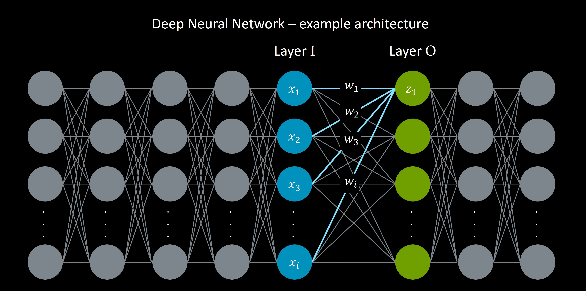

## What is KleidiAI?

KleidiAI is a set of micro-kernels that integrates into machine learning frameworks, accelerating AI inference on Arm-based platforms. KleidiAI's micro-kernels are hand-optimized in Arm assembly code to leverage modern architecture instructions that greatly speed up AI inference on Arm CPUs. 

If both of the following two conditions are met, you can benefit from KleidiAI automatically, without any further action:
* Your ML Framework integrates KleidiAI.
* Your hardware platform supports the required Arm instructions for your inference.

### How does Generative AI execute mathematically in hardware?

{}
“Any sufficiently advanced technology is indistinguishable from magic” - Arthur C. Clarke
{}

The math behind the perceived magic of the Generative AI models today is *matrix multiplication*. To help you grasp this concept, and better understand KleidiAI, this section offers a high-level explanation of neural network architecture.

Neural networks consist of layers of neurons. Each neuron in a layer is connected to all the neurons in the previous layer. Each of these connections has a unique connection strength, learned through training. This is called a connection's *weight*. 

During inference, such as when trying to generate the next *token* or *word* with a given input, each neuron performs a weighted sum of inputs, and then decides its value through an activation function. The weighted sum is the dot product of each connected neuron's input (*x*) and its connection weight (*w*). A layer of neuron's calculations can be efficiently calculated through matrix multiplication, where the input matrix is multiplied by the weight matrix. 

For example, in the image below, *z1* is calculated as a dot product of connected *x*s and *w*s from the previous layer. A matrix multiplication operation can therefore efficiently calculate all *z* values in Layer 0.

In addition to *weights*, each neuron in a neural network is assigned a *bias*. These weights and biases are learned during training, and make up a model's parameters. For example, in the Llama 3 model with 8 billion parameters, the model has around 8 billion individual weights and biases that embody what the model learned during training. Generally speaking, the higher the number of parameters a model has, the more information it can retain from its training, which increases its performance capability. For more information about Llama 3 view its [Hugging Face model card](https://huggingface.co/meta-llama/Meta-Llama-3-8B).

### Why is speeding up matrix multiplication crucial for AI performance?
What does this all mean? An 8 billion parameter model generating one token requires billions of dot product calculations, with at least hundreds of millions of matrix multiplication operations. Speeding up matrix multiplication is therefore a critical piece to both running massive Generative AI models on servers and smaller-model constrained devices, like smartphones.

KleidiAI uses modern Arm CPU instructions to accelerate matrix multiplication and overall AI inference.

## What Arm features does KleidiAI leverage?
Each KleidiAI matrix multiplication micro-kernel uses a specific Arm architecture feature to enhance AI inference. In this section you can read a description of each architecture feature that KleidiAI uses to accelerate matrix multiplication.

* **Dot Product**: KleidiAI uses the `vdotq_s32` intrinsic, which is a vector dot product, introduced as part of SIMD. It computes the dot product of two vector 8-bit integers and accumulates the result into a 32-bit integer. View the `vdot` documentation [here](https://developer.arm.com/documentation/ddi0597/2024-03/SIMD-FP-Instructions/VDOT--by-element---BFloat16-floating-point-indexed-dot-product--vector--by-element--).

* **SMMLA**: KleidiAI also makes use of the Int8 Matrix Multiplication (i8mm) feature including the `SMMLA` instruction,  which stands for *Signed 8-bit integer matrix multiply-accumulate*. It multiplies a 2x8 matrix of 8-bit integers by a 8x2 matrix of 8-bit integers, which is accumulated into a 2x2 matrix of 32-bit integers. For more information, view the *SMMLA* and *i8mm* documentation [here](https://developer.arm.com/documentation/ddi0602/latest/SIMD-FP-Instructions/SMMLA--vector---Signed-8-bit-integer-matrix-multiply-accumulate--vector--).

* **FMLA**: This instruction, which stands for *Floating-point Multiply Accumulate*, is for 16-bit operations. It is included as part of the Advanced SIMD extension, multiplying and accumulating two vectors together, each containing eight 16-bit numbers. View the `FMLA` documentation [here](https://developer.arm.com/documentation/ddi0602/2024-03/SIMD-FP-Instructions/FMLA--vector---Floating-point-fused-Multiply-Add-to-accumulator--vector--).

* **FMOPA**: This instruction stands for *Floating-point outer product and accumulate*. It is included in the Arm Scalable Vector Extension 2 (SVE2). The single precision `FMOPA` variant enables optimized matrix multiplication on 32-bit numbers. View the `FMOPA` documentation [here](https://developer.arm.com/documentation/ddi0602/2023-12/SME-Instructions/FMOPA--non-widening---Floating-point-outer-product-and-accumulate-?lang=en).

Today, Arm-powered hardware containing these instructions exist in cloud servers and smartphones. Here are some examples of the first products from popular vendors that support KleidiAI:

| Area        | Example Product     | Arm-based SoC      | Arm Architecture  |
| ---------   | -----------------   | ----------------   | ----------- |
| Smartphone  | Google Pixel 6      | Google Tensor G1    | Armv8.2  |
| Smartphone  | OPPO Reno6 Pro 5G   | MediaTek Dimensity 1200 | Armv8.2  |
| Smartphone  | Vivo Y22            | MediaTek Helio G70  | Armv8.2  |
| Smartphone  | Xiaomi Mi 11        | Qualcomm Snapdragon 888 | Armv8.2  |
| Smartphone  | Samsung Galaxy S20 Ultra      | Samsung Exynos 990 | Armv8.2  |
| Smartphone  | Google Pixel 8 Pro | Google Tensor G3   | Armv9.0  |
| Smartphone  | Samsung Galaxy S22 | Snapdragon 8 Gen 1 | Armv9.0  |
| Smartphone  | OPPO Find X5 Pro   | Snapdragon 8 Gen 1 | Armv9.0  |
| Smartphone  | Xiaomi 12T         | Mediatek Dimensity 9000 | Armv9.0  |
| Server      | c8y                | Alibaba Yitian 710 | Armv9.0  |
| Server      | GB200 NVL72        | NVIDIA Grace       | Armv9.0  |
| Server      | C7g, M7g, R7g      | AWS Graviton 3     | Armv8.4  |

This Learning Path now moves on to answer the following questions while stepping through a C++ example:
* How does KleidAI 'just work' with ML Frameworks?
* What do the micro-kernels in KleidiAI do?
* How are the KleidiAI micro-kernels speeding up matrix multiplication?
