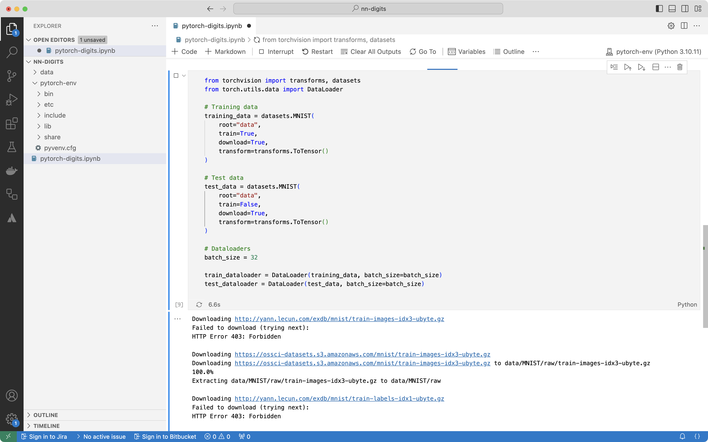
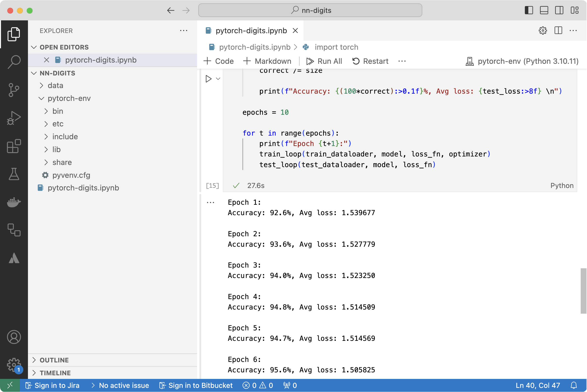

---
# User change
title: "Datasets and training"

weight: 5

layout: "learningpathall"
---

Start by downloading the MNIST dataset. Proceed as follows:

1. Open the pytorch-digits.ipynb you created in [Create a PyTorch model for digit classification](/learning-paths/cross-platform/pytorch-digit-classification-architecture/).

2. Add the following statements:

```python
from torchvision import transforms, datasets
from torch.utils.data import DataLoader

# Training data 
training_data = datasets.MNIST(
    root="data",
    train=True,
    download=True,
    transform=transforms.ToTensor()
)

# Test data
test_data = datasets.MNIST(
    root="data",
    train=False,
    download=True,
    transform=transforms.ToTensor()
)

# Dataloaders
batch_size = 32

train_dataloader = DataLoader(training_data, batch_size=batch_size)
test_dataloader = DataLoader(test_data, batch_size=batch_size)
```

The above code snippet downloads the MNIST dataset, transforms the images into tensors, and sets up data loaders for training and testing. Specifically, the `datasets.MNIST` function is used to download the MNIST dataset, with `train=True` indicating training data and `train=False` indicating test data. The `transform=transforms.ToTensor()` argument converts each image in the dataset into a PyTorch tensor, which is necessary for model training and evaluation.

The DataLoader wraps the datasets and allows efficient loading of data in batches. It handles data shuffling, batching, and parallel loading. Here, the train_dataloader and test_dataloader are created with a batch_size of 32, meaning they will load 32 images per batch during training and testing.

This setup prepares the training and test datasets for use in a machine learning model, enabling efficient data handling and model training in PyTorch.

To run the above code, you will need to install certifi package:

```console
pip install certifi
```

The certifi Python package provides the Mozilla root certificates, which are essential for ensuring the SSL connections are secure. If you’re using macOS, you may also need to install the certificates by running:

```console
/Applications/Python\ 3.x/Install\ Certificates.command
```

Make sure to replace `x` with the number of Python version you have installed.

After running the code you will see the output that might look like shown below:



# Train the model

To train the model, specify the loss function and the optimizer:

```Python
learning_rate = 1e-3

loss_fn = nn.CrossEntropyLoss()
optimizer = torch.optim.Adam(model.parameters(), lr=learning_rate)
```

Use CrossEntropyLoss as the loss function and the Adam optimizer for training. The learning rate is set to 1e-3.

Next, define the methods for training and evaluating the feedforward neural network:

```Python
def train_loop(dataloader, model, loss_fn, optimizer):
    size = len(dataloader.dataset)
    for batch, (x, y) in enumerate(dataloader):
        # Compute prediction and loss
        pred = model(x)
        loss = loss_fn(pred, y)

        # Backpropagation
        optimizer.zero_grad()
        loss.backward()
        optimizer.step()

def test_loop(dataloader, model, loss_fn):
    size = len(dataloader.dataset)
    num_batches = len(dataloader)
    test_loss, correct = 0, 0

    with torch.no_grad():
        for x, y in dataloader:
            pred = model(x)
            test_loss += loss_fn(pred, y).item()
            correct += (pred.argmax(1) == y).type(torch.float).sum().item()

    test_loss /= num_batches
    correct /= size
    
    print(f"Accuracy: {(100*correct):>0.1f}%, Avg loss: {test_loss:>8f} \n")
```

The first method, `train_loop`, uses the backpropagation algorithm to optimize the trainable parameters and minimize the prediction error of the neural network. The second method, `test_loop`, calculates the neural network error using the test images and displays the accuracy and loss values. 

You can now invoke these methods to train and evaluate the model using 10 epochs.

```Python
epochs = 10

for t in range(epochs):
    print(f"Epoch {t+1}:")
    train_loop(train_dataloader, model, loss_fn, optimizer)
    test_loop(test_dataloader, model, loss_fn)
```

After running this code, you will see the following output that shows the training progress.



Once the training is complete, you will see something like the following:

```output
Epoch 10:
Accuracy: 95.4%, Avg loss: 1.507491 
```

which shows the model achieved around 95% of accuracy.

# Save the model

Once the model is trained, you can save it. There are various approaches for this. In PyTorch, you can save both the model’s structure and its weights to the same file using the `torch.save()` function. Alternatively, you can save only the weights (parameters) of the model, not the model architecture itself. This requires you to have the model’s architecture defined separately when loading. To save the model weights, you can use the following command: 

```Python
torch.save(model.state_dict(), "model_weights.pth"). 
```

However, PyTorch does not save the definition of the class itself. When you load the model using `torch.load()`, PyTorch needs to know the class definition to recreate the model object.

Therefore, when you later want to use the saved model for inference, you will need to provide the definition of the model class.

Alternatively, you can use TorchScript, which serializes both the architecture and weights into a single file that can be loaded without needing the original class definition. This is particularly useful for deploying models to production or sharing models without code dependencies.

Use TorchScript to save the model using the following commands:

```Python
# Set model to evaluation mode
model.eval()

# Trace the model with an example input
traced_model = torch.jit.trace(model, torch.rand(1, 1, 28, 28))  

# Save the traced model
traced_model.save("model.pth") 
```

The above commands set the model to evaluation mode, trace the model, and save it. Tracing is useful for converting models with static computation graphs to TorchScript, making them portable and independent of the original class definition.

Setting the model to evaluation mode before tracing is important for several reasons:

1.	Behavior of Layers like Dropout and BatchNorm:
    * Dropout. During training, dropout randomly zeroes out some of the activations to prevent overfitting. During evaluation dropout is turned off, and all activations are used.
    * BatchNorm. During training, Batch Normalization layers use batch statistics to normalize the input. During evaluation, they use running averages calculated during training.

2. Consistent Inference Behavior. By setting the model to eval mode, you ensure that the traced model will behave consistently during inference, as it will not use dropout or batch statistics that are inappropriate for inference.

3. Correct Tracing. Tracing captures the operations performed by the model using a given input. If the model is in training mode, the traced graph may include operations related to dropout and batch normalization updates. These operations can affect the correctness and performance of the model during inference.
    
In the next step, you will use the saved model for inference.
