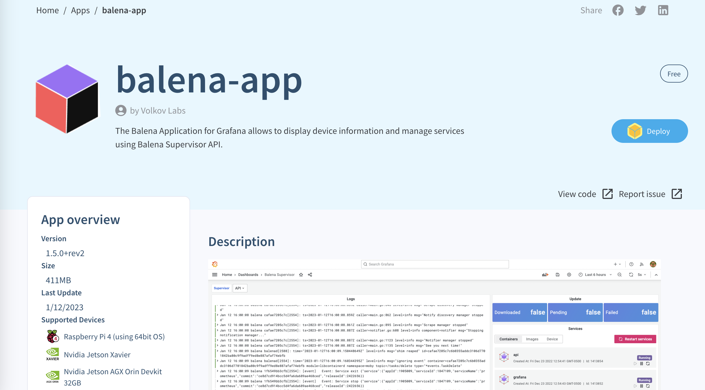
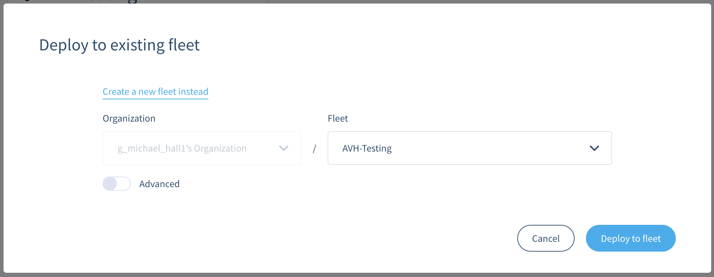
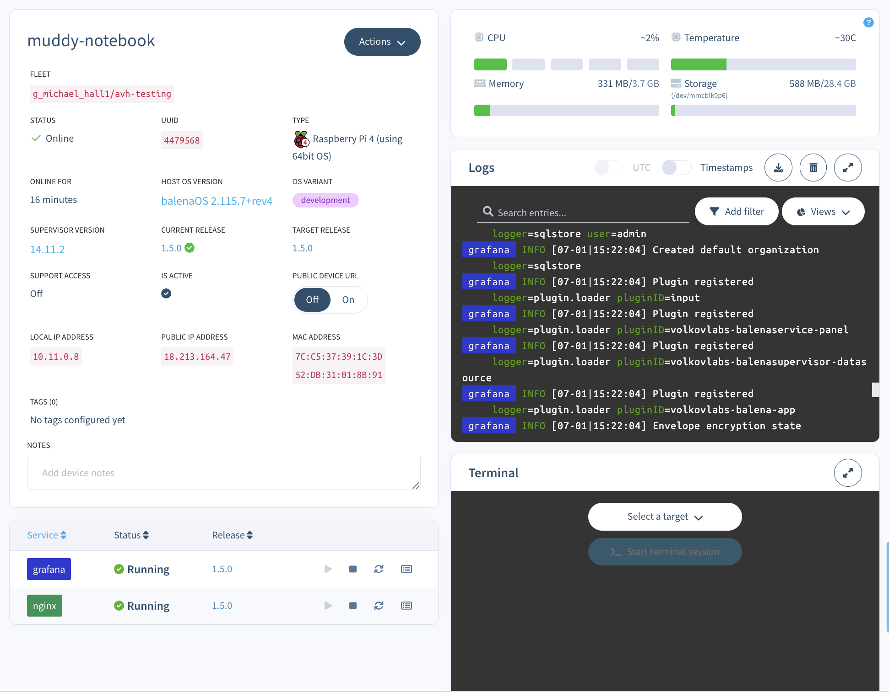
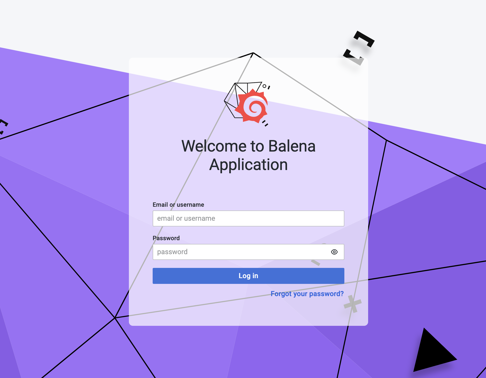
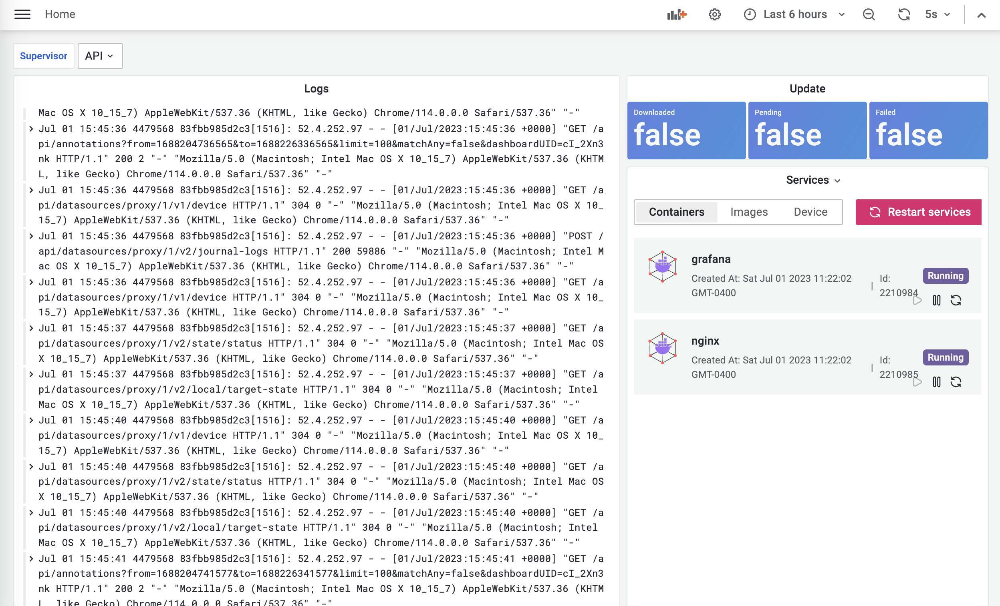

## Deploy from Balena Hub

You can build and deploy your own custom applications on Balena OS, or use a pre-build application from the [Balena Hub](https://hub.balena.io/). We're keeping this tutorial simple, so we're going to use that second option and deploy a Grafana dashboard that will show the state of our Balena OS device.

At the top of your Balena Cloud dashboard is a button that will open the Balena Hub in a new tab, click that.

On the Balena Hub, click `Apps` in the top navigation bar, then search for `balena-app`. This is a pre-built dashboard backed by Grafana, and served by Nginx, that is an easy example to use for your first app deployment.

Click on the app to open its details page. Then look for the `Deploy` button in the upper-right corner of the page. Clicking this button will take you back to your Balena Cloud dashboard with a dialog window to deploy `balena-app` to a fleet.

Click the `Use an existing fleet instead` link and then choose your `AVH-Testing` fleet you created in the first step of this tutorial. You don't need to do any advanced configuration for this app. Click the `Deploy to fleet` button to begin the deployment.

> If you have more than one device in your fleet, this process will deploy the selected application to all of the device in your fleet simultaneously!

Once the deployment is finished, click on your device in Balena Cloud dashboard to open up that device's page. You will now see that the Grafana and Nginx services have been deployed to and are running on your device.

You will also be able to see the system logs from your device, and optional get access to the device's terminal from this Balena Cloud screen.

## Accessing your Grafana dashboard

Your application is now running, but it's not accessible from the outside world. In order to view your Grafana dashboard in your browser, you will need to tell Balena to make your device accessible from a public URL. To do that, toggle the `Public Device URL` switch to the `On` position. A link will appear next to that switch, click on it to open the newly created public URL.

This will open the `balena-app` on your device in your browser. You will be presented with a login screen, use the default username `admin` and password `admin` to log in. You will be prompted to set a new password for the `admin` user before continuing.

You will now be able to see the Grafana dashboard monitoring your Balena OS installation on this device, including the containers running Grafana and Nginx.
