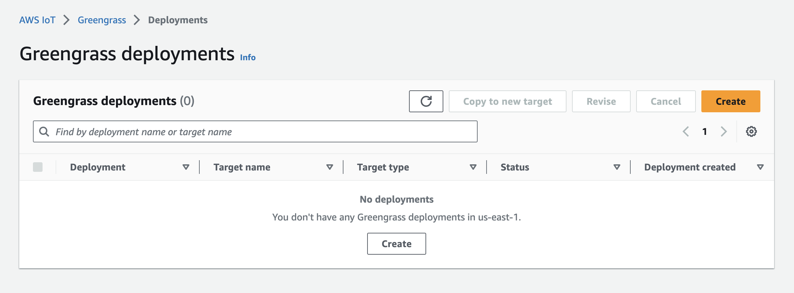
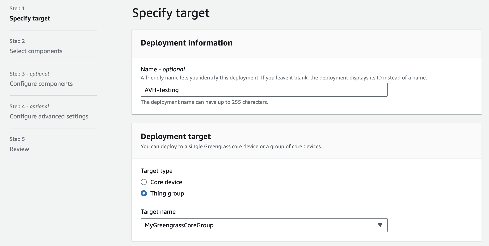
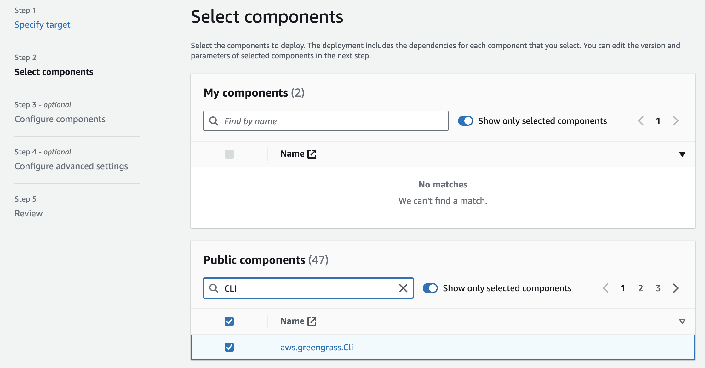
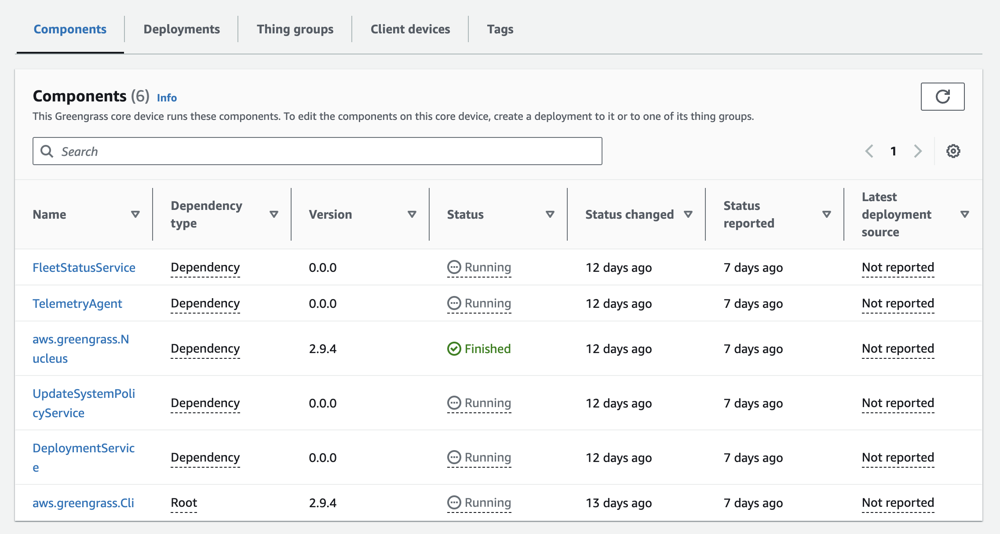

## Create a new Greengrass Deployment

In AWS IoT Greengrass you manage your set of applications (called Components) in what they call a Deployment. You define a Deployment as a set of Components and their configurations. Deployments can be revises to change configurations or add/remove components.



In the AWS IoT console, navigate to `Manage -> Greengrass devices -> Deployments` on the right-side navigation, then click the `Create` button to start a new Greengrass deployment.



Call you deployment `AVH-Testing` and for the Deployment Target select `Thing group` and the `MyGreengrassCoreGroup` that was created when you followed the AWS IoT Greengrass Install Guide. 



The next step is to select which Components should be in your Deployment. For this tutorial we are going to keep it simple and deploy the AWS Greengrass CLI (which is different from the AWS CLI) onto our virtual device. In the Public Components section, search for `CLI` and then select `aws.greengrass.Cli` from the list.

There is no configuration you need to do for the AWS Greengrass CLI component, so you can skip the next couple of screens until you get to the `Review` step. Here you can verify your component selection and deployment target before clicking the `Deploy` button.

## Verify your deployment

After deploying you will be redirected to your `AVH-Testing` deployment page.


After a moment you should see that the deployment to your `MyGreengrassCore` device was successful.



Clicking on that device will now show you a list of installed and running Components.

Finally, return to your AVH console and run the AWS Greengrass CLI

```bash { target="ubuntu:latest" command_line="pi@ubuntu:~$ | 2-15"}
/greengrass/v2/bin/greengrass-cli --help
Usage: greengrass-cli [-hV] [--ggcRootPath=<ggcRootPath>] [COMMAND]
Greengrass command line interface

      --ggcRootPath=<ggcRootPath>
                  The AWS IoT Greengrass V2 root directory.
  -h, --help      Show this help message and exit.
  -V, --version   Print version information and exit.
Commands:
  help                Show help information for a command.
  component           Retrieve component information and stop or restart components.
  deployment          Create local deployments and retrieve deployment status.
  logs                Analyze Greengrass logs.
  get-debug-password  Generate a password for use with the HTTP debug view component.
  pubsub              Publish or subscribe to local topic.
  iotcore             Publish or subscribe to IoT Core.
  ```

  ## Revising your deployment

  This is only the first revision of your Deployment. Going forward you can add more Components, remove the Greengrass CLI component, and change configurations by simply revising your `AVH-Testing` deployment.

  

  When you create a new revision of your deployment, the new Components and configurations will be automatically deployed to every device in your deployment simultaneously.