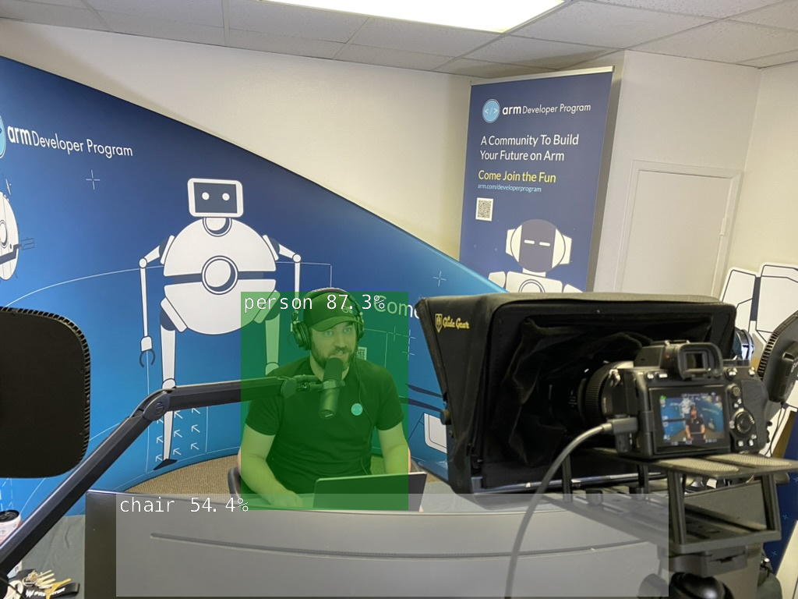

## Detect objects in video and images

{}
The first time you run a new model it will take some time to start up. Subsequent launches will be faster.
{}

Change directory to the prepare for image detection:

```console
cd build/aarch64/bin
```

### DetectNet for object detection on a video feed

To start DetectNet using your camera:

```console
./detectnet csi://0
```

If you want to increase or decrease the sensitivity, add a threshold parameter. By default it is set to 0.5.

```console
./detectnet csi://0 --threshold=0.25
```


### DetectNet for object detection on image files

The following command is using one of the sample images provided in the docker image. 

You can replace "peds_0.jpg" with your own image, and change output.jpg to an appropriate name.

```console
# --network=ssd-mobilenet-v2 is an optional parameter
./detectnet --network=ssd-mobilenet-v2 images/peds_0.jpg images/test/output.jpg
```

If needed, use the `docker cp` command examples to add your own images.




You are now able to perform object detection using the camera or your own images copied into the Docker container.
