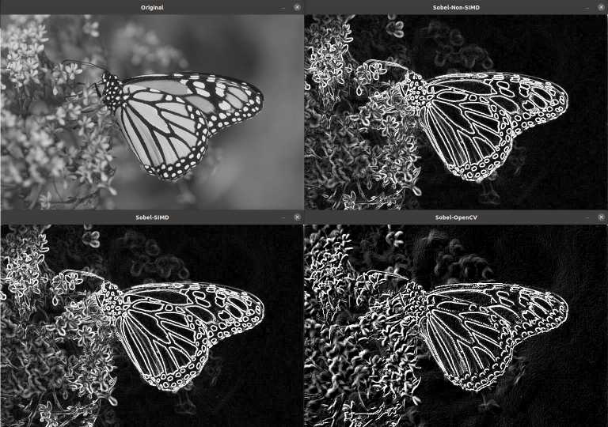

---
# User change
title: "Results" 

weight: 7 # 1 is first, 2 is second, etc.

# Do not modify these elements
layout: "learningpathall"
---

# Results
A successful run will output execution time measurement results in microseconds in the terminal for the three implementations and open four windows showing (as seen below) of the original, non-SIMD, SIMD and OpenCV images of a butterfly.

In the results presented below, a value >1 is faster and a value <1 is slower in comparison to the normalized value. In short, higher values are better.

## QEMU
| | QEMU | | 
| --- | --- | --- |
| Compiler | GCC 11.3.0 |
| Non-SIMD | 1.00 |
| SIMD     | 0.29 |
| OpenCV   | 0.02 |

The results in the table above have been normalized to the _QEMU Non-SIMD_ value, giving the relative speed-up. We observe the following: 
* the non-SIMD implementation is the fastest

## AWS EC2

| | Graviton2 | | Graviton3 | |
| --- | --- | --- | --- | --- | --- | --- |
| Compiler | GCC 12.2.0 | ACfL 22.1 | GCC 12.2.0 | ACfL 22.1 |
| Non-SIMD | 1.0 | 1.0 | 1.7 | 1.8 |
| SIMD     | 3.4 | 3.8 | 5.8 | 6.7 |
| OpenCV   | 0.3 | 0.3 | 0.4 | 0.5 |

The results in the table above have been normalized to the _Graviton2 Non-SIMD_ value, giving the relative speed-up. We observe the following:
* Graviton3 runs the Sobel filter workload faster than Graviton2
* ACfL performs slighlty better than GCC for the _SIMD_ implementaion of the Sobel filter

## Raspberry Pi 4

| | Raspberry Pi 4 | |
| --- | --- | --- |
| Compiler | GCC 11.3.0 | ACfL 22.1 |
| Non-SIMD | 1.0 | 0.9 |
| SIMD     | 2.7 | 3.0 |
| OpenCV   | 0.3 | 0.3 |  

The results in the table above have been normalized to the _Raspberry Pi 4 Non-SIMD_ value, giving the relative speed-up. We observe the following:
* ACfL performs slighlty better than GCC for the _SIMD_ implementaion of the Sobel filter

## Summary
This brings us to the end of the practical steps of this learning path. You have now ported an `x86_64` application to `aarch64`, built and run the ported application in emulation, on remote hardware and on physical hardware, very well done!

Next, check out the [Review](../_review) to test your knowledge and [Next Steps](../_next-steps) for further reading.