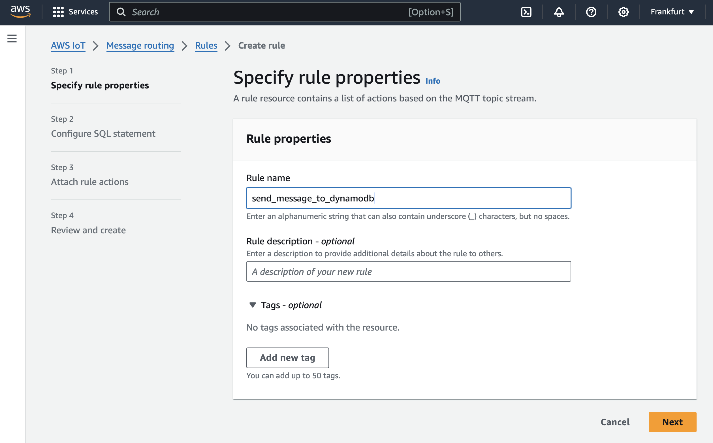
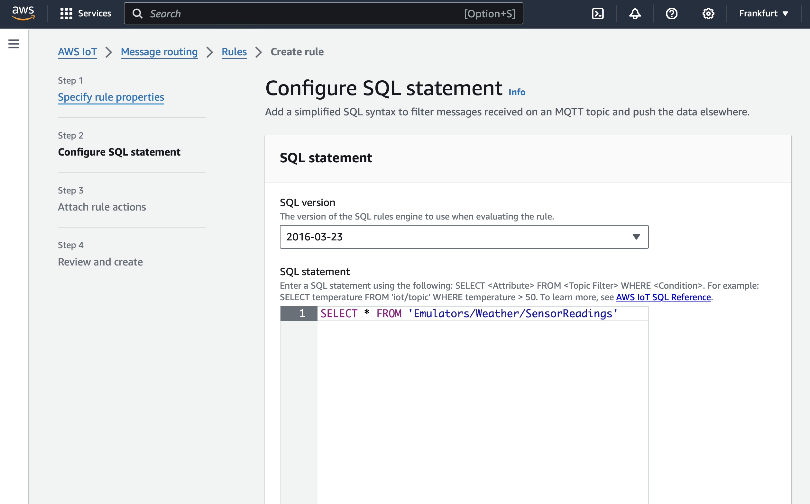
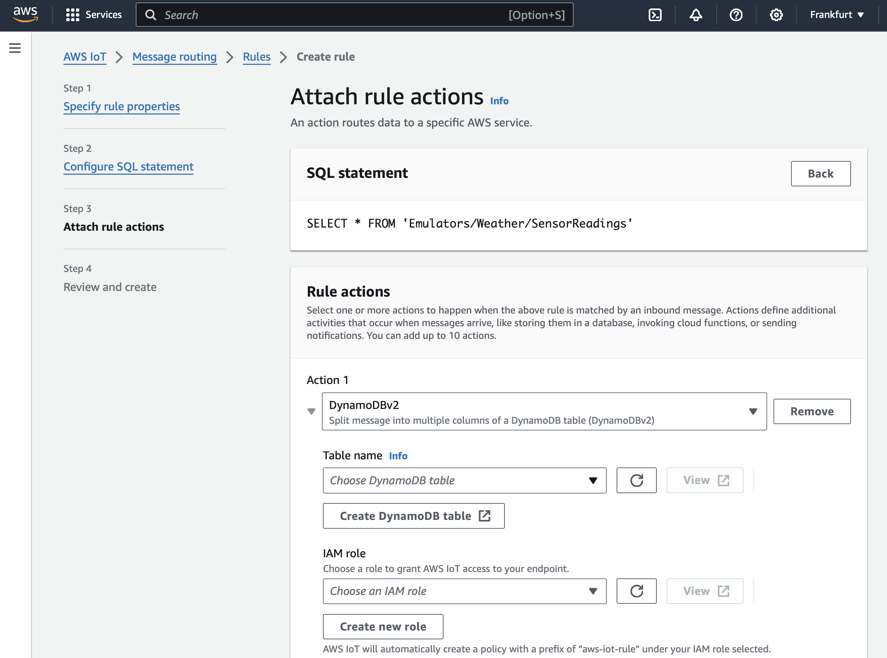
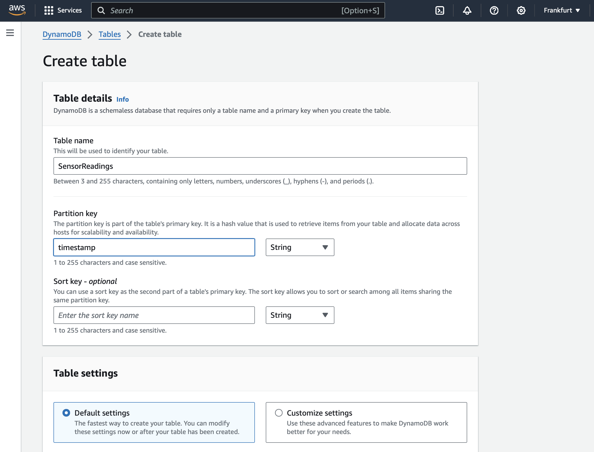

---
# User change
title: "Create a ASP.NET Core Web API project"

weight: 3

layout: "learningpathall"
---
## Before you begin
Before you begin, prepare the weather station emulator and connect it to AWS IoT Core by completing this [Learning Path](/learning-paths/laptops-and-desktops/win_aws_iot). 
## Create the rule
Start by creating the rule: 

1. Open AWS IoT Core, and look for *Rules* under *Message routing*:


2. Click the *Create rule* button. This will opens *Create rule* view, in which you configure the rule:



3. Use the *Create rule* view to configure the rule as follows. Firstly, under the rule name, type: send_message_to_dynamodb. Then, click the *Next* button. This will take you to the Configure SQL statement, where you use the following SQL query:

```sql
SELECT * FROM 'Emulators/Weather/SensorReadings'
```



4. Click the *Next* button.



5. This opens the *Attach rule actions*, where under *Action 1*, select *DynamoDBv2*. This activates additional controls (see figure below):


6. Click the *Create DynamoDB* table. This will open another tab, where you type *SensorReadings* for the Table name and *timestamp* for the partition key. Ensure to check *Default settings*, scroll down, and click the *Create table* button. Wait a few moments for the table to be created. Then, return to the *Create rule* view.



7. In the *Create rule* view, click the *Refresh* button next to the *Choose DynamoDB* table name drop-down. Then, select the *SensorReadings* table from that drop-down. Afterward, click the *Create new role* button (located below the IAM role). This activates the *Create role* pop-up.

8. In the *Create role* pop-up window, type 'weather_station_dynamo_db', and click the *Create* button. By now, the *Attach rule* actions screen looks like this:


9. Scroll down and click the *Next* button. This displays the summary screen, where you click the *Create* button.

## Test the rule
Now, everything is set up. The messages sent from the device are automatically inserted as new rows into the SensorReadings table. To check this, run the application from [Create IoT applications with Windows on Arm and AWS IoT Core](laptops-and-desktops/win_aws_iot/). Namely, open the command prompt, change the working directory to AWS.WeatherStation, and then type:

```console
npm start
```

This starts the emulator, which streams data to the AWS IoT Core. The output of the emulator looks like this:

```output
{"deviceId":"WeatherStationEmulator","timestamp":"2024-05-03T10:40:51.239Z","temperature":"22.35","humidity":"58","pressure":"1000.1"}
{"deviceId":"WeatherStationEmulator","timestamp":"2024-05-03T10:40:52.274Z","temperature":"27.59","humidity":"54","pressure":"1006.1"}
{"deviceId":"WeatherStationEmulator","timestamp":"2024-05-03T10:40:53.296Z","temperature":"38.77","humidity":"52","pressure":"1019.6"}
{"deviceId":"WeatherStationEmulator","timestamp":"2024-05-03T10:40:54.305Z","temperature":"32.57","humidity":"54","pressure":"1020.8"}
{"deviceId":"WeatherStationEmulator","timestamp":"2024-05-03T10:40:55.305Z","temperature":"30.86","humidity":"53","pressure":"1014.9"}
```

To ensure this data is written to the DynamoDB table, go to the AWS console, and in the search box type 'DynamoDB'. Select *DynamoDB* from the list. This takes you to the DynamoDB dashboard, where you click *Explore items* on the left. Then, check the *SensorReadings* radio button, and you see the items in the table:


Note that the values in the table are the same as those generated by the emulator. This ensures that you have successfully integrated AWS IoT Core with DynamoDB.

## Summary
In this learning path, you learned how to use the Rules Engine to write data from the weather station emulator to DynamoDB. This process involved creating a database in Amazon DynamoDB and using the Rules Engine to establish rules that automatically transfer the data to a DynamoDB table. Through these steps, you gained practical experience in managing real-time IoT data workflows and enhancing the scalability and responsiveness of IoT applications.
