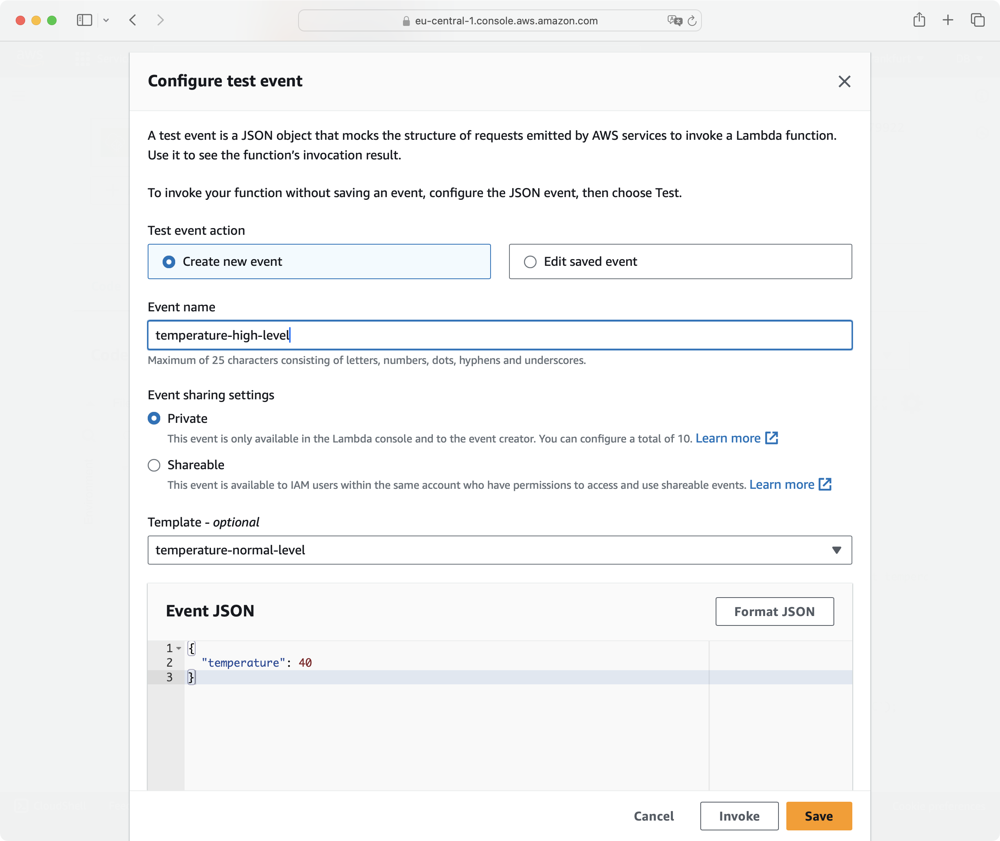
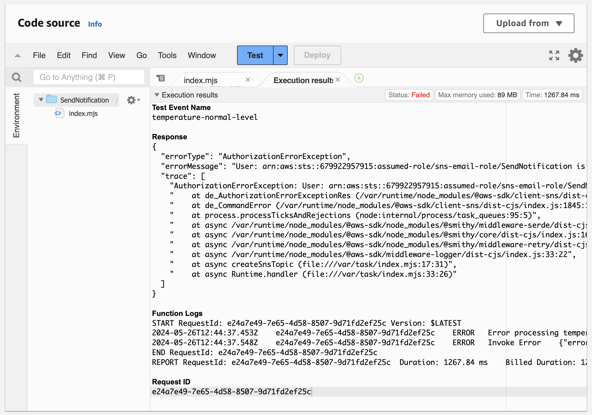
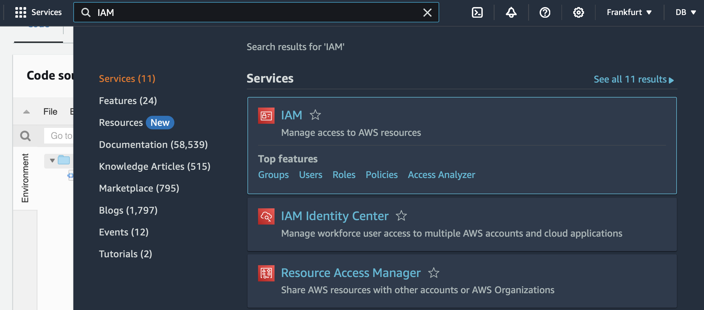
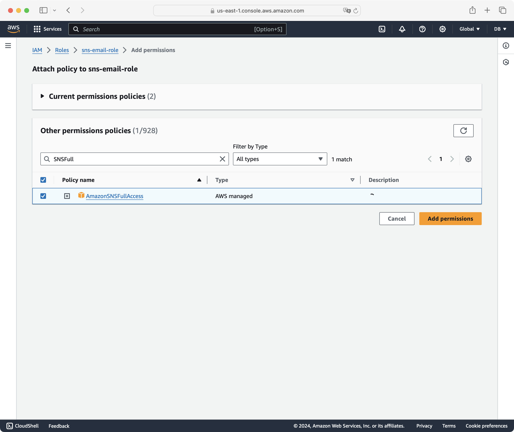
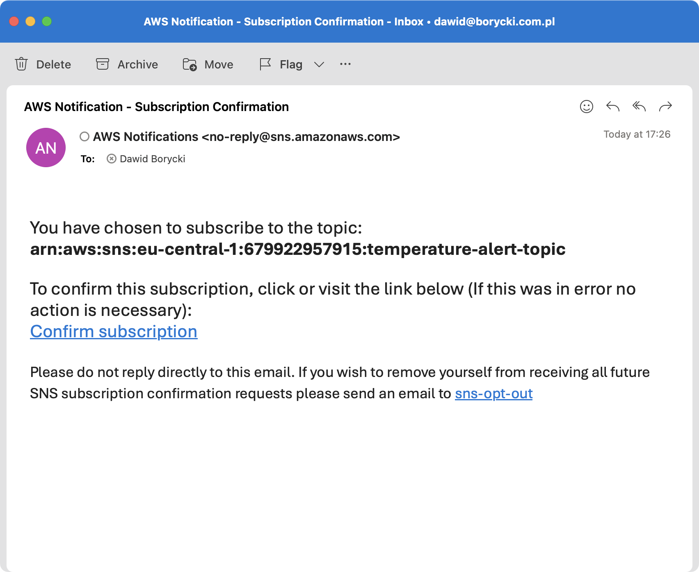
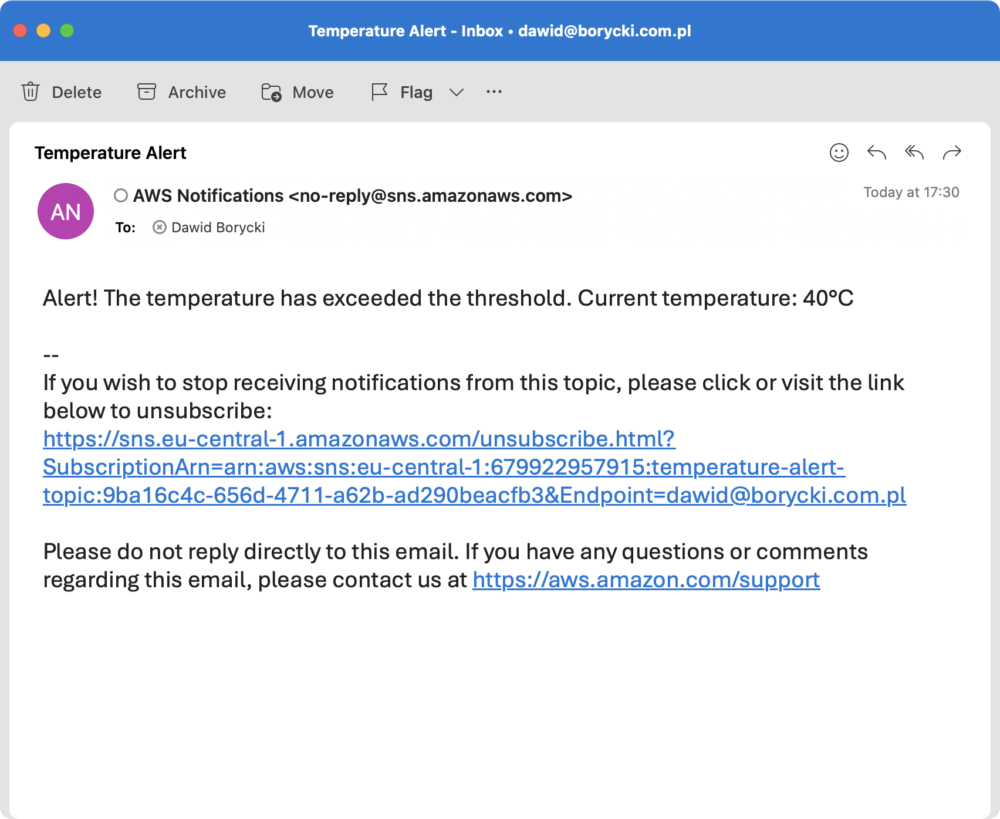
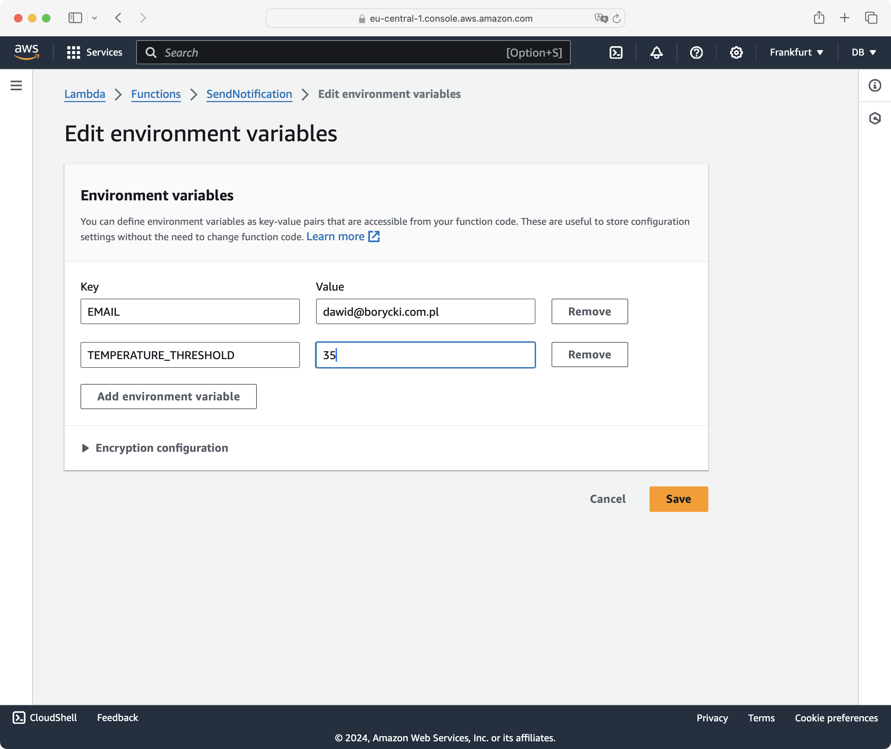

---
# User change
title: "Implement Lambda Function"

weight: 5

layout: "learningpathall"
---
## Objective
You will now implement the Lambda function to send an email notification whenever the received temperature exceeds a predefined threshold. 

## Amazon Simple Notification Service
To send emails, you will use Amazon Simple Notification Service (SNS). 

SNS is a fully-managed messaging service provided by AWS that enables you to decouple and scale microservices, distributed systems, and serverless applications. SNS supports the delivery of messages to a variety of endpoints, allowing for seamless communication between different parts of an application or across multiple applications.

SNS uses a publish/subscribe (pub/sub) messaging model, where messages are sent to a topic and then distibuted to all the subscribers of the topic. This makes it easy to broadcast messages to multiple recipients simultaneously.

To send emails using SNS, you first create a topic. Topics are communication channels to which messages are sent. You create a topic for each category of message that you would like to send.

To receive a notification, you need to subscribe to a topic. Subscribers express interest in receiving messages published to a topic by subscribing. Each subscriber specifies an endpoint and a protocol; for example, email, SMS, or HTTP.

To send an email, you will publish a message in SNS. When a message is published to a topic, SNS delivers it to all subscribed endpoints. The message can include attributes and filtering criteria to determine which subscribers receive the message.

## Implementation
To implement the above mechanism using a Lambda function, go back to the AWS Lambda console. 

Then, scroll down to the Code source section and paste the following code under index.mjs. The *.mjs* extension in AWS Lambda indicates that the file is an ECMAScript (ES) module.

```JavaScript
import { SNSClient, CreateTopicCommand, SubscribeCommand, PublishCommand } from "@aws-sdk/client-sns";

const snsClient = new SNSClient({ region: "eu-central-1" }); // Update your region

export const handler = async (event) => {
    const threshold = 35;  // Set your temperature threshold here
    const email = 'dawid@borycki.com.pl';  // Replace with the email to receive notifications
    const topicName = 'temperature-alert-topic';

    const receivedTemperature = event.temperature;

    // Function to create SNS topic if it doesn't exist
    async function createSnsTopic() {
        const createTopicParams = {
            Name: topicName
        };
        const topicResponse = await snsClient.send(new CreateTopicCommand(createTopicParams));
        return topicResponse.TopicArn;
    }

    // Function to subscribe email to SNS topic
    async function subscribeEmailToTopic(topicArn) {
        const subscribeParams = {
            Protocol: 'email',
            TopicArn: topicArn,
            Endpoint: email
        };
        await snsClient.send(new SubscribeCommand(subscribeParams));
    }

    try {
        // Create the SNS topic and get its ARN
        const topicArn = await createSnsTopic();

        // Subscribe email to the topic
        await subscribeEmailToTopic(topicArn);

        // Check if the temperature exceeds the threshold
        if (receivedTemperature > threshold) {
            const params = {
                Message: `Alert! The temperature has exceeded the threshold. Current temperature: ${receivedTemperature}°C`,
                Subject: 'Temperature Alert',
                TopicArn: topicArn
            };

            // Publish the message to the SNS topic
            await snsClient.send(new PublishCommand(params));
            console.log(`Notification sent: ${params.Message}`);
        } else {
            console.log(`Temperature is within safe limits: ${receivedTemperature}°C`);
        }
    } catch (error) {
        console.error(`Error processing temperature data: ${error}`);
        throw error;
    }
};
```

In the code above, you first import the AWS SDK for SNS. Specifically, the following code imports the necessary classes from the AWS SDK for JavaScript (v3) for working with Amazon SNS (Simple Notification Service). 

Then, an instance of SNSClient is created, specifying the AWS region (eu-central-1 in this case):

```JavaScript
import { SNSClient, CreateTopicCommand, SubscribeCommand, PublishCommand } from "@aws-sdk/client-sns";

const snsClient = new SNSClient({ region: "eu-central-1" }); // Update your region
```

Next, you have the handler function, which is the entry point for the Lambda function. The handler receives an event object containing temperature data. 

It declares the temperature threshold, the email address for notifications, and the SNS topic name:

```JavaScript
export const handler = async (event) => {
    const threshold = 35;  // Set your temperature threshold here
    const email = 'dawid@borycki.com.pl';  // Replace with the email to receive notifications
    const topicName = 'temperature-alert-topic';

    const receivedTemperature = event.temperature;
```

The Lambda function then creates the SNS topic using the createSnsTopic function, which is an asynchronous function that creates an SNS topic if it doesn't already exist, and returns the Topic ARN (Amazon Resource Name). 

The ARN is the unique resource identifier within the AWS cloud.

```JavaScript
async function subscribeEmailToTopic(topicArn) {
    const subscribeParams = {
        Protocol: 'email',
        TopicArn: topicArn,
        Endpoint: email
    };
    await snsClient.send(new SubscribeCommand(subscribeParams));
}
```

To create a subscription, the above code defines the subscribeEmailToTopic function. This is an asynchronous function that subscribes the specified email address to the SNS topic using the Topic ARN.

```JavaScript
async function subscribeEmailToTopic(topicArn) {
    const subscribeParams = {
        Protocol: 'email',
        TopicArn: topicArn,
        Endpoint: email
    };
    await snsClient.send(new SubscribeCommand(subscribeParams));
}
```

Then, the code uses the above functions, and checks if the received temperature exceeds the predefined threshold. If the temperature exceeds the threshold, a message is published to the SNS topic, triggering an email notification. If the temperature is within safe limits, it logs the information. If any error occurs during the process, it logs the error and throws it.

```JavaScript
try {
    // Create the SNS topic and get its ARN
    const topicArn = await createSnsTopic();

    // Subscribe email to the topic
    await subscribeEmailToTopic(topicArn);

    // Check if the temperature exceeds the threshold
    if (receivedTemperature > threshold) {
        const params = {
            Message: `Alert! The temperature has exceeded the threshold. Current temperature: ${receivedTemperature}°C`,
            Subject: 'Temperature Alert',
            TopicArn: topicArn
        };

        // Publish the message to the SNS topic
        await snsClient.send(new PublishCommand(params));
        console.log(`Notification sent: ${params.Message}`);
    } else {
        console.log(`Temperature is within safe limits: ${receivedTemperature}°C`);
    }
} catch (error) {
    console.error(`Error processing temperature data: ${error}`);
    throw error;
}
```

In summary, this Lambda function creates an SNS topic and subscribes an email address to it. It then checks the temperature data from the event, and if the temperature exceeds the threshold, it sends an email notification via SNS.

After making these changes, the Lambda code editor looks as shown below:


Now, click the Deploy button to apply code changes.

## Testing the Function

### Test Events
You will now create two test events to manually invoke the Lambda function. Click the Test button. This opens the Configure test event window:


In this window, type **temperature-normal-level** for the Event name, and then under Event JSON paste the following payload:

```JSON
{
  "temperature": 30
}
```

Finally, click the *Save* button. This takes you back to the Lambda function console.

Click the triangle icon, in the Test button. This expands the menu, from which you select *Configure test event*:


This opens the *Configure test event* window, where you select *Create new event*, change the event name to **temperature-high-level**, and paste the following payload for the Event JSON:

```JSON
{
  "temperature": 40
}
```

The *Configure test event* window should looks as shown:



Click the *Save* button to add a new test event. This takes you back to the Lambda function console. 

### Testing the function
In the Lambda function console, click the triangle icon next to the Test button, and select *temperature-normal-level* event:


Then, click the *Test* button. The Lambda function is invoked, and you will see the following execution result:



This means that our Lambda function does not have the necessary permissions to create the SNS topic.

### Configuring permissions
To configure permissions you will use AWS Identity and Access Management (IAM). IAM is a service provided by Amazon Web Services (AWS) that allows you to securely manage access to AWS services and resources. With IAM, you can create and manage AWS users and groups, and use permissions to allow or deny their access to AWS resources. 

Here, you will modify the role, which was created along with Lambda function. IAM roles allow you to delegate access to users or services without sharing long-term credentials (like access keys). Roles are used to grant temporary access to AWS resources.

Specifically, you will attach the policy giving the Lambda a full access to the SNS. Policies are JSON documents that define permissions. They specify who can access which resources and what actions they can perform. Policies can be attached to users, groups, or roles.

To modify the role, proceed as shown:
1. Go the AWS console, and type **IAM** in the search box. Then, select IAM from the list:



2. This will take you to the IAM Dashboard, where you click *Roles under Access management*:


3. Click the *sns-email-role*. This opens another screen, which should look like shown below:


4. Click the *Add permissions* button. This activates the drop-down list, from which you select *Attach policies*.

5. In the *Attach policy to sns-email-role* view, type *SNSFull* in the search box. This filters the list of policies to display one item: *AmazonSNSFullAccess*. Check the check-box on the left of the policy name, and then click the *Add permissions* button:



The role has been updated. You can now go back to AWS Lambda.

### Testing the function
After updating the role, the SendNotification Lambda function can create SNS topics and send emails. To test this, in the Lambda function console, select the *temperature-high-level* test event, and click the Test button. You will see that the test event was processed without an error:


Go to your mailbox and look for an email from AWS Notification. The first email will ask you to confirm the subscription



Click the *Confirm subscription* link. Then, invoke the *temperature-high-level* event one more time to see that you received an alert email. It will look as shown:



Now, you can start the weather station emulator you created in this [Learning Path](/learning-paths/laptops-and-desktops/win_aws_iot/). Observe the values generated by the emulator. When the temperature exceeds the threshold of 35, you will receive an email notification


## Environment Variables
In the above code, you hardcoded an email, SNS topic, and temperature threshold. This means that every time those values change, you need to modify the function code and redeploy it. In practice, it is better to use environment variables.

You can modify the function code to use environment variables. First, you need to create two environment variables: EMAIL and TEMPERATURE_THRESHOLD.

Proceed as shown:
1. In the Lambda function dashboard, click the *Configuration* tab, and select *Environment variables*:


2. Click the *Edit* button. This opens the *Edit environment variables* view, where you click *Add environment variable*. This activates additional controls, where you type **EMAIL** for *Key* and your email for *Value*. Click the *Add environment variable* button one more time, and add another variable with **TEMPERATURE_THRESHOLD** as *Key*, and **35** as *Value*:



3. Click the *Save* button.

Now, you can modify the Lambda function code to use environment variables:

```JavaScript
import { SNSClient, CreateTopicCommand, SubscribeCommand, PublishCommand } from "@aws-sdk/client-sns";

const snsClient = new SNSClient({ region: "eu-central-1" }); // Update your region

export const handler = async (event) => {
    const threshold = parseFloat(process.env.TEMPERATURE_THRESHOLD);  // Set your temperature threshold here
    const email = process.env.EMAIL  // Replace with the email to receive notifications
    const topicName = 'temperature-alert-topic';

    const receivedTemperature = event.temperature;

    // Function to create SNS topic if it doesn't exist
    async function createSnsTopic() {
        const createTopicParams = {
            Name: topicName
        };
        const topicResponse = await snsClient.send(new CreateTopicCommand(createTopicParams));
        return topicResponse.TopicArn;
    }

    // Function to subscribe email to SNS topic
    async function subscribeEmailToTopic(topicArn) {
        const subscribeParams = {
            Protocol: 'email',
            TopicArn: topicArn,
            Endpoint: email
        };
        await snsClient.send(new SubscribeCommand(subscribeParams));
    }

    try {
        // Create the SNS topic and get its ARN
        const topicArn = await createSnsTopic();

        // Subscribe email to the topic
        await subscribeEmailToTopic(topicArn);

        // Check if the temperature exceeds the threshold
        if (receivedTemperature > threshold) {
            const params = {
                Message: `Alert! The temperature has exceeded the threshold. Current temperature: ${receivedTemperature}°C`,
                Subject: 'Temperature Alert',
                TopicArn: topicArn
            };

            // Publish the message to the SNS topic
            await snsClient.send(new PublishCommand(params));
            console.log(`Notification sent: ${params.Message}`);
        } else {
            console.log(`Temperature is within safe limits: ${receivedTemperature}°C`);
        }
    } catch (error) {
        console.error(`Error processing temperature data: ${error}`);
        throw error;
    }
};
```

As shown above, you use process.env to read environment variables.

## Summary
Here, you learned how to create a Lambda function that is triggered by a message received on an AWS IoT Core topic. Specifically, you learned how to:

1. **Create a Lambda Function** - you started by setting up a Lambda function that listens for temperature data sent to a specific topic on AWS IoT Core. This function processes the data and takes necessary actions based on predefined conditions.

2. **Implement the Lambda Function** - you saw how to implement the Lambda function to handle the incoming data, check if the temperature exceeds a specified threshold, and prepare to send notifications if necessary. You wrote the function using modern JavaScript with ES modules and utilized the AWS SDK for JavaScript (v3).

3. **Create Test Events** -  to ensure our Lambda function works as expected, you created test events in the Lambda console. These test events simulate the messages that would be received from the IoT Core, allowing us to validate the function's behavior without needing actual IoT devices.

4. **Use SNS to Send Emails** - you integrated Amazon Simple Notification Service (SNS) to send email notifications when the temperature exceeds the threshold. This involved creating an SNS topic, subscribing an email address to the topic, and publishing messages to the topic from within the Lambda function.

5. **Incorporate Environment Variables** - finally, you enhanced our Lambda function by using environment variables for configurable parameters such as the email address and temperature threshold. This approach makes the function more flexible and easier to manage, as you can change these settings without modifying the code.

By following these steps, you have built a complete solution that:

1. Processes IoT data in real-time using AWS Lambda.

2. Sends alerts via email when specific conditions are met.

3. Utilizes best practices for configuration management using environment variables.

This setup can be further expanded and customized to fit various IoT applications, providing a robust foundation for building event-driven architectures with AWS services.
