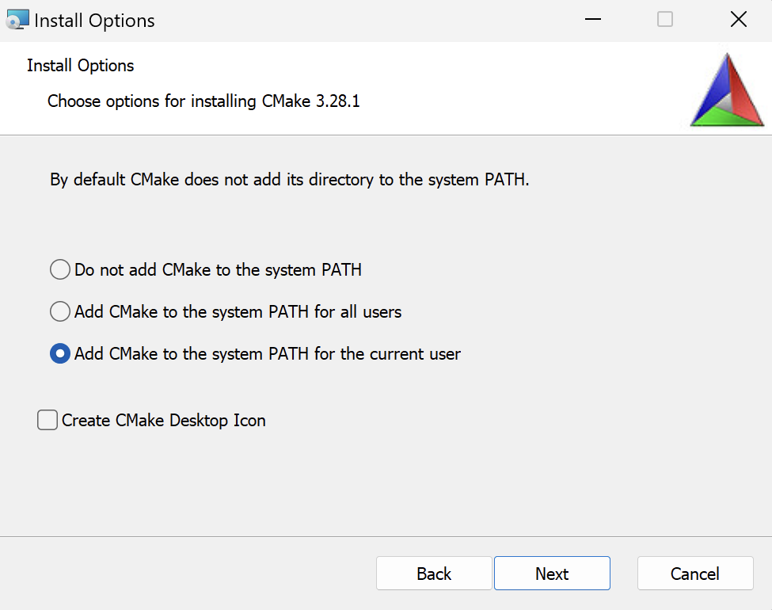
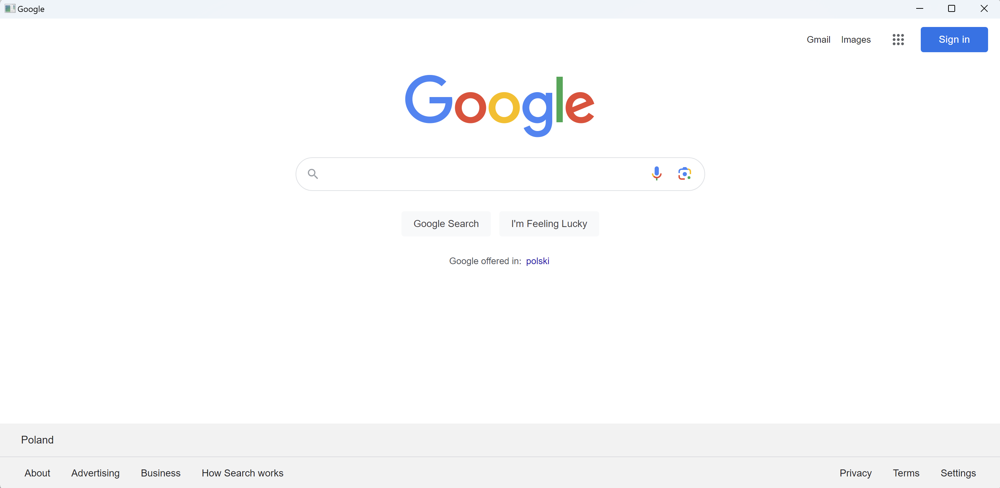
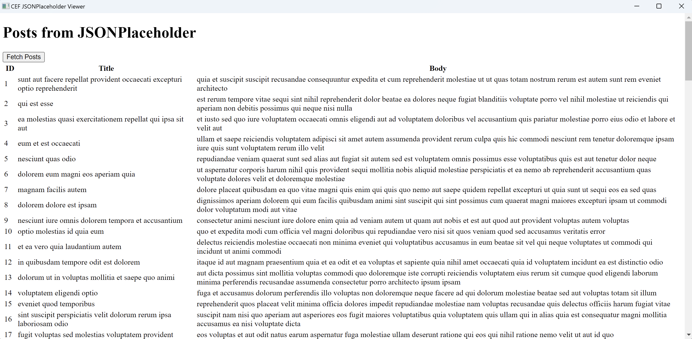
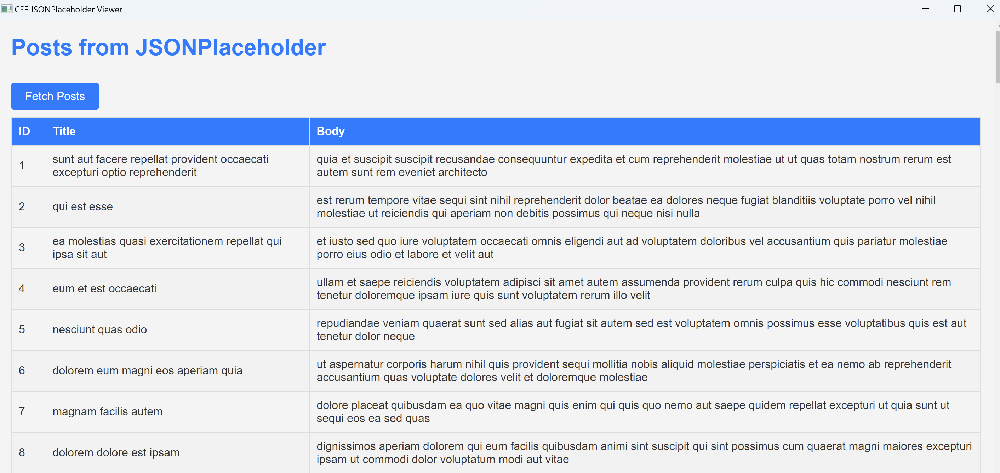

## Introduction
The Chromium Embedded Framework (CEF) is a robust and versatile open-source framework that simplifies the embedding of Chromium-based web browsers into other applications. Primarily written in C++, CEF enables developers to seamlessly integrate web functionalities into desktop programs. It leverages modern web technologies, enriching user interfaces with dynamic web content and utilizing a familiar web development stack in desktop application development. CEF's widespread adoption is attributed to its high performance, extensive features, and ability to deliver consistent, cross-platform web experiences in native applications.

In this learning path, you will learn how to create a desktop application for Windows on Arm64. This application will fetch and display data from `JSONPlaceholder`, a mock REST API for demonstration purposes. Fetching and displaying data from an API is a standard functionality in web applications, and through this process, you will learn how to effectively utilize web technologies in a desktop app.

## Before you begin
Before you begin make sure to install the following:
1. CMake for Arm64 [link](https://github.com/Kitware/CMake/releases/download/v3.28.1/cmake-3.28.1-windows-arm64.msi). During an installation check **Add CMake to the system PATH for the current user** as show below



2. Visual Studio 2022 with Desktop development with C++ workload.

## Prepare the project
Start by downloading the Standard Distribution of the CEF binary for [Windows on Arm64](https://cef-builds.spotifycdn.com/index.html#windowsarm64). In this learning path, you will use the following CEF version: 
120.1.10+g3ce3184+chromium-120.0.6099.129 / Chromium 120.0.6099.129.

Then, extract the downloaded file to a folder. Right-click the downloaded file, select 'Extract all...', and name the folder 'cef-binary'. Once the extraction process completes, you will find a folder named 'cef_binary_120.1.10+g3ce3184+chromium-120.0.6099.129_windowsarm64' within 'cef-binary'. Note that the exact name might differ if you download a different CEF version.

Next, rename the folder `cef_binary_120.1.10+g3ce3184+chromium-120.0.6099.129_windowsarm64` to `windowsarm64` for simplicity.

Now, use CMake to prepare the build files for Visual Studio 2022 and the Arm64 architecture. Open the Command Prompt or a Terminal, and proceed with the following steps:

```console
cd <PATH_TO_CEF_BINARY>
cd windowsarm64

cmake -G "Visual Studio 17" -A arm64 -B build
```
Replace <PATH_TO_CEF_BINARY> in the command above to the directory path on your machine where you downloaded the CEF binary.

The output of this command will look like:

```output
C:\cef_binary\windowsarm64>cmake -G "Visual Studio 17" -A arm64 -B build
-- Selecting Windows SDK version 10.0.22621.0 to target Windows 10.0.22631.
-- The C compiler identification is MSVC 19.38.33133.0
-- The CXX compiler identification is MSVC 19.38.33133.0
-- Detecting C compiler ABI info
-- Detecting C compiler ABI info - done
-- Check for working C compiler: C:/Program Files/Microsoft Visual Studio/2022/Community/VC/Tools/MSVC/14.38.33130/bin/Hostarm64/arm64/cl.exe - skipped
-- Detecting C compile features
-- Detecting C compile features - done
-- Detecting CXX compiler ABI info
-- Detecting CXX compiler ABI info - done
-- Check for working CXX compiler: C:/Program Files/Microsoft Visual Studio/2022/Community/VC/Tools/MSVC/14.38.33130/bin/Hostarm64/arm64/cl.exe - skipped
-- Detecting CXX compile features
-- Detecting CXX compile features - done
-- *** CEF CONFIGURATION SETTINGS ***
-- Generator:                    Visual Studio 17 2022
-- Platform:                     Windows
-- Project architecture:         arm64
-- Binary distribution root:     C:/cef_binary/windowsarm64
-- Visual Studio ATL support:    ON
-- CEF sandbox:                  ON
-- Standard libraries:           comctl32.lib;gdi32.lib;rpcrt4.lib;shlwapi.lib;ws2_32.lib;Advapi32.lib;dbghelp.lib;Delayimp.lib;ntdll.lib;OleAut32.lib;PowrProf.lib;Propsys.lib;psapi.lib;SetupAPI.lib;Shell32.lib;Shcore.lib;Userenv.lib;version.lib;wbemuuid.lib;WindowsApp.lib;winmm.lib
-- Compile defines:              __STDC_CONSTANT_MACROS;__STDC_FORMAT_MACROS;WIN32;_WIN32;_WINDOWS;UNICODE;_UNICODE;WINVER=0x0A00;_WIN32_WINNT=0x0A00;NTDDI_VERSION=NTDDI_WIN10_FE;NOMINMAX;WIN32_LEAN_AND_MEAN;_HAS_EXCEPTIONS=0;PSAPI_VERSION=1;CEF_USE_SANDBOX;CEF_USE_ATL
-- Compile defines (Debug):      _HAS_ITERATOR_DEBUGGING=0
-- Compile defines (Release):    NDEBUG;_NDEBUG
-- C compile flags:              /MP;/Gy;/GR-;/W4;/WX;/wd4100;/wd4127;/wd4244;/wd4324;/wd4481;/wd4512;/wd4701;/wd4702;/wd4996;/Zi
-- C compile flags (Debug):      /MTd;/RTC1;/Od
-- C compile flags (Release):    /MT;/O2;/Ob2;/GF
-- C++ compile flags:            /MP;/Gy;/GR-;/W4;/WX;/wd4100;/wd4127;/wd4244;/wd4324;/wd4481;/wd4512;/wd4701;/wd4702;/wd4996;/Zi /std:c++17
-- C++ compile flags (Debug):    /MTd;/RTC1;/Od
-- C++ compile flags (Release):  /MT;/O2;/Ob2;/GF
-- Exe link flags:                /MANIFEST:NO;/LARGEADDRESSAWARE;/DELAYLOAD:api-ms-win-core-winrt-error-l1-1-0.dll;/DELAYLOAD:api-ms-win-core-winrt-l1-1-0.dll;/DELAYLOAD:api-ms-win-core-winrt-string-l1-1-0.dll;/DELAYLOAD:advapi32.dll;/DELAYLOAD:comctl32.dll;/DELAYLOAD:comdlg32.dll;/DELAYLOAD:credui.dll;/DELAYLOAD:cryptui.dll;/DELAYLOAD:d3d11.dll;/DELAYLOAD:d3d9.dll;/DELAYLOAD:dwmapi.dll;/DELAYLOAD:dxgi.dll;/DELAYLOAD:dxva2.dll;/DELAYLOAD:esent.dll;/DELAYLOAD:gdi32.dll;/DELAYLOAD:hid.dll;/DELAYLOAD:imagehlp.dll;/DELAYLOAD:imm32.dll;/DELAYLOAD:msi.dll;/DELAYLOAD:netapi32.dll;/DELAYLOAD:ncrypt.dll;/DELAYLOAD:ole32.dll;/DELAYLOAD:oleacc.dll;/DELAYLOAD:propsys.dll;/DELAYLOAD:psapi.dll;/DELAYLOAD:rpcrt4.dll;/DELAYLOAD:rstrtmgr.dll;/DELAYLOAD:setupapi.dll;/DELAYLOAD:shell32.dll;/DELAYLOAD:shlwapi.dll;/DELAYLOAD:uiautomationcore.dll;/DELAYLOAD:urlmon.dll;/DELAYLOAD:user32.dll;/DELAYLOAD:usp10.dll;/DELAYLOAD:uxtheme.dll;/DELAYLOAD:wer.dll;/DELAYLOAD:wevtapi.dll;/DELAYLOAD:wininet.dll;/DELAYLOAD:winusb.dll;/DELAYLOAD:wsock32.dll;/DELAYLOAD:wtsapi32.dll;/STACK:0x800000
-- Exe link flags (Debug):       /DEBUG
-- Exe link flags (Release):
-- Shared link flags:
-- Shared link flags (Debug):    /DEBUG
-- Shared link flags (Release):
-- CEF Binary files:             chrome_elf.dll;d3dcompiler_47.dll;libcef.dll;libEGL.dll;libGLESv2.dll;snapshot_blob.bin;v8_context_snapshot.bin;vk_swiftshader.dll;vk_swiftshader_icd.json;vulkan-1.dll
-- CEF Resource files:           chrome_100_percent.pak;chrome_200_percent.pak;resources.pak;icudtl.dat;locales
-- Could NOT find Doxygen (missing: DOXYGEN_EXECUTABLE)
CMake Warning at CMakeLists.txt:254 (message):
  Doxygen must be installed to generate API documentation.


-- Configuring done (3.1s)
-- Generating done (0.0s)
-- Build files have been written to: C:/cef_binary/windowsarm64/build
```

## Build the project
The previous command has generated the build files in the 'build' subfolder within 'cef_binary/windowsarm64'. To build the project, use the following CMake command in the console:

```console
cmake --build build
```

This command compiles the project, including sample applications such as `cefsimple`. This particular application creates a browser window and renders an HTML website. It is composed of several components, including the `SimpleApp` class, which is crucial for managing process-level callbacks in a CEF-based application. `SimpleApp` offers a variety of interfaces and methods crucial for multiple processes, along with some that are specific to certain process types. For example, the `CefBrowserProcessHandler interface` is unique to the browser process. The `GetBrowserProcessHandler()` method in `SimpleApp` must return a reference to `SimpleApp` itself since it implements both `CefApp` and `CefBrowserProcessHandler`. This ensures that appropriate handlers are accessible in the correct process context. For more detailed information about this application, visit the CEF project's [website](https://bitbucket.org/chromiumembedded/cef/wiki/GeneralUsage.md#markdown-header-sample-application).

## Launching the application
Let's run the `cefsimple` application. The binaries can be found under the `build\tests\cefsimple\Debug` folder. For example, the path might be something like `C:\cef_binary\windowsarm64\build\tests\cefsimple\Debug`, but this could vary based on your specific setup.

By default, the application renders the Google homepage:



## Modify the application
You will now modify the `cefsimple` application to render a custom page. This page will fetch data from `JSONPlaceholder` and display it in a table.

First, close the `cefsimple` application if it's running. Then, locate and open the `simple_app.cc` file, under the `cef_binary\windowsarm64\tests\cefsimple` folder. Scroll down to the definition of the `SimpleApp` class, and modify the `OnContextInitialized` method. Change the URL from http://www.google.com to `file://c:\web\index.html`. (Note: Replace this path with the actual location of your custom HTML file.):

```cpp
void SimpleApp::OnContextInitialized() {
  CEF_REQUIRE_UI_THREAD();

  CefRefPtr<CefCommandLine> command_line =
      CefCommandLine::GetGlobalCommandLine();

  // Create the browser using the Views framework if "--use-views" is specified
  // via the command-line. Otherwise, create the browser using the native
  // platform framework.
  const bool use_views = command_line->HasSwitch("use-views");

  // SimpleHandler implements browser-level callbacks.
  CefRefPtr<SimpleHandler> handler(new SimpleHandler(use_views));

  // Specify CEF browser settings here.
  CefBrowserSettings browser_settings;

  std::string url;

  // Check if a "--url=" value was provided via the command-line. If so, use
  // that instead of the default URL.
  url = command_line->GetSwitchValue("url");
  if (url.empty()) {
    //url = "http://www.google.com";
    url = "file://c:\\web\\index.html";
  }

  if (use_views) {
    // Create the BrowserView.
    CefRefPtr<CefBrowserView> browser_view = CefBrowserView::CreateBrowserView(
        handler, url, browser_settings, nullptr, nullptr,
        new SimpleBrowserViewDelegate());

    // Create the Window. It will show itself after creation.
    CefWindow::CreateTopLevelWindow(new SimpleWindowDelegate(browser_view));
  } else {
    // Information used when creating the native window.
    CefWindowInfo window_info;

#if defined(OS_WIN)
    // On Windows we need to specify certain flags that will be passed to
    // CreateWindowEx().
    window_info.SetAsPopup(nullptr, "cefsimple");
#endif

    // Create the first browser window.
    CefBrowserHost::CreateBrowser(window_info, handler, url, browser_settings,
                                  nullptr, nullptr);
  }
}

CefRefPtr<CefClient> SimpleApp::GetDefaultClient() {
  // Called when a new browser window is created via the Chrome runtime UI.
  return SimpleHandler::GetInstance();
}
```

Make sure to save the `simple_app.cc` file after making your changes. Then, to rebuild the project, open your Command Prompt or Terminal, navigate to your build directory, and type the following command:

```console
cmake --build build
```

This command will compile the updated code and rebuild the `cefsimple` application with your modifications. Remember, it's important to be in the directory where your CMake build files are located when executing this command.

### Custom webpage
You will now create a custom index.html file to fetch data from the JSONPlaceholder:
1. Create the new folder `C:\web`.  
2. Under `C:\web` create a new file `index.html` and modify it as follows:

```HTML
<!DOCTYPE html>
<html>
<head>
    <title>CEF JSONPlaceholder Viewer</title>    
    <script>
        function fetchPosts() {
            fetch('https://jsonplaceholder.typicode.com/posts')
                .then(response => response.json())
                .then(posts => {
                    let tableContent = posts.map(post => 
                        `<tr><td>${post.id}</td><td>${post.title}</td><td>${post.body}</td></tr>`
                    ).join('');
                    document.getElementById('postsTable').innerHTML = tableContent;
                })
                .catch(error => console.error('Error:', error));
        }
    </script>
</head>
<body>
    <h1>Posts from JSONPlaceholder</h1>
    <button onclick="fetchPosts()">Fetch Posts</button>
    <table>
        <thead>
            <tr>
                <th>ID</th>
                <th>Title</th>
                <th>Body</th>
            </tr>
        </thead>
        <tbody id="postsTable">
            <!-- Posts will be loaded here -->
        </tbody>
    </table>
</body>
</html>
```

Re-run the application, and you will see the following:



This example demonstrates the versatility and power of CEF applications. One of their key strengths is the ability to modify the rendered content dynamically. This means you can change what's displayed in the application, like updating the HTML or CSS, without having to rebuild the entire application each time. This feature significantly streamlines the development process, making it quicker and more efficient.

Let's leverage this capability to enhance our application. You will focus on styling the application by updating the HTML and CSS, providing a more engaging and visually appealing user interface. This step will show how easily you can improve the look and feel of your CEF application with just a few modifications to the web content.

### Style the application
Add `styles.css` file to modify the appearance of the application:
1. In the `C:\web\` folder create a new file `styles.css` with the content below:

```CSS
body {
    font-family: Arial, sans-serif;
    margin: 20px;
    background-color: #f4f4f4;
    color: #333;
}

h1 {
    color: #007bff;
}

table {
    width: 100%;
    border-collapse: collapse;
}

table, th, td {
    border: 1px solid #ddd;
}

th, td {
    padding: 10px;
    text-align: left;
}

th {
    background-color: #007bff;
    color: white;
}

tr:nth-child(even) {
    background-color: #f2f2f2;
}

button {
    background-color: #007bff;
    color: white;
    padding: 10px 20px;
    border: none;
    border-radius: 5px;
    cursor: pointer;
    font-size: 16px;
    margin: 10px 0;
}

button:hover {
    background-color: #0056b3;
}
```

2. Modify `index.html` to reference `styles.css` as shown:

```HTML
<!DOCTYPE html>
<html>
<head>
    <title>CEF JSONPlaceholder Viewer</title>
    <link rel="stylesheet" type="text/css" href="styles.css">
    <!--Other contents of the index.html file-->
</head>
```

After re-running the application you will see the following:



## Summary
CEF is a powerful tool for integrating web browser functionalities into desktop applications, utilizing modern web technologies. You have learnt how to setup a project, create a basic application, and using CMake for CEF projects. Additionally, you explored more advanced features like fetching and displaying data from JSONPlaceholder, adding and styling HTML elements like tables and buttons through separate CSS files all on your Windows on Arm machine.
