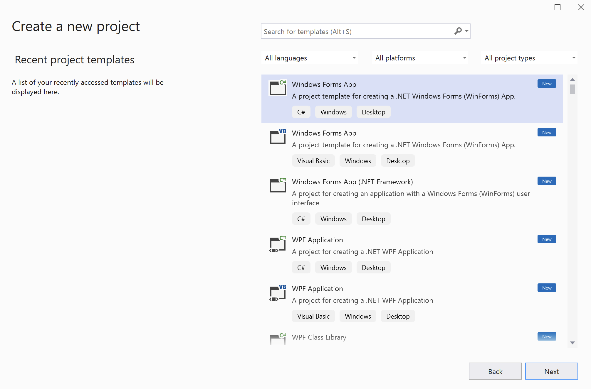
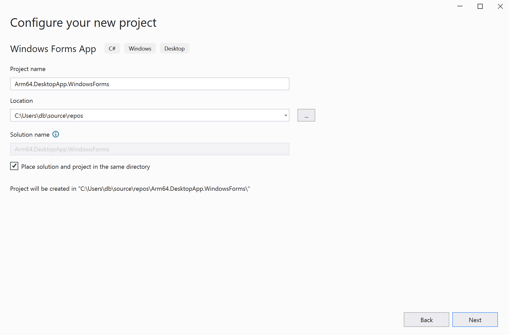
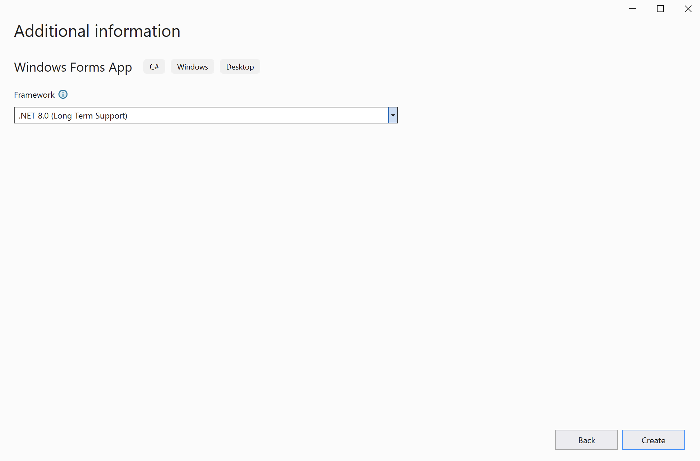
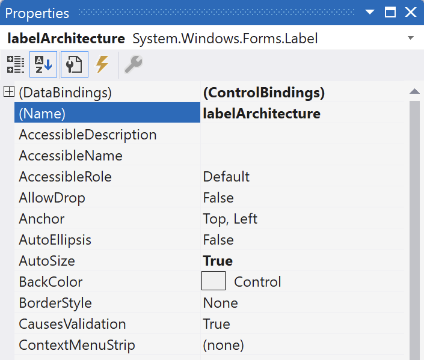

## Introduction
Windows Forms, often referred to as WinForms, is a graphical (GUI) class library included as part of Microsoft's .NET Framework. It provides a rich set of controls and components that enable developers to create desktop applications for Windows operating systems with ease. Windows Forms applications are event-driven, meaning they respond to various events such as user actions (like mouse clicks or key presses) and system-generated notifications. This platform offers a robust drag-and-drop environment in Visual Studio, simplifying UI design without requiring extensive manual coding. Its versatility and integration with the .NET Framework make Windows Forms a popular choice for building feature-rich Windows applications with a familiar look and feel.

In addition to being a part of the Microsoft .NET Framework, Windows Forms (WinForms) is also available in .NET, which is the open-source, cross-platform successor to the .NET Framework. This inclusion ensures that developers can utilize WinForms not only in the traditional .NET Framework environment but also in the modern, more flexible .NET ecosystem. This availability broadens the scope for building desktop applications for Windows, allowing developers to leverage the rich GUI capabilities of WinForms along with the advanced features and improvements found in the .NET platform.

In this learning path, you will learn how to use WinForms to create a desktop application. The application will perform computation-intensive operations, such as matrix multiplication. Then, you will explore how Windows on Arm can be used to accelerate the application by comparing the computation time with that of x64 systems.

You can find the complete code used in this learning path in [this repository](https://github.com/dawidborycki/Arm64.DesktopApp.WindowsForms.git).

## Before you begin
Before you begin, install Visual Studio 2022 with .NET Desktop Development workload.

## Create the project
Start by creating the project. Open Visual Studio and then click 'Create a new project'. 


In the 'Create a new project' window, select the 'Windows Forms App' template. 



This will open the 'Configure your new project' view, in which you should configure the project as follows (refer to the figure below):

1. Project name: **Arm64.DesktopApp.WindowsForms**
2. Location: Select the project location on your drive (example: **C:\Users\db\source\repos**)
3. Check the option **Place solution and project in the same directory**
4. Click the **Next** button



In the final step, 'Additional Information', select **.NET 8.0 (Long-Term Support)** from the 'Framework' dropdown list. Then, click the **Create** button. 



Your project is now ready. Next, you will create the user interface and then implement the application logic.

## User interface
To create the user interface proceed as follows:
1. In Visual Studio click, View > Toolbox. A Toolbox will appear on the left.
2. From the toolbox, drag the following controls onto the **Form1** window: 
* three labels 
* two NumericUpDown controls
* one Button
* one ListBox
3. Position the controls as shown in the figure below:


4. Right-click the first label and select the Properties from the context menu 
5. In the Properties window, change the (Name) property to **labelArchitecture**:



6. Similarly, rename the ListBox from **listBox1** to **listBoxResults**
7. Modify the properties of the first NumericUpDown control as follows:
* (Name): numericUpDownMatrixSize
* Increment: 100
* Minimum: 100
* Maximum: 1000

8. Modify the properties of the second NumericUpDown control as follows:
* (Name): numericUpDownExecutionCount
* Increment: 10
* Minimum: 10
* Maximum: 100

9. Change the Text property of the button to **Start**

{} You can use the TableLayoutPanel control to host other controls. By doing so, the controls will automatically resize and reposition when the user changes the size of the window.{}

## Application logic

You will now implement the application logic.

1. Start by opening the Solution Explorer (click View > Solution Explorer) 
2. In Solution Explorer window, right-click Arm64.DesktopApp.WindowsForms and select Add -> New Folder from the context menu 
3. Rename the new folder to Helpers
4. Right-click the Helpers folder and select Add -> Class. This will open the Add New Item window. Type `MatrixHelper.cs` in the Name text box and then click the **Add** button.
5. A file named `MatrixHelper.cs` will be added to the solution. Modify this file as follows:

```cs
namespace Arm64.DesktopApp.WindowsForms.Helpers
{
    public static class MatrixHelper
    {
        private static readonly Random random = new();

        private static double[,] GenerateRandomMatrix(int matrixSize)
        {            
            var matrix = new double[matrixSize, matrixSize];

            for (int i = 0; i < matrixSize; i++)
            {
                for (int j = 0; j < matrixSize; j++)
                {
                    matrix[i, j] = random.NextDouble();
                }
            }

            return matrix;
        }

        private static double[,] MatrixMultiplication(double[,] matrix1, double[,] matrix2)
        {
            if (matrix1.Length != matrix2.Length)
            {
                throw new ArgumentException("The matrices must be of equal size");
            }

            if (matrix1.GetLength(0) != matrix1.GetLength(1) || matrix2.GetLength(0) != matrix2.GetLength(1))
            {
                throw new ArgumentException("The matrices must be square");
            }

            int matrixSize = matrix2.GetLength(0);

            var result = new double[matrixSize, matrixSize];

            for (int i = 0; i < matrixSize; i++)
            {
                for (int j = 0; j < matrixSize; j++)
                {
                    result[i, j] = 0;

                    for (int k = 0; k < matrixSize; k++)
                    {
                        result[i, j] += matrix1[i, k] * matrix2[k, j];
                    }
                }
            }

            return result;
        }

        public static void SquareMatrixMultiplication(int matrixSize)
        {
            var matrix1 = GenerateRandomMatrix(matrixSize);
            var matrix2 = GenerateRandomMatrix(matrixSize);

            MatrixMultiplication(matrix1, matrix2);
        }
    }
}
```

6. Similarly, under the 'Helpers' folder, create a file named `PerformanceHelper.cs`:

```cs
using System.Diagnostics;

namespace Arm64.DesktopApp.WindowsForms.Helpers
{
    public static class PerformanceHelper
    {
        private static readonly Stopwatch stopwatch = new();

        public static double MeasurePerformance(Action method, int executionCount)
        {
            stopwatch.Restart();

            for (int i = 0; i < executionCount; i++)
            {
                method();
            }

            stopwatch.Stop();

            return stopwatch.ElapsedMilliseconds;
        }
    }
}
```

The above code implements two classes: `MatrixHelper` and `PerformanceHelper`. The `MatrixHelper` class implements two private methods: `MatrixMultiplication` and `GenerateRandomMatrix`. The `MatrixMultiplication` method takes two square matrices as input and calculates their product using the mathematical formula explained [here](https://en.wikipedia.org/wiki/Matrix_multiplication). Three 'for' loops are used and the result of the matrix multiplication is stored in the variable result, which is returned by the `MatrixMultiplication` method. The `GenerateRandomMatrix` method is used to generate a square matrix with elements pseudo-randomly generated using the `NextDouble` method of the Random class. Finally, the `MatrixHelper` class also implements the `SquareMatrixMultiplication` method, which generates two matrices of a given size and then calculates their product.

The `PerformanceHelper` class has one method, MeasurePerformance. This method works by invoking a function using the Action delegate, passed as the first parameter of the MeasurePerformance method. The function is invoked several times (as specified by the second parameter, executionCount). After that, the MeasurePerformance method returns the time taken to execute the specific code. To measure the execution time, you will use the System.Diagnostics.Stopwatch class. Specifically, an instance of this class has two useful methods: Restart and Stop. Restart resets and starts the stopwatch, while Stop halts the stopwatch, allowing us to read the time elapsed since the last restart.

You will now use the previously implemented classes to create the event handler for the button. Proceed as follows:
1. Open 'Form1.cs' in Visual Studio, and then double-click the Start button. Visual Studio will automatically generate the buttonStart_Click method, which you will need to modify as follows:

```cs
private void buttonStart_Click(object sender, EventArgs e)
{
    int matrixSize = Convert.ToInt32(numericUpDownMatrixSize.Value);
    int executionCount = Convert.ToInt32(numericUpDownExecutionCount.Value);
            
    var executionTime = PerformanceHelper.MeasurePerformance(
        () => MatrixHelper.SquareMatrixMultiplication(matrixSize),
        executionCount);

    listBoxResults.Items.Add($"Size: {matrixSize}, Count: {executionCount}, " +
        $"Time: {executionTime} ms");
}
```

2. Modify the Form1 constructor as shown below:

```cs
public Form1()
{
    InitializeComponent();

    labelArchitecture.Text = $"Processor architecture: {Environment.GetEnvironmentVariable("PROCESSOR_ARCHITECTURE")}";

    Text = "ARM";
}
```

The above changes will do the following: Firstly, when the application starts, the first label will display the processor architecture. To obtain the processor architecture, use the PROCESSOR_ARCHITECTURE environment variable, which is set by the .NET runtime. Then, update the caption of the window to 'ARM'.

When the application is running and the user clicks the Start button, the application will read the values from the `NumericUpDown` controls. These values will be used to set the matrix size and the execution count. Given these values, the application will invoke the MeasurePerformance static method of the PerformanceHelper class to measure the time needed to perform matrix multiplication for the given matrix size and execution time. The computation time will then be added to the list box.

## Run the application
The application is now ready to run. To do this, click 'Debug' > 'Start Debugging'. Visual Studio will then build and launch the application. Afterwards, click 'Start'. Then, change the matrix size to 200 and click the 'Start' button again. Repeat this process for matrix sizes of 300, 400, and 500. The results should appear as shown in the following figure:


By default, the application uses the Arm64 configuration. For each matrix size, you will observe the computation time. In the next step, you will learn how to change the build configuration to x64. This will allow you to compare the results with those obtained using x64.
