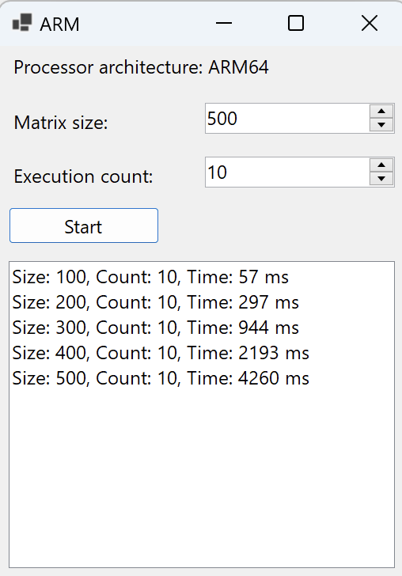

## Objective
In this section, you will change the build configuration of the application and then launch it using various settings to compare the matrix multiplication computation times.

## Creating new build configurations
To change the build configuration, click the target platform dropdown (by default, it displays 'Any CPU'), and then select 'Configuration Manager...':

In the Configuration Manager, select '<New ...>' from the Active solution platform dropdown:

This will open the 'New Solution Platform' window, where you should select ARM64 from the 'Type or select the new platform' dropdown:

Then, click the OK button. Similarly, create the x64 solution platform

## Comparing the performance
You will now compare the computation performance on x64 and Arm64 platforms. First, start the application in Release mode, and architecture set to x64:

Once the application has started, run calculations for the following matrix sizes: 100, 200, 300, 400, and 500. You should see results similar to those in the following figure.

Afterwards, launch the application for the Arm64 platform. Run the matrix multiplication for the same matrix sizes as above and observe the computation times:

By comparing the execution times, we observe that, on average, Arm64 provides almost a 30% performance improvement over x64.

## Summary
In this learning path, we focused on developing and optimizing a desktop application using Windows Forms in .NET on Arm64, particularly for matrix multiplication operations. 

We began by understanding the basics of Windows Forms, a GUI class library in .NET, and its role in developing desktop applications. Then, we discussed the steps to create a new Windows Forms project in Visual Studio, including setting up the project environment and selecting the appropriate .NET Framework version.

Afterwards, we created the user interface of the application. This involved using the Visual Studio Toolbox to add and configure various controls like labels, NumericUpDown controls, buttons, and a ListBox.

Subsequently, we implemented application logic. This included creating and modifying specific classes and methods, such as `MatrixHelper` for matrix operations and `PerformanceHelper` for measuring execution performance. Detailed steps were given on setting up an event handler for the application's Start button, which was crucial for triggering matrix multiplication computations.

The application was configured and run in different modes (x64 and Arm64) to compare the performance in matrix multiplication tasks. This comparison was essential to understand the efficiency and speed of execution in different architectural settings. It was noted that the Arm64 platform showed a significant improvement in computation times compared to the x64 platform, highlighting the effectiveness of the application's design and optimization.

In summary, this learning path provided a comprehensive guide on developing a Windows Forms application, from its initial setup and UI design to implementing logic, handling events, and analyzing performance across different system architectures.