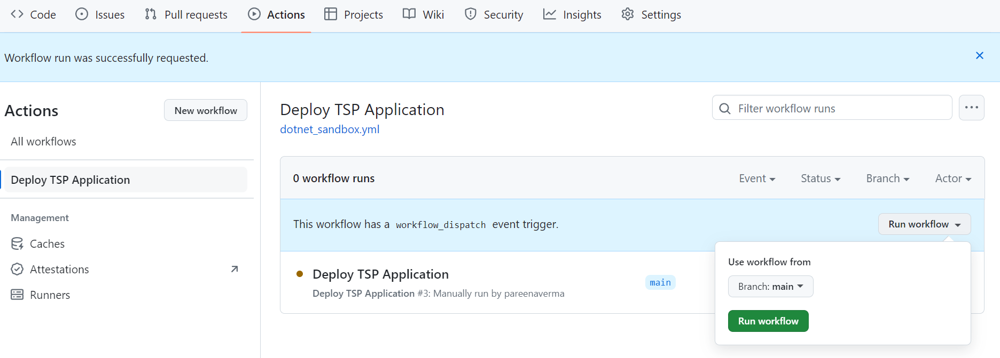
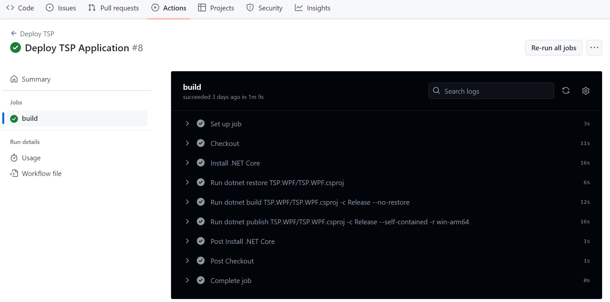

---
# User change
title: "Build and run the .NET application using the GitHub Actions workflow"

weight: 3

layout: "learningpathall"
---

## Objective
In this section you will run the CI/CD pipeline to verify that you are able to build and run the .NET application on your Windows Sandbox self-hosted runner.

## CI/CD pipeline
The CI/CD pipeline is declared under the `.github/workflows/dotnet_sandbox.yml` file. This YAML configuration defines a CI/CD pipeline for an .NET core project using GitHub Actions. It specifies actions to be triggered manually or on push to the main branch. This is indicated at the top of the YAML declaration:
```XML
on:
  push: 
    branches: [ main ]
# Allows you to run this workflow manually from the Actions tab
  workflow_dispatch:
```

The pipeline consists of one job: build. This job runs on the self-hosted runner as shown in the file below:

```XML
jobs:

  build:

    runs-on: self-hosted  
```
The job includes the following steps:
1. Checking out the code using actions/checkout@v4.
2. Setting up .NET using actions/setup-dotnet@v4.
3. Building the project in Release configuration using the dotnet build -c Release command
4. Publishing the project in Release configuration using the dotnet publish -c Release command

```XML
steps:
    - name: Checkout
      uses: actions/checkout@v4

    # Install the .NET Core workload
    - name: Install .NET Core
      uses: actions/setup-dotnet@v4
      with:
        dotnet-version: 8.0.x

    - run: dotnet restore ${{ env.Project_Path }}

    - run: dotnet build ${{ env.Project_Path }} -c Release --no-restore

    - run: dotnet publish ${{ env.Project_Path }} -c Release --self-contained -r win-arm64
```

This pipeline automates the process of building the .NET application and publishing it on your self-hosted runner.

## Run the pipeline
To run the above pipeline, you can either make modifications to the source code and commit these changes to the main branch, or you can trigger the pipeline manually. 

Follow the steps below to trigger the pipeline manually:

* Click on the Actions Tab of your repository.
* Your workflow named "Deploy TSP Application" appears.
* Click on the "Run workflow" drop-down and select the "Run workflow" button.



This triggers the CI/CD pipeline. You can monitor the progress of this pipeline under the Actions tab of your GitHub repository:



To check that your application has been published correctly in the last step, you can go to the location of the application inside Windows Sandbox and run it.

The application should be published in your runner folder under "actions-runner\_work\sandbox-ci-cd-net\sandbox-ci-cd-net\TSP.WPF\bin\Release\net8.0-windows7.0\win-arm64\publish\".

Double-click TSP.WPF to run the application. The application starts as shown:


This process demonstrates how you can seamlessly integrate Windows Sandbox with GitHub Actions to automate the build and deployment of your application.

