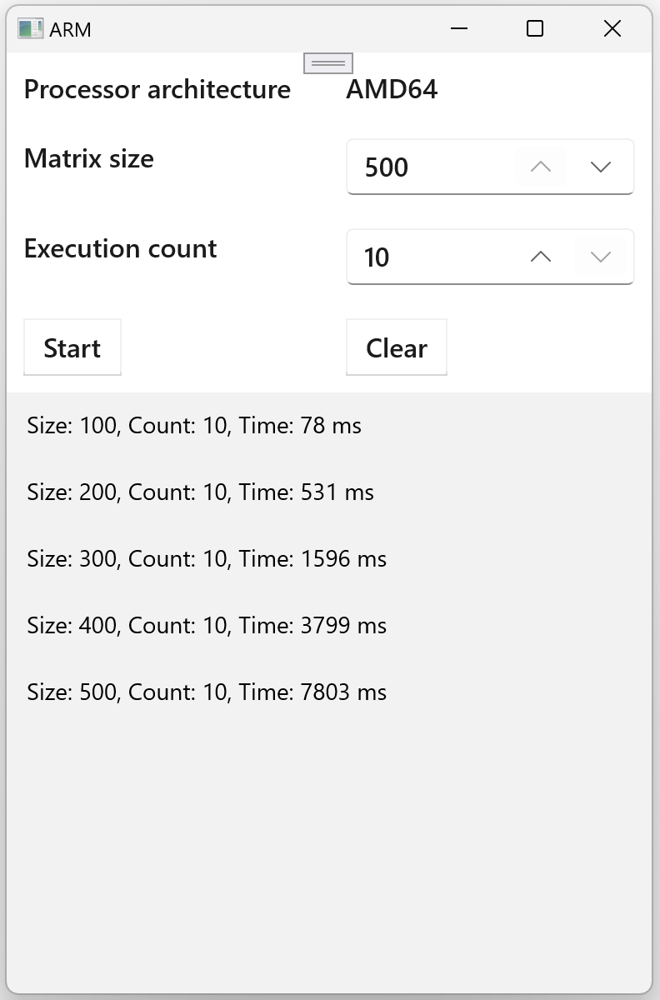
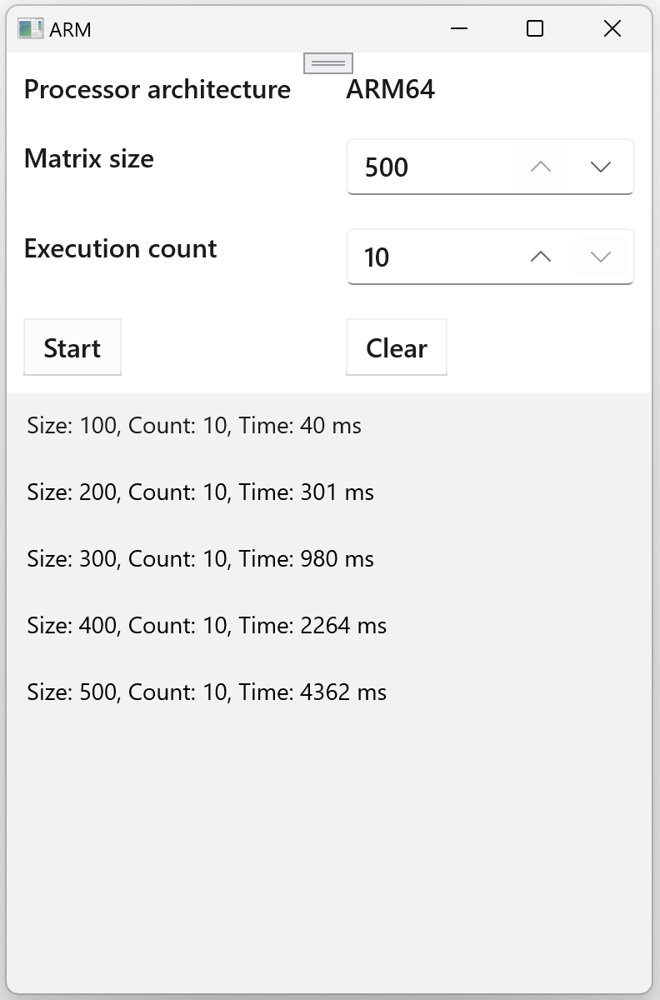

## Objective
In this section, you will launch the application using different settings to compare matrix multiplication computation times.

## Launching the application
To run the application, use the dropdown lists in Visual Studio:

Ensure you change the 'Configuration mode' to 'Release'. Then, select the architecture - either 'x64' or 'ARM64' - and click on 'Arm64.WinUIApp (Package)'.

## Comparing the performance
Now, you will compare the computation performance on x64 and ARM64 platforms. First, launch the application for x64. After it starts, perform calculations for the following matrix sizes: 100, 200, 300, 400, and 500. The results should resemble those in the figure below.

Next, launch the application for the ARM64 platform. Execute matrix multiplication for the same matrix sizes as above and note the computation times:

Upon comparing the execution times, it is observed that ARM64, on average, provides almost a 50% performance improvement over x64.

## Summary
In this learning path, we focused on various aspects of WinUI 3 app development. We started by discussing WinUI 3, highlighting its role as a modern UI framework for Windows apps, emphasizing its features like the Fluent Design System, unified development experience, and compatibility with various app types.

We covered the initial steps necessary to start developing a WinUI 3 app, including installing Visual Studio 2022 with the appropriate workloads (.NET desktop development and Universal Windows Platform development) and selecting specific components like the Windows App SDK C# Templates.

Instructions were provided on how to create a new WinUI 3 project in Visual Studio, including selecting the 'Blank App, Packaged (WinUI 3 in Desktop)' template and configuring project settings like the project name and location.

We discussed how to add styles to a WinUI 3 application, focusing on defining and applying XAML styles in the App.xaml file for various UI elements like TextBlock, NumberBox, Button, and ListBox.

Guidance was given on how to programmatically set the size of a WinUI 3 application window using the `AppWindow.Resize` method.

We reviewed a proposed implementation plan for the application's logic, including creating helper classes for matrix operations and performance measurement, and implementing event handlers for UI controls.

We concluded with a discussion on creating event handlers for button actions and dynamically reading and displaying processor architecture, along with resizing the application window. Finally, the application was run in different modes (x64 and Arm64) to compare the performance in matrix multiplication tasks. This comparison was essential to understand the efficiency and speed of execution in different architectural settings. It was noted that the Arm64 platform showed a significant improvement in computation times compared to the x64 platform, highlighting the effectiveness of the application's design and optimization.

Throughout the learning path, we focused on clear and precise instructions, ensuring a foundational understanding of WinUI 3 app development, from setup and project creation to implementing specific features and functionalities.