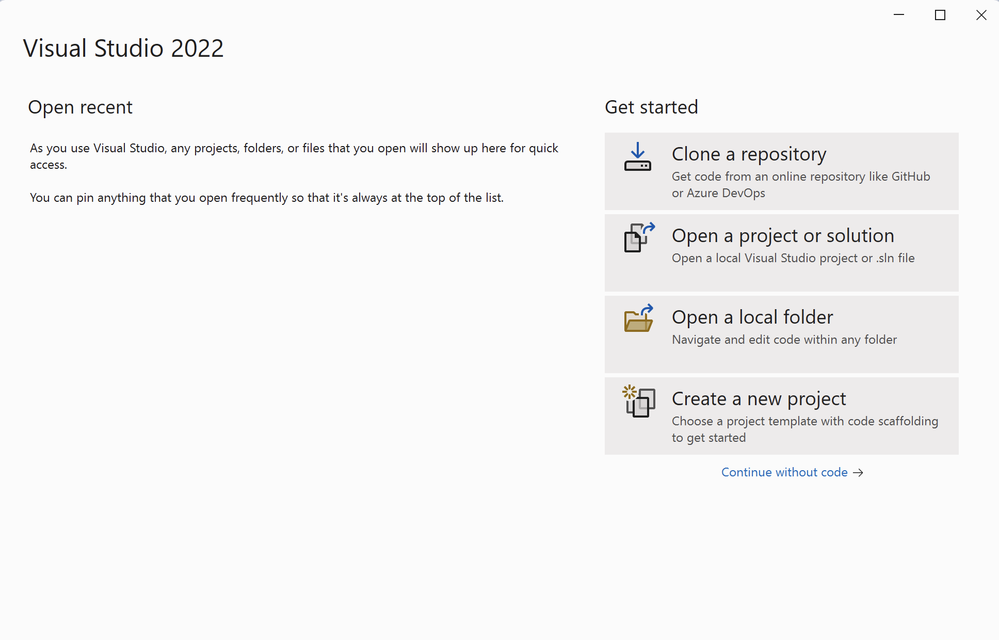
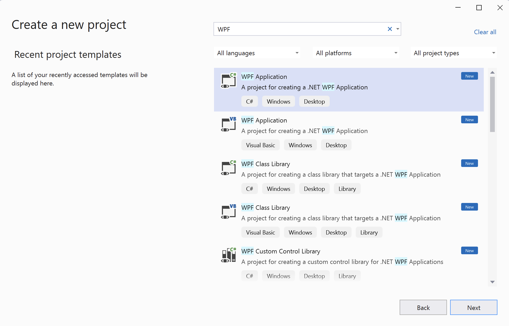

## Introduction
Windows Presentation Foundation (WPF) is a comprehensive framework for building modern desktop applications. WPF is designed to enable developers to create applications with rich user interfaces, integrating documents, media, two-dimensional and three-dimensional graphics. WPF uses Extensible Application Markup Language (XAML), a declarative XML-based language, to define and link various UI elements.

One of the key features of WPF is its separation of business logic from the UI, enabling designers and developers to work simultaneously on the same project with minimal overlap. This separation is facilitated by the use of data binding, templates, and styles, making WPF applications highly customizable and easy to maintain.

WPF also supports a wide range of multimedia functionalities, including 2D and 3D graphics, animation, and audio and video playback, providing a robust framework for developing visually appealing applications. Additionally, it offers advanced features like hardware acceleration for graphical display and the integration of Direct3D elements, enhancing the performance and visual fidelity of applications.

Through its comprehensive feature set and the support for modern application development patterns, such as the Model-View-ViewModel (MVVM) pattern, WPF remains a powerful tool for building desktop applications on the Windows platform, even as newer technologies like .NET MAUI emerge.

In this learning path, you will create a WPF application from scratch. The application will perform the computationally intensive task of the multiply-add operation on two vectors. By measuring execution times of these operations, you will see the enhancements provided by Arm64 architecture-based devices. Along the way, you will learn how to use Syncfusion's chart library, a third-party tool, to create a column series chart demonstrating the computation times.

You can find the complete project code used in this learning path [here](https://github.com/dawidborycki/Arm64.DesktopApp.WPF).

## Create the project
You will now create the WPF project. Open Visual Studio and click Create a new project. 



In the next window, search for the WPF template. 



This will open the 'Configure your new project' view, in which you should configure the project as follows:

1. Project name: **Arm64.DesktopApp.WPF**
2. Location: Select the project location on your drive (example: **C:\Users\db\source\repos**)
3. Check the option **Place solution and project in the same directory**
4. Click the **Next** button


In the last step, Additional Information, choose the **.NET 8.0 (Long Term Support)** option. Finally, click the **Create** button. 


Your project should be now ready. Next, open the Solution Explorer (View -> Solution Explorer) to view the created project. It consists of the following elements:
1. App.xaml and App.xaml.cs. These files represent the entry point of the WPF application. App.xaml is used to define application-wide resources, such as styles, control templates, and other XAML resources. App.xaml.cs is the code-behind file for App.xaml and contains the application's startup logic, event handling for application-level events (like Startup, Exit, and DispatcherUnhandledException), and any other application-wide code.
2. MainWindow.xaml and MainWindow.xaml.cs. These files implement a main window that serves as the primary UI for the application. MainWindow.xaml is used to define the layout and elements of the main window, including controls like buttons, text boxes, and data grids. MainWindow.xaml.cs is the code-behind file that contains the logic to handle events and interactions within the main window.

Now that your project is set up, you are ready to begin development. As mentioned earlier the application will perform intense computational tasks. You will use the multiply add vector operations, implemented in the [.NET MAUI learning path](/learning-paths/laptops-and-desktops/win_net_maui). 

## Helpers
Start by creating two new helper classes: PerformanceHelper and VectorHelper. The first class will be used to measure code execution times, while the second class will implement vector operations.

Proceed as follows:
1. Open the Solution Explorer in Visual Studio, right-click on the Arm64.DesktopApp.WPF project, and then select Add -> New Folder. Rename the folder to Helpers.
2. Right-click the Helpers folder, and select Add -> New Item... This will open the Add New Item window, where you should type PerformanceHelper.cs and click the Add button:


3. Modify 'PerformanceHelper.cs' as follows:
```cs
using System.Diagnostics;

namespace Arm64.DesktopApp.WPF.Helpers
{
    public static class PerformanceHelper
    {
        private static readonly Stopwatch stopwatch = new();

        public static double MeasurePerformance(Action method, int executionCount)
        {
            stopwatch.Restart();

            for (int i = 0; i < executionCount; i++)
            {
                method();
            }

            stopwatch.Stop();

            return stopwatch.ElapsedMilliseconds;
        }
    }
}
```
4. Similarly, add the VectorHelper.cs. Then, modify the file as follows:
```cs
namespace Arm64.DesktopApp.WPF.Helpers
{
    public static class VectorHelper
    {
        private static readonly Random random = new();

        private static double[] GenerateRandomVector(int size, double minValue = 0, double maxValue = 1)
        {
            return Enumerable.Range(0, size)
                             .Select(_ => random.NextDouble() * (maxValue - minValue) + minValue)
                             .ToArray();
        }

        public static double[] AdditionOfProduct(int size, double minValue = 0, double maxValue = 1)
        {
            var a = GenerateRandomVector(size, minValue, maxValue);
            var b = GenerateRandomVector(size, minValue, maxValue);
            var c = GenerateRandomVector(size, minValue, maxValue);

            var result = new double[size];

            for (int i = 0; i < size; i++)
            {
                result[i] = a[i] * b[i] + c[i];
            }

            return result;
        }
    }
}
```

## Data Model
Now, you will create the data model class, ChartData, to represent points in the chart. Proceed as follows:
1. Open Solution Explorer and right-click on the Arm64.DesktopApp.WPF project.
2. Select Add -> New Folder. Rename the folder to Data.
3. Right-click the Data subfolder, and select Add -> New Item. This action opens the Add New Item window, in which you should set the file name to ChartData.cs.
4. Modify ChartData.cs as follows:
```cs
namespace Arm64.DesktopApp.WPF.Data
{
    public class ChartData
    {
        public int ExecutionCount { get; set; }

        public double ExecutionTime { get; set; }
    }
}
```

## User Interface
Before starting the UI design, install the Syncfusion.SfChart.WPF NuGet package in Visual Studio 2022. Follow these steps to complete the installation:

1. Open Visual Studio 2022 and access the Solution Explorer by navigating to View -> Solution Explorer.
2. In Solution Explorer, right-click on Dependencies under the Arm64.DesktopApp.WPF project. From the context menu, select Manage NuGet Packages... to open the NuGet Package Manager.
3. In the NuGet Package Manager, search for Syncfusion Chart WPF. Then select Syncfusion.SfChart.WPF from the results and click the Install button. Refer to the figure below for guidance:


4. A Preview Changes window will appear. Click the Apply button to confirm and proceed with the changes to the solution. The installation of the NuGet package will complete.

After installing the NuGet package, proceed to modify the application view. Namely, open MainWindow.xaml and modify it as follows:

```XML
<Window x:Class="Arm64.DesktopApp.WPF.MainWindow"
        xmlns="http://schemas.microsoft.com/winfx/2006/xaml/presentation"
        xmlns:x="http://schemas.microsoft.com/winfx/2006/xaml"
        xmlns:d="http://schemas.microsoft.com/expression/blend/2008"
        xmlns:mc="http://schemas.openxmlformats.org/markup-compatibility/2006"
        xmlns:local="clr-namespace:Arm64.DesktopApp.WPF"
        xmlns:syncfusion="http://schemas.syncfusion.com/wpf"
        mc:Ignorable="d"
        Title="MainWindow"
        Height="600"
        Width="600">

    <Window.Resources>
        <!--Styles for Labels, TextBoxes and Buttons-->
        <Style TargetType="Label">
            <Setter Property="FontSize"
                    Value="14" />
            <Setter Property="Margin"
                    Value="10" />
        </Style>

        <Style TargetType="TextBox">
            <Setter Property="FontSize"
                    Value="14" />
            <Setter Property="Margin"
                    Value="5" />
            <Setter Property="VerticalAlignment"
                    Value="Center" />
        </Style>

        <Style TargetType="Button">
            <Setter Property="FontSize"
                    Value="14" />
            <Setter Property="Margin"
                    Value="10" />
            <Setter Property="FontWeight"
                    Value="SemiBold" />
            <Setter Property="Width"
                    Value="150" />
        </Style>
    </Window.Resources>

    <Grid>
        <Grid.RowDefinitions>
            <RowDefinition Height="Auto" />
            <RowDefinition Height="Auto" />
            <RowDefinition Height="Auto" />
            <RowDefinition Height="Auto" />
            <RowDefinition Height="*" />
        </Grid.RowDefinitions>

        <Grid.ColumnDefinitions>
            <ColumnDefinition Width="*" />
            <ColumnDefinition Width="2*" />
        </Grid.ColumnDefinitions>

        <!-- Label for Displaying Processor Architecture -->
        <Label x:Name="LabelProcessorArchitecture"
               Content="Processor Architecture"
               Grid.ColumnSpan="2" />

        <!-- Label and TextBox for Vector Size -->
        <Label Content="Vector size:"
               Grid.Row="1" />
        <TextBox x:Name="TextBoxVectorSize"
                 Grid.Row="1"
                 Grid.Column="1"
                 Text="10000" />

        <!-- Label and TextBox for Execution Count -->
        <Label Content="Execution Count:"
               Grid.Row="2" />

        <TextBox x:Name="TextBoxExecutionCount"
                 Grid.Row="2"
                 Grid.Column="1"
                 Text="1000" />

        <!--Buttons-->
        <StackPanel Grid.Row="3"
                    Grid.ColumnSpan="2"
                    Margin="5"
                    Orientation="Horizontal">

            <Button x:Name="ButtonRunCalculations"
                    Content="Run calculations"
                    Click="ButtonRunCalculations_Click" />

            <Button x:Name="ButtonClearResults"
                    Content="Clear results"
                    Click="ButtonClearResults_Click" />

        </StackPanel>

        <!--Column chart-->
        <syncfusion:SfChart x:Name="BarChart"
                            Grid.Row="4"
                            Grid.ColumnSpan="2">
            <syncfusion:SfChart.PrimaryAxis>
                <syncfusion:NumericalAxis Header="Execution count"
                                          FontSize="14" />

            </syncfusion:SfChart.PrimaryAxis>
            <syncfusion:SfChart.SecondaryAxis>
                <syncfusion:NumericalAxis Header="Computation time [ms]"
                                          FontSize="14"
                                          Maximum="5000"
                                          Minimum="0" />

            </syncfusion:SfChart.SecondaryAxis>

            <syncfusion:ColumnSeries ItemsSource="{Binding Items, Mode=OneWay}"
                                     XBindingPath="ExecutionCount"
                                     YBindingPath="ExecutionTime">
                <syncfusion:ColumnSeries.AdornmentsInfo>
                    <syncfusion:ChartAdornmentInfo LabelPosition="Outer"
                                                   Background="White"
                                                   FontSize="14"
                                                   ShowLabel="True">
                    </syncfusion:ChartAdornmentInfo>
                </syncfusion:ColumnSeries.AdornmentsInfo>
            </syncfusion:ColumnSeries>
        </syncfusion:SfChart>

    </Grid>
</Window>
```

In the above XAML declaration, we imported the XAML namespace for Syncfusion controls (xmlns:syncfusion="http://schemas.syncfusion.com/wpf"). Then, we defined three anonymous styles that will be implicitly applied to all labels, text boxes, and buttons. These styles are utilized to configure margins and font attributes.

Following this, we now set up a Grid layout with two columns and five rows. The first four rows are configured to automatically adjust their height to fit all the controls, while the last row expands to fill the remaining window space. The columns are designed such that the first column occupies 1/3 of the window's width, while the second column takes the remaining 2/3 of the window's width.

The first row contains a label, which displays the processor architecture. The second row contains a label and a text box for entering the vector size. The third row contains a label and a text box for controlling the execution count. The fourth row contains two buttons. Finally, the chart (spanning across both columns) is added to the fifth row.

The chart is configured with two numerical axes. The horizontal (primary) axis displays the execution count, and the vertical (secondary) axis shows the calculation time. This setup allows users to generate a graph representing the calculation time across a number of executions.

The complete XAML declaration results in the following view:
 


## Application Logic
You will now implement the application logic. So that the computations will be launched when the user clicks Run calculations button. Follow these steps:

1. Open the Solution Explorer in Visual Studio 2022 by clicking View > Solution Explorer
2. In the Solution Explorer window, left-click on the MainWindow.xaml.cs file and modify it as outlined below:
   
```cs
public partial class MainWindow : Window
{
    public ObservableCollection<ChartData> Items { get; set; } = [];

    public MainWindow()
    {
        InitializeComponent();

        DataContext = this;

        LabelProcessorArchitecture.Content = "Processor architecture: " +
            $"{Environment.GetEnvironmentVariable("PROCESSOR_ARCHITECTURE")}";
    }

    private void ButtonRunCalculations_Click(object sender, RoutedEventArgs e)
    {
        int size = Convert.ToInt32(TextBoxVectorSize.Text);
        int executionCount = Convert.ToInt32(TextBoxExecutionCount.Text);

        var executionTime = PerformanceHelper.MeasurePerformance(
            () => VectorHelper.AdditionOfProduct(size),
            executionCount);

        Items.Add(new ChartData { 
            ExecutionCount = executionCount,
            ExecutionTime = executionTime,
        });         
    }

    private void ButtonClearResults_Click(object sender, RoutedEventArgs e)
    {
        Items.Clear();
    }
```

This code is designed to measure and display the performance (execution time) of a vector addition of product over a specified number of executions. The results are dynamically displayed in the UI through a chart that is bound to the Items collection. This collection is implemented using ObservableCollection<ChartData> for the Items property. ObservableCollection is a dynamic data collection that provides notifications when items are added, removed, or when the whole list is refreshed. Thus, the chart will be refreshed whenever items are added to the ObservableCollection.

Next, in the constructor, the InitializeComponent method is called to initialize the window components defined in XAML. The DataContext of the window is set to itself (this), enabling data binding between the window's controls and its properties. It also initializes a label with the system's processor architecture, fetched from environment variables.

The ButtonRunCalculations_Click method is an event handler for a button's Click event. It reads the vector size and execution count from two text boxes (TextBoxVectorSize and TextBoxExecutionCount), converts them into integers, and then uses these values to call the MeasurePerformance method on the PerformanceHelper class. This method measures the execution time of a computation (performed by the VectorHelper.AdditionOfProduct method) repeated a specified number of times (executionCount). The resulting execution time is then added to the Items collection as a new ChartData object, which triggers an update in the UI to reflect the new data.

Lastly, the ButtonClearResults_Click method clears the Items collection, which removes all data points from the UI.

You have an application ready. In the next step, you will launch it using Arm64 and x64 configurations to compare the computation times.
