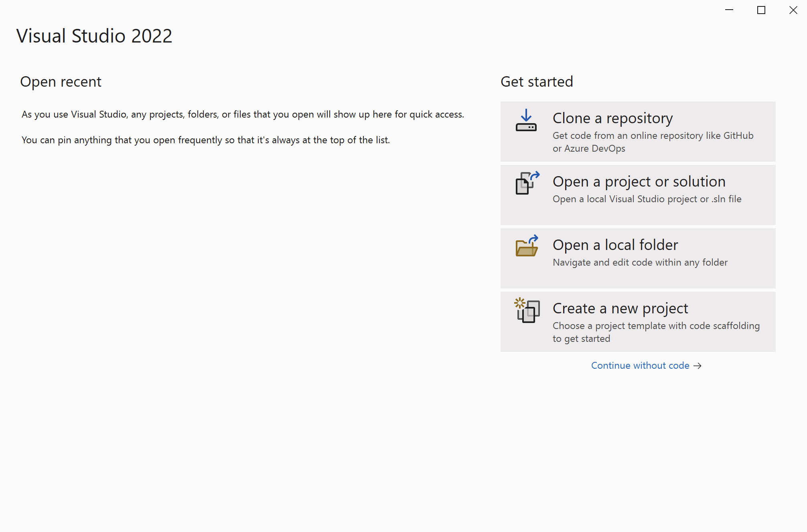
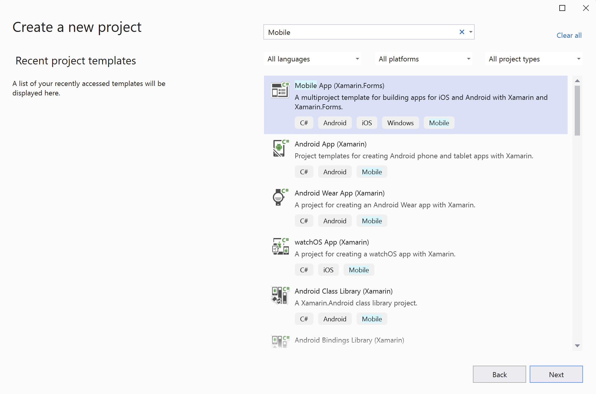
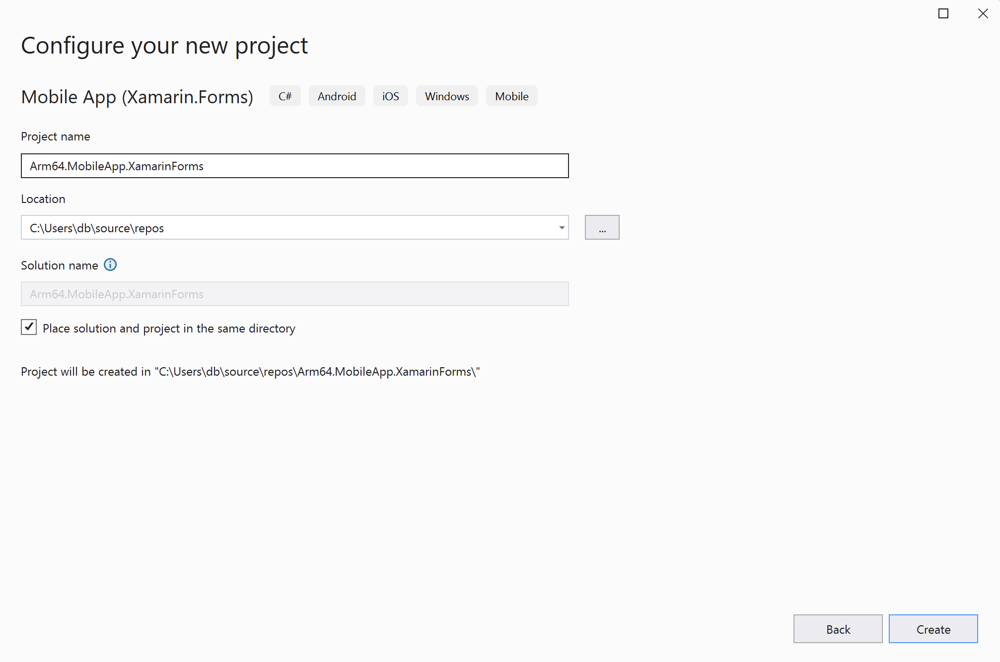
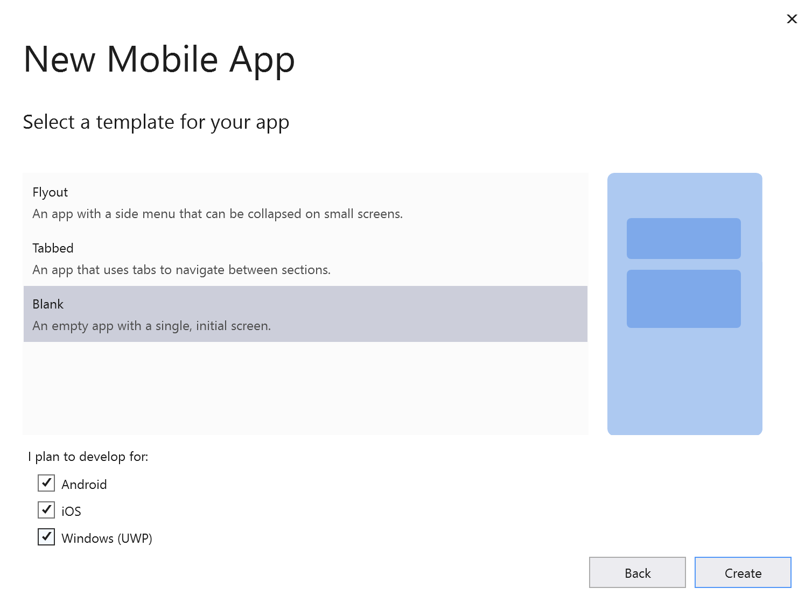
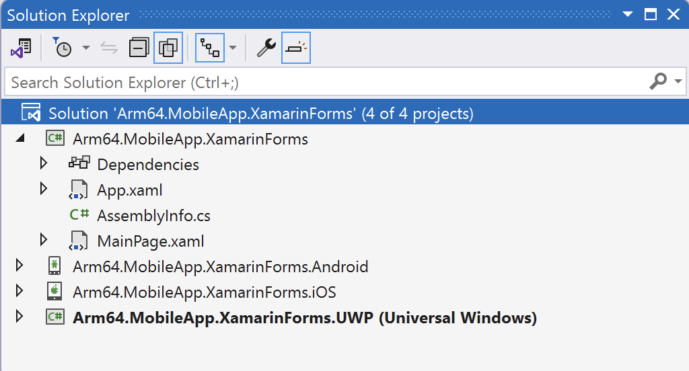

## Introduction
Xamarin Forms is a cross-platform UI toolkit that allows developers to create native user interfaces for iOS, Android, and Windows apps using a single, shared codebase. Developed by Xamarin, a Microsoft-owned company, Xamarin Forms extends the .NET platform with tools and libraries specifically for building mobile apps. It enables developers to use C# for cross-platform development, sharing code, logic, and UI across platforms. Xamarin Forms also integrates with popular .NET features like LINQ and async/await, making it a powerful tool for modern mobile development. The toolkit includes a rich set of controls and an (Model-View-ViewModel) MVVM framework, making it easier to separate logic from the UI and make the code portable.

In this learning path, you will learn how to use Xamarin Forms to create a cross-platform application. Then, you will launch this application on Windows on Arm using x64 and Arm64 build configurations and compare the performance. By doing so, we will be able to see how Arm64 can accelerate Xamarin Forms applications. 

You can find the complete project code used in this learning path [here](https://github.com/dawidborycki/Arm64.MobileApp.XamarinForms.git).

## Before you begin
Before you begin the implementation, install Visual Studio 2022 with the following workloads:
1. .NET Multi-platform App UI development,
2. Universal Windows Platform development.

## Create the project
Open Visual Studio, and then click 'Create a new project'. 



In the next window, search for for the 'Mobile App (Xamarin.Forms)' template. 



This will open the 'Configure your new project' view, in which you should configure the project as follows (refer to the figure below):

1. Project name: **Arm64.MobileApp.XamarinForms**.
2. Location: Select the project location on your drive (example: **C:\Users\db\source\repos**).
3. Check the option **Place solution and project in the same directory**.
4. Click the **Create** button.



In the last step, 'New Mobile App', choose the **Blank** option in the 'Select a template for your app' list. Then, check Android, iOS and Windows (UWP) under the 'I plan to develop for:'. Finally click the **Create** button. 



The project creation process may take a few moments. During this process, you might be prompted to enable Developer Mode for Windows. If so, follow the instructions shown there to enable Developer Mode:


Then, accept any other license terms that appear, including Android SDK - License Agreement. 

Your project should be now ready. Next, open the Solution Explorer (View -> Solution Explorer) to view the created projects:



There are four projects:
1. Arm64.MobileApp.XamarinForms - this is the project, containing the shared code. This project is referenced by other projects.
2. Arm64.MobileApp.XamarinForms.Android - this is an Android-specific project. You use this project to build the binaries for the Android.
3. Arm64.MobileApp.XamarinForms.iOS - this is an iOS-specific project, which generates executables for iOS.
4. Arm64.MobileApp.XamarinForms.UWP - this is an Universal Windows App (UWP) project, which generates executables for Windows.

Now that your project is set up, you are ready to begin development. All subsequent modifications will be implemented in the shared project, `Arm64.MobileApp.XamarinForms`. The application is designed to perform intense computational task. You will use the square matrix multiplication, implemented in the [Windows Forms learning path](/learning-paths/laptops-and-desktops/win_forms). The time required for the computations will be displayed on a label. Additionally, it will be rendered in a chart for visual representation. To create a chart, you will use the `Syncfusion.SfChart.WPF` library, a popular tool for graphical data representation, which you will install as a NuGet package.

You will adopt the Model-View-ViewModel (MVVM) design pattern, which separates the UI from the business logic, for implementing the application's logic. 

Finally, you will compile the application for UWP for both x64 and Arm64 platforms to compare performance across different hardware architectures.

## User Interface
Before starting the UI design, install the `Syncfusion.SfChart.WPF` NuGet package in Visual Studio 2022. Follow these steps to complete the installation:

1. Open Visual Studio 2022 and access the Solution Explorer by navigating to View -> Solution Explorer.
2. In Solution Explorer, right-click on 'Dependencies' under the Arm64.MobileApp.XamarinForms project. From the context menu, select 'Manage NuGet Packages...' to open the NuGet Package Manager.
3. In the NuGet Package Manager, search for 'Sf chart.' Then select 'Syncfusion.SfChart.WPF' from the results and click the 'Install' button. Refer to the figure below for guidance:


4. A 'Preview Changes' window will appear. Click the 'Apply' button to confirm and proceed with the changes to the solution. The installation of the NuGet package will complete.
5. Finally, in the 'License Acceptance' window that appears, click the 'I Accept' button to agree to the terms and complete the installation process.

After installing the NuGet package, proceed to modify the application view. The views of the Xamarin Forms applications are designed with the help of the XAML declarative markup language. Still, you can create the UI by manually putting controls on the window in the design mode. However, the approach based on XAML significantly accelerates the UI design and is much more efficient in practice. So, you will use this approach here and start by opening `MainWindow.xaml` (to do so double-click MainWindow.xaml under the Arm64.MobileApp.XamarinForms in the Solution Explorer).

Next, modify `MainWindow.xaml` as follows:

```XML
<?xml version="1.0" encoding="utf-8" ?>
<ContentPage xmlns="http://xamarin.com/schemas/2014/forms"
             xmlns:x="http://schemas.microsoft.com/winfx/2009/xaml"
             x:Class="Arm64.MobileApp.XamarinForms.MainPage"
             xmlns:syncfusion="clr-namespace:Syncfusion.SfChart.XForms;assembly=Syncfusion.SfChart.XForms">

    <ContentPage.Resources>
        <Style TargetType="Button">
            <Setter Property="Margin"
                Value="2,2,2,0" />
            <Setter Property="FontAttributes"
                    Value="Bold"/>
        </Style>

        <Style TargetType="Label">
            <Setter Property="FontAttributes"
                Value="Bold" />
        </Style>

        <Style TargetType="syncfusion:SfChart">
            <Setter Property="Margin"
                Value="10" />
        </Style>
    </ContentPage.Resources>

    <Grid>
        <Grid.RowDefinitions>
            <RowDefinition Height="Auto" />
            <RowDefinition Height="*" />
        </Grid.RowDefinitions>
        <Grid.ColumnDefinitions>
            <ColumnDefinition Width="*" />
            <ColumnDefinition Width="*" />
        </Grid.ColumnDefinitions>

        <!--Buttons-->
        <StackLayout Grid.Row="0"
            Grid.Column="0"
            Orientation="Vertical">
            <Button Text="Run calculations"/>
            <Button Text="Plot results" />
        </StackLayout>

        <!--Label-->
        <Label Grid.Row="0" 
               Grid.Column="1" 
               Text="" />

        <!--Chart-->
        <syncfusion:SfChart Grid.Row="1"
                    Grid.ColumnSpan="2">
            <syncfusion:SfChart.PrimaryAxis>
                <syncfusion:NumericalAxis>
                    <syncfusion:NumericalAxis.Title>
                        <syncfusion:ChartAxisTitle Text="Trial number" FontSize="16"/>
                    </syncfusion:NumericalAxis.Title>
                </syncfusion:NumericalAxis>
            </syncfusion:SfChart.PrimaryAxis>

            <syncfusion:SfChart.SecondaryAxis>
                <syncfusion:NumericalAxis
                                  Maximum="3000"
                                  Minimum="0">
                    <syncfusion:NumericalAxis.Title>
                        <syncfusion:ChartAxisTitle Text="Computation time [ms]" FontSize="16"/>
                    </syncfusion:NumericalAxis.Title>
                </syncfusion:NumericalAxis>
            </syncfusion:SfChart.SecondaryAxis>

            <syncfusion:LineSeries EnableAnimation="True"
                           Label="Computation time">
            </syncfusion:LineSeries>
        </syncfusion:SfChart>
    </Grid>
</ContentPage>
```

In the XAML declaration, start by importing the XAML namespace for Syncfusion controls, as indicated in the last parameter of the ContentPage attribute. Then define three anonymous styles that will be implicitly applied to all buttons, labels, and Syncfusion Charts within the current window. These styles are utilized to configure margins and font attributes.

Following this, you set up a Grid layout with two rows and two columns. The first row is configured to automatically adjust its height to fit all the controls, while the second row expands to fill the remaining window space. Both columns are designed to have equal widths. This arrangement effectively creates a 2x2 resizable table layout.

Using this layout, you have positioned two buttons in the left cell of the first row. The label is then placed in the right cell of the first row. Finally, the chart, spanning across both cells, is added to the second row.

The chart is configured with two numerical axes. The horizontal (primary) axis displays the trial number, and the vertical (secondary) axis shows the calculation time for each trial. This setup allows users to generate a graph representing the calculation time across successive trials by running the calculation multiple times.

The complete XAML declaration results in the following view
 


To use the chart control on UWP you will also need to make one more modification:
1. In Solution Explorer go to `Arm64.MobileApp.XamarinForms.UWP` project.
2. Open `App.xaml.cs`, and modify the OnLaunched method as follows:

```CS
protected override void OnLaunched(LaunchActivatedEventArgs e)
{
#if DEBUG
    if (System.Diagnostics.Debugger.IsAttached)
    {
        this.DebugSettings.EnableFrameRateCounter = true;
    }
#endif            

    Frame rootFrame = Window.Current.Content as Frame;

    // Do not repeat app initialization when the Window already has content,
    // just ensure that the window is active
    if (rootFrame == null)
    {
        // Create a Frame to act as the navigation context and navigate to the first page
        rootFrame = new Frame();

        rootFrame.NavigationFailed += OnNavigationFailed;
        
        // Comment out the following line
        //Xamarin.Forms.Forms.Init(e);

        // Add the following:
        // <START>
        List<Assembly> assembliesToInclude = new List<Assembly>
        {
            typeof(Syncfusion.SfChart.XForms.UWP.SfChartRenderer).GetTypeInfo().Assembly
        };

        Xamarin.Forms.Forms.Init(e, assembliesToInclude);
        // <END>

        if (e.PreviousExecutionState == ApplicationExecutionState.Terminated)
        {
            //TODO: Load state from previously suspended application
        }

        // Place the frame in the current Window
        Window.Current.Content = rootFrame;
    }

    if (rootFrame.Content == null)
    {
        // When the navigation stack isn't restored navigate to the first page,
        // configuring the new page by passing required information as a navigation
        // parameter
        rootFrame.Navigate(typeof(MainPage), e.Arguments);
    }
    // Ensure the current window is active
    Window.Current.Activate();            
}
```

## Helpers
You will now supplement the shared project with two helper classes:

1. **MatrixHelper**: This class implements matrix multiplication based on the mathematical formula detailed [here](https://en.wikipedia.org/wiki/Matrix_multiplication).
2. **PerformanceHelper**: This class provides functionality to measure code execution time.

To implement these classes, follow these steps:

1. Open the Solution Explorer in Visual Studio 2022 by clicking View > Solution Explorer.
2. In the Solution Explorer window, right-click on the `Arm64.MobileApp.XamarinForms` project, and choose Add -> New Folder from the context menu.
3. Name the new folder 'Helpers'.
4. Right-click on the Helpers folder, select Add -> Class to open the 'Add New Item' window. Enter 'MatrixHelper.cs' in the Name field and click the Add button.
5. Modify the newly added `MatrixHelper.cs` file as outlined below.
```cs
using System;

namespace Arm64.MobileApp.XamarinForms.Helpers
{
    public static class MatrixHelper
    {
        private static readonly Random random = new Random();

        private static double[,] GenerateRandomMatrix(int matrixSize)
        {
            var matrix = new double[matrixSize, matrixSize];

            for (int i = 0; i < matrixSize; i++)
            {
                for (int j = 0; j < matrixSize; j++)
                {
                    matrix[i, j] = random.NextDouble();
                }
            }

            return matrix;
        }

        private static double[,] MatrixMultiplication(double[,] matrix1, double[,] matrix2)
        {
            if (matrix1.Length != matrix2.Length)
            {
                throw new ArgumentException("The matrices must be of equal size");
            }

            if (matrix1.GetLength(0) != matrix1.GetLength(1) || matrix2.GetLength(0) != matrix2.GetLength(1))
            {
                throw new ArgumentException("The matrices must be square");
            }

            int matrixSize = matrix2.GetLength(0);

            var result = new double[matrixSize, matrixSize];

            for (int i = 0; i < matrixSize; i++)
            {
                for (int j = 0; j < matrixSize; j++)
                {
                    result[i, j] = 0;

                    for (int k = 0; k < matrixSize; k++)
                    {
                        result[i, j] += matrix1[i, k] * matrix2[k, j];
                    }
                }
            }

            return result;
        }

        public static void SquareMatrixMultiplication()
        {
            const int matrixSize = 250;

            var matrix1 = GenerateRandomMatrix(matrixSize);
            var matrix2 = GenerateRandomMatrix(matrixSize);

            MatrixMultiplication(matrix1, matrix2);
        }
    }
}
```

6. Similarly, within the 'Helpers' folder, create another file named `PerformanceHelper.cs`. Modify the file using the following code:
```cs
namespace Arm64.MobileApp.XamarinForms.Helpers
{
    public static class PerformanceHelper
    {
        private static readonly Stopwatch stopwatch = new Stopwatch();

        public static double MeasurePerformance(Action method, int executionCount)
        {
            stopwatch.Restart();

            for (int i = 0; i < executionCount; i++)
            {
                method();
            }

            stopwatch.Stop();

            return stopwatch.ElapsedMilliseconds;
        }
    }
}
```

The MatrixMultiplication method in the MatrixHelper class accepts two square matrices and calculates their product using three 'for' loops. The result is stored in the 'result' variable and returned. The GenerateRandomMatrix method creates a square matrix with pseudo-randomly generated elements using the Random.NextDouble method. The class also includes the SquareMatrixMultiplication method for generating and multiplying two matrices of a given size. Here, we fix the matrix size to 250.

The PerformanceHelper class contains a MeasurePerformance method. This method executes a function (passed as the first parameter via the Action delegate) multiple times (specified by the 'executionCount' parameter) and returns the execution time. Execution time is measured using the `System.Diagnostics.Stopwatch` class, which has methods Restart (to reset and start the stopwatch) and Stop (to halt the stopwatch and record the time elapsed).

With the UI and helper classes set up, you are now ready to implement the application logic using the Model View ViewModel (MVVM) architectural pattern.
