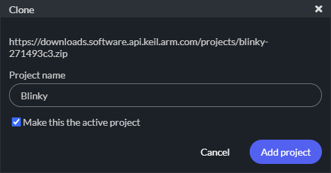
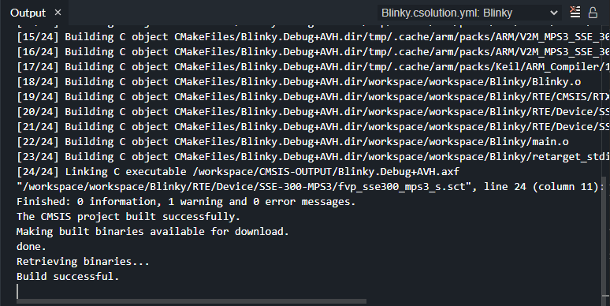
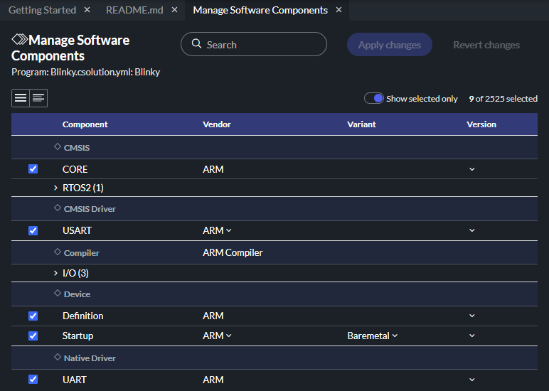

---
# User change
title: "Work with an example project"

weight: 2 # 1 is first, 2 is second, etc.

# Do not modify these elements
layout: "learningpathall"
---

## Before you begin

To access Keil Studio Cloud, you need an [Arm Account](https://developer.arm.com/register). If you already have an Mbed account, you can use it to access Keil Studio.

To work with development boards over USB, you must use Keil Studio in a desktop browser that supports the WebUSB standard: Google Chrome or Microsoft Edge (Chromium). All other features are supported in the latest versions of the following desktop browsers: Google Chrome, Microsoft Edge, Opera, Safari, and Mozilla Firefox.

## Getting started with the IDE

1. Go to [keil.arm.com](https://keil.arm.com).

1. Click the **Hardware** menu to see the list of supported hardware.

   You can search for a board by name or vendor, or filter the list by vendor or core. You can also display boards with example projects with the Only include boards with example projects checkbox.

1. Search for and select the **V2M-MPS3-SSE-300-FVP** board in the list.

   You can either download or import example projects into Keil Studio from the **Projects** tab and get access to board details from the **Features** and **Documentation** tabs.

1. Find the **Blinky** example in the **Projects** tab and click the **Open in Keil Studio** button.  

   

## Import and build an example project

1. Log into Keil Studio with your Arm or Mbed account if you are not already logged in. Keil Studio opens. Confirm the project name in the **Import Project** dialog box. Keil Studio sets the newly imported project as the active project by default.  

2. Click **Add project**.
   The project loads to your workspace and is the active project. The README.md file of the project displays. Review the file to learn more about project settings and board requirements.  

   

3. In the top-left corner, select the **Target hardware**. Set to **AVH (SSE-300-MPS3)**:  

4. Use the build button (1) to build the project:  

5. The **Output** window shows the success of the operation:

## Run the example project

1. Use the run button (2) to run the project on Arm Virtual Hardware in your browser:  

2. Again, the **Output** window shows the success of the operation:

  

To stop program execution, click the **Cancel** button.

## Manage Software Components

If you want to review or change the software components that are used in the project, open the **Manage Software Components** view by clicking button (3):  

The view opens and shows the currently selected software components:

Using the **Show selected only** toggle, you can switch between this short view and the full list of components. In the full list, enable or disable components as required.

