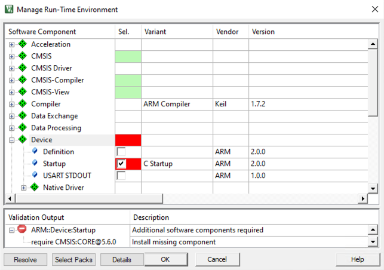
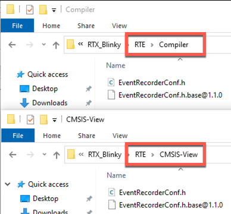
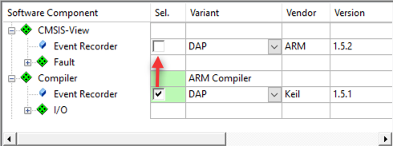
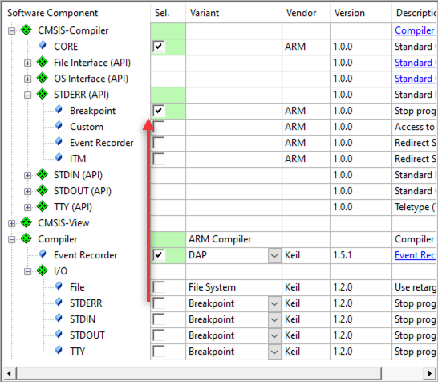
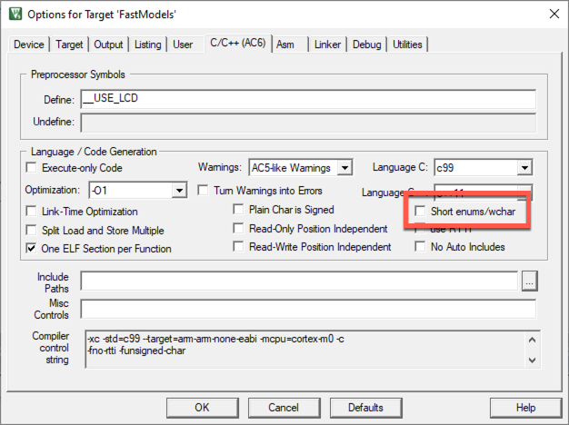

## Troubleshooting

This section provides an overview of the most common errors you might encounter along with possible resolutions.

### Missing device

The following error occurs when you try to migrate a project to CMSIS v6 but you have not installed the Cortex_DFP pack:


{}
Install [ARM.Cortex_DFP.1.0.0.pack](https://www.keil.com/pack/ARM.Cortex_DFP_.1.0.0.pack) or above.
{}

### Error instantiating RTE components

The following error occurs when you try to migrate a Keil RTX-based project but you have not installed the CMSIS-RTX pack:


{}
Install [ARM.CMSIS-RTX.5.8.0.pack](https://www.keil.com/pack/ARM.CMSIS-RTX.5.8.0.pack) or above.
{}

### Missing software components

#### Migrating Keil RTX5-based projects

The following warning is shown in the Validation Output window when you try to migrate a Keil RTX-based project:


{}
Use the **Resolve** button to select the missing component automatically.
{}

#### Migrating projects

The following error comes up if the `Device:Startup` component requires a CMSIS-CORE component with a specific v5.x.x version.



In the Build Output window you might see:


Anyway, the build operation should work normally and the resulting binary will work fine on hardware. If you want to get rid of the error, check one of the following options.

A similar error can come up for any software component. Here's an example using MDK-Middleware:


{}
1. Contact the CMSIS-Pack vendor for your device/software component and ask for an updated version without the CMSIS-CORE version requirement. Alterntively, do the following:
2. Edit the device's PDSC file and change for example:
```xml
<require Cclass="CMSIS" Cgroup="CORE" Cversion="5.6.0"/>
```
to
```xml
<require Cclass="CMSIS" Cgroup="CORE"/>
```
{}

### Updating configuration files

Moving a component from one pack to another has an additional implication. The Event Recorder component, for example, comes with a configuration file (`EventRecorderConf.h`). This configuration file is stored in the project under the RTE/*Cclass* folder. When you switch from one pack to the other, the Cclass name changes and a fresh copy of the original configuration file is copied to your project.



{}
Copy any edits that you made in the old configuration file into the new one.
{}

### Manual migration from Keil.ARM_Compiler pack

As the components from the Keil.ARM_Compiler pack do not have 1:1 replacements, you need to deselect the old components and select the replacements from the two new packs (ARM.CMSIS-Compiler and ARM.CMSIS-View):

1. Compiler:EventRecorder migration

   Deselect the `Compiler:Event Recorder` component and select the `CMSIS-View:Event Recorder` component:

   
2. Compiler:I/O migration

   Deselect any component of `Compiler:I/O` and select the corresponding `CMSIS-Compiler` component:

   

   This table helps you to identify the correct components:

   | Compiler:I/O:     | CMSIS-Compiler:            |
   |-------------------|----------------------------|
   | STDERR@Breakpoint | STDERR (API):Breakpoint    |
   | STDERR@ITM        | STDERR (API):ITM           |
   | STDERR@User       | STDERR (API):Custom        |
   | STDIN@Breakpoint  | STDIN (API):Breakpoint     |
   | STDIN@ITM         | STDIN (API):ITM            |
   | STDIN@User        | STDIN (API):Custom         |
   | STDOUT@Breakpoint | STDOUT (API):Breakpoint    |
   | STDOUT@EVR        | STDOUT (API):EventRecorder |
   | STDOUT@ITM        | STDOUT (API):ITM           |
   | STDOUT@User       | STDOUT (API):Custom        |
   | TTY@Breakpoint    | TTY (API):Breakpoint       |
   | TTY@ITM           | TTY (API):ITM              |
   | TTY@User          | TTY (API):Custom           |

{}
All CMSIS-Compiler components require CMSIS-Compiler:Core to be present.
{}

### Linker errors using the RTX5 library

In CMSIS v5, the RTX5 libraries were built using the compiler options `-fshort-enums` and `-fshort-wchar`. In CMSIS v6, the default compiler options are different. If you are using the new libraries with old build settings, you will encounter the linker error `L6242W`:

```
.\Blinky.axf: Error: L6242E: Cannot link object Itx timer.o as its attributes are incompatible with the image attributes.
   ... wchart-16 clashes with wchart-32.
   ... packed-enum clashes with enum_is_int
```

{}
In µVision, go to **Project - Options for Target** and click on the **C/C++ (AC6)** tab. Unselect **Short enums/wchar** and rebuild the project:



{}

{}
If you are using libraries in your project that have been built with short enums/wchars (for example the MDK-Middleware), you need to use the RTX5 source code variant in your project as otherwise the linker will fail, even when unselecting the "Short enums/wchar" option.
{}
