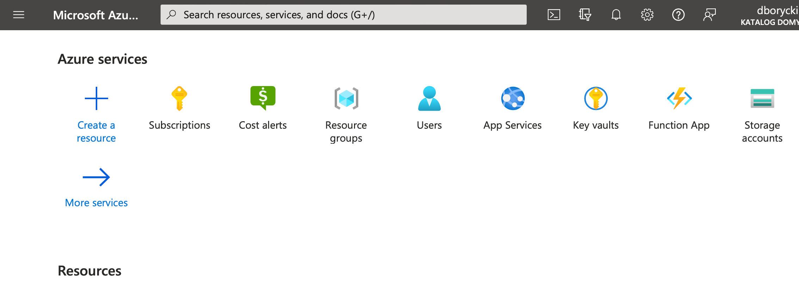
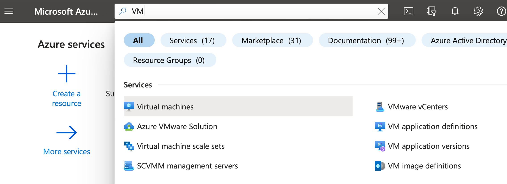
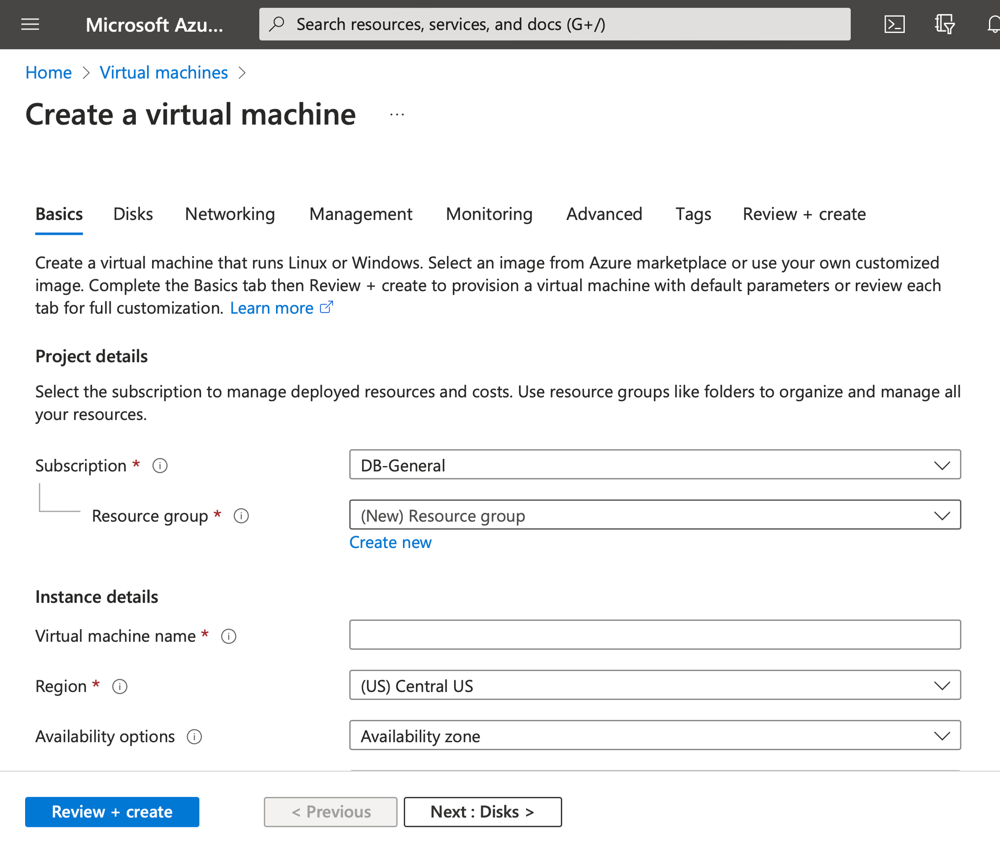
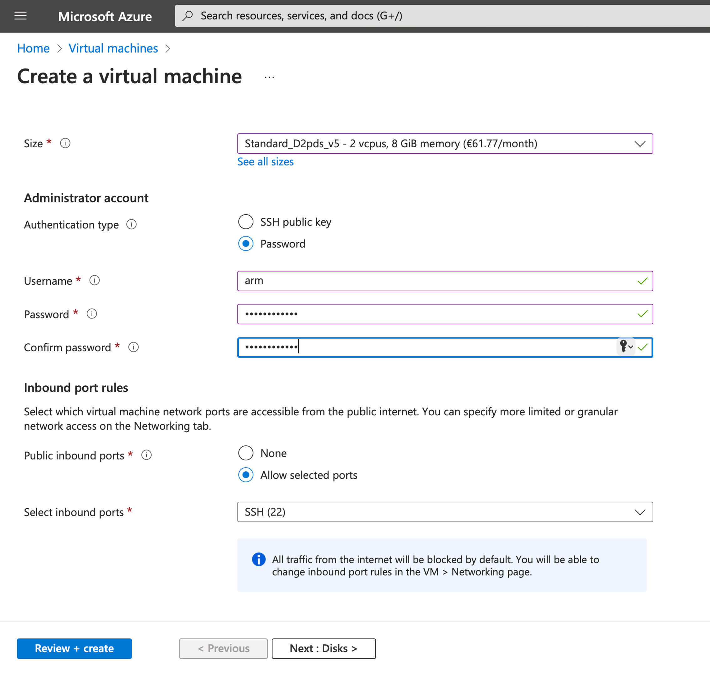
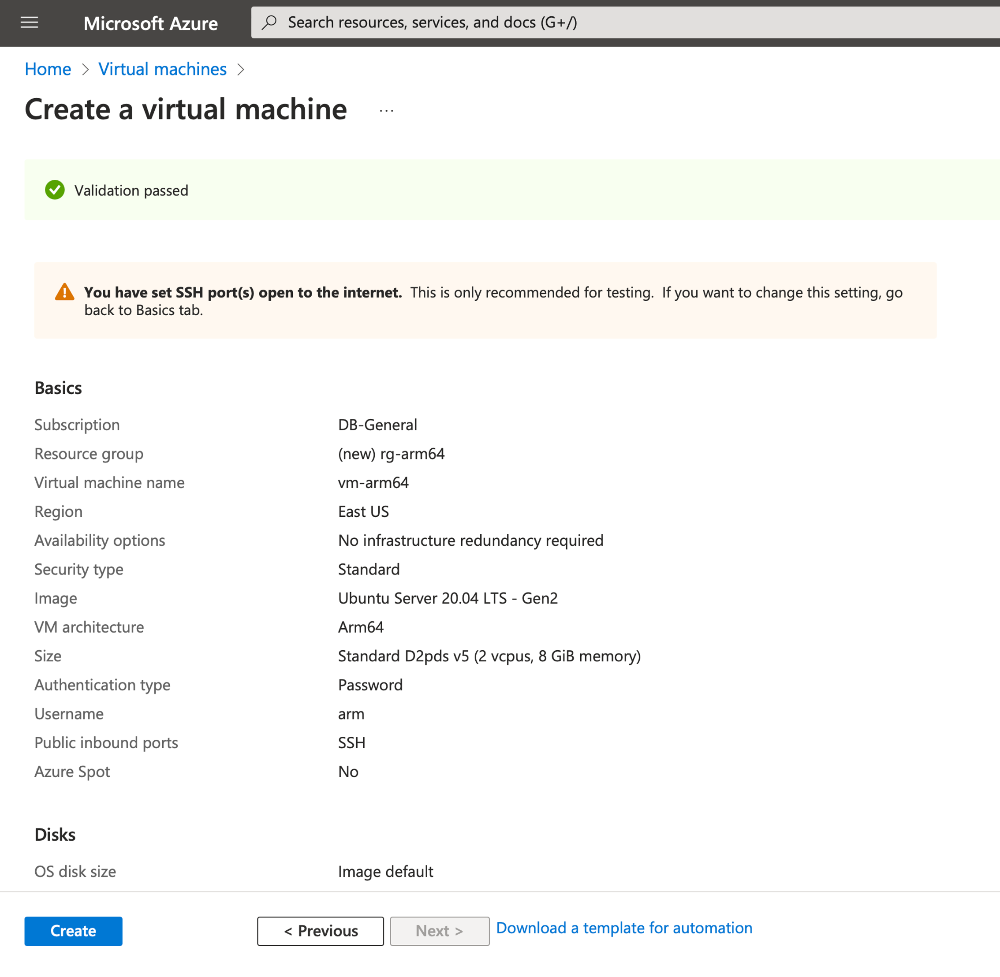
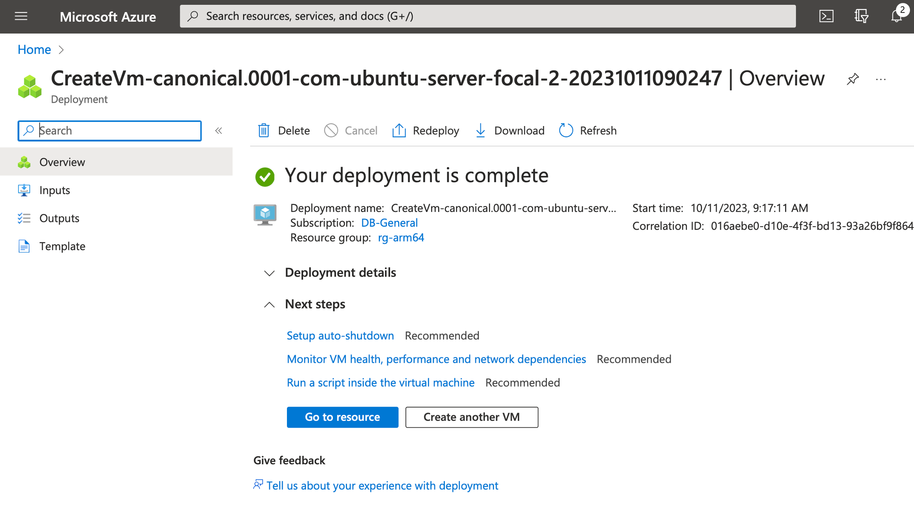
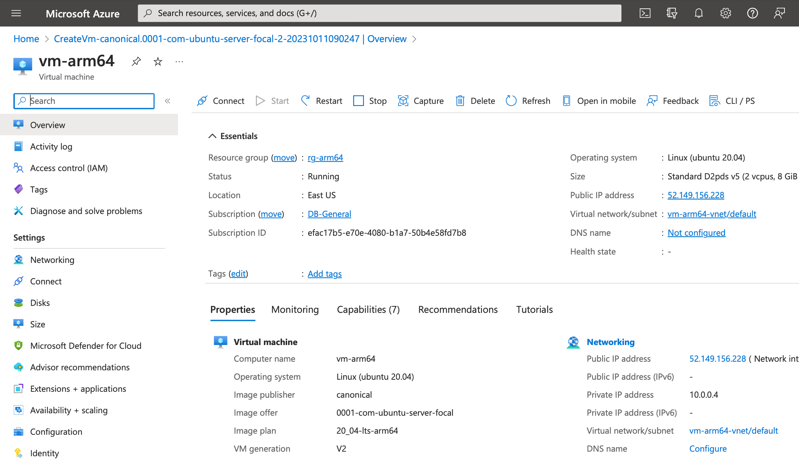

## Virtual Machine

### Virtual Machine Azure Resource
Let's start by creating the Virtual Machine. Go to https://portal.azure.com and sign in. You will see this screen which enables you to create Azure resources:

In the search box, type **VM**, and pick the first item on the list (Virtual machines):

In the Virtual machines, click **+ Create** (in the top left corner), and then select **Azure virtual machine**:

This takes you to the **Create a Virtual Machine** wizard as shown below:

### Virtual machine configuration
1. Subscription: select your subscription.
2. Resource group: click Create new link, then type **rg-arm64**, and click OK.
3. Virtual machine name: **vm-arm64**.
4. Region: select depending on your physical location.
5. Availability options: select **No infrastructure redundancy required**.
6. Security type: **Standard**.
7. VM architecture: **arm64**.
8. Image: **Ubuntu Server 20.04 LTS – ARM64 Gen 2**.
9. Size:
    * Click **See all sizes**.
    * In the **Select a VM size** type **D2pds** in the search box
    * Select **D2pds_v5**. *Note* that this size might not be available due to quota limits. If this happens, click **Request quota link** (which is located next to the **VM size** name). This will activate a New Quota Request. Type **2** under New limit and click Submit. Wait a few minutes for the quota limits to be updated.

At this point, your configuration should look like this example:
")

Let's now configure other aspects of the Virtual Machine:
1.	Administrator account. **Select Password**, and then populate with:
    * Username: **arm**
    * Password: type your password (make a note of this password as you'll need it to connect to VM)
    * Confirm password: re-type your password
2.	Inbound port rules. Keep them default: **SSH(22)**.

Click the **Review + create** button. Azure Portal will validate your configuration and, if all is correct, you will see a green box saying: Validation passed: 

Click the Create button. The portal will now start the process of creating your VM. You will notice that apart from the VM itself, the portal creates additional resources for you: 
* Public IP address (you'll need to use it to connect to the VM and then to see your application running)
* Network Security Group
* Virtual network
* Network interface
* Virtual disk

Wait a few moments for the deployment to be completed:

Finally, click the **Go to resource** button. You'll be redirected to the overview of your newly created virtual machine in Microsoft Azure:

Note your Public IP address (top right part of the overview). In this tutorial, this is **52.149.156.228**.
