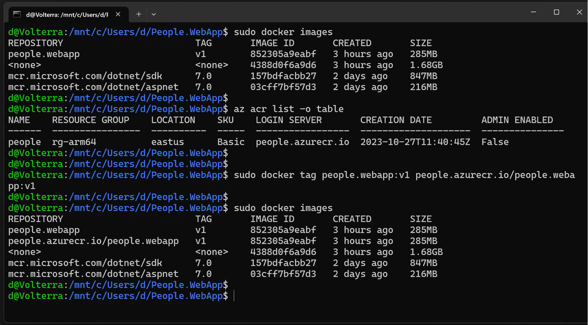
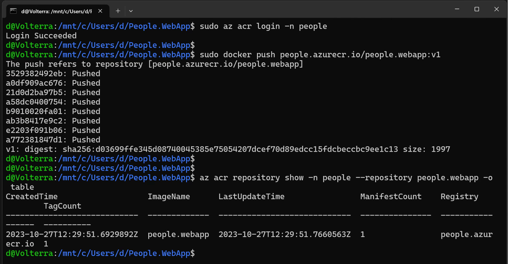

## Objective
You will now push the local Docker image to the registry, you created in Azure.

### Pushing the local image to Azure
Start by opening the WSL console, where you type

```console
sudo docker images
```

This command will display the list of local Docker images (we display this to have all the necessary information, like the image name and tag available). Then, we need to tag the local image with the fully qualified name of the container registry (login server) we created in Azure. To display the fully qualified name of the registry, we type:

```console
az acr list -o table
```

Subsequently, we tag the image using the login server:
```console
sudo docker tag people.webapp:v1 people.azurecr.io/people.webapp:v1
```

The last command does not provide any output. To ensure the local image was correctly tagged, we type (Figure 22):
```console
sudo docker images
```



Finally, we push the image to the remote registry. We proceed as follows:
1.	In the WSL terminal, we type:
```console
sudo az login
```
2.	Then open https://microsoft.com/devicelogin and use the code provided by the above command.
3.	Login to Azure Container Registry:
```console
sudo az acr login -n people
```
4.	Push the image:
```console
sudo docker push people.azurecr.io/people.webapp:v1
```

To confirm the image was pushed, type:
```console
az acr repository show -n people --repository people.webapp -o table
```

The above commands are summarized in the figure below:


## Summary
This part of the tutorial taught you how to create the container registry in Microsoft Azure and push the local Docker image to the remote repository. Along the way, you learned how to work with Azure Command Line Interface (Azure CLI) to create and manage resources in Azure. 