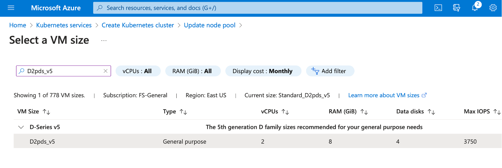

## Recap
In the previous part of this learning path series, you learned how to containerize an application. Specifically, you created a container image. Then you used this container image to run the container in your local environment. However, the same container image can be used to launch the application in the cloud using various services. Here, I will show you how you can use Azure Container Instance to deploy a containerized application.

At this time, Azure Container Instance was not yet compatible with arm64 Docker containers. So, I will use a sample ASP.NET application from the Microsoft Container Registry: mcr.microsoft.com/dotnet/samples:aspnetapp. 

Then, we will see what happens if we try to deploy our arm64 Docker container image to Azure Container Instance.

## Create an Azure Container Instance
In this section, you will create the Azure Container Instance using Azure Portal and deploy the sample ASP.NET application from the Microsoft Container Registry. 

To start, we login to Azure Portal. Then, in the search box, we type **Container instances**, and select the first item on the list:

The above procedure will open the Container instances, in which you click the +Create button. This will activate the wizard, which you use to configure your Azure Container Instance:
1.	Subscription: **Select your subscription**.
2.	Resource group: **rg-arm64** (create a new group, if needed).
3.	Container name: **aspnet-sample**.
4.	Region: **East US** (or select the region close to your location).
5.	Availability zones: **None** or default.

At this point, the Create container instance wizard will look as shown below:

Then, continue with other settings:
1.	SKU: **Standard**.
2.	Image source: **Other registry**.
3.	Run with Azure Spot Discount: **Unchecked**.
4.	Image type: **Public**.
5.	Image: **mcr.microsoft.com/dotnet/samples:aspnetapp**.
6.	OS type: **Linux**
7.	Size: **1 vcpu, 1.5 GiB memory, 0 gpus** (or choose any other size if this specific size is unavailable in the Azure region you used)

You should end up with the following configuration:

Now you will need to configure port mapping. Let’s click the **Next: Networking >** button, and under the Networking tab scroll down to Ports. Afterward, you add 8080 port for the TCP protocol: 

This setting corresponds to the **-p** flag we used in part 2 of this learning path series. Specifically, the port configuration enables us to create the port mapping, which will map port 8080 of the container instance to the corresponding point inside the running container.

{}Here, we use 8080 port because the sample ASP.NET application listens on this port by default. {}

Finally, you click the **Review + create** button. This will run the final validation of your configuration, and you will see the following screen:

Click the **Create** button, and wait a few moments for the resource to be created. You will then see the confirmation screen, where you click the **Go to resource** button.

