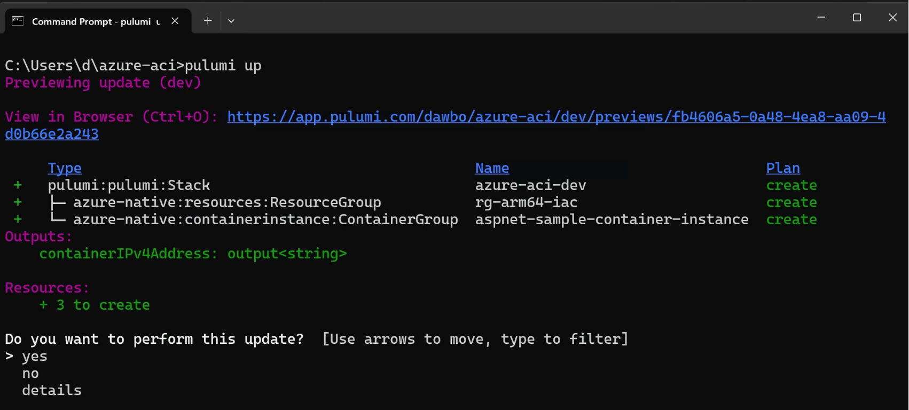
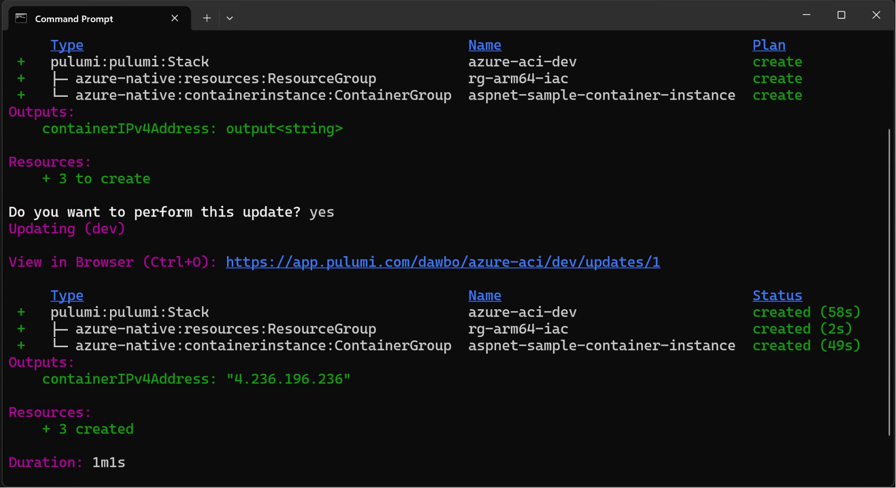
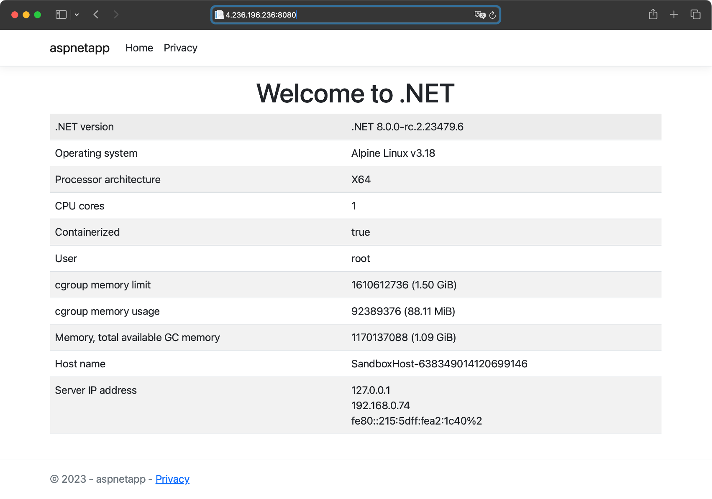

## Objective
You will now modify the index.ts to deploy the Azure Container Instance.

## Modify index.ts
Open the index.ts and replace its original content by the following code:

```typescript
import * as resources from "@pulumi/azure-native/resources";
import * as containerinstance from "@pulumi/azure-native/containerinstance";

// Create an Azure Resource Group named rg-arm64-iac
const resourceGroup = new resources.ResourceGroup("rg-arm64-iac");

// Use sample ASP.NET Docker image
const imageName = "mcr.microsoft.com/dotnet/samples:aspnetapp";

// Create Azure Container Instance
const containerGroup = new containerinstance.ContainerGroup("aspnet-sample-container-instance", {
    resourceGroupName: resourceGroup.name,
    osType: "Linux",
    containers: [{
        name: "aspnet-sample-app",
        image: imageName,
            ports: [{ port: 8080 }],
            resources: {
                requests: {
                    cpu: 1.0,
                    memoryInGB: 1.5,
                },
            },
    }],
    ipAddress: {
        ports: [{
            port: 8080,
            protocol: "Tcp",
        }],
        type: "Public",
    },
    restartPolicy: "always",
});

export const containerIPv4Address = containerGroup.ipAddress.apply(ip => ip?.ip);
```

The above code will create two resources: a resource group and the Azure Container Instance. The declaration of the resource group is straightforward and doesn’t require any additional comments. A declaration of the Azure Container Instance is structured as follows. First, we define the name of the container instance as the first parameter of the ContainerGroup function. Then, we pass an anonymous object with five properties corresponding to the parameters we used when manually provisioning the Azure Container Instance in part 3 of this series. So, these properties include the name of the resource group, the type of the operating system, a specification of the container, network configuration, and restart policy. We configure those similarly as before. In particular, we use the following Docker image: mcr.microsoft.com/dotnet/samples:aspnetapp and configure the container port to 8080.

The last statement of the index.ts will instruct Pulumi to display the public IP address of the created Azure Container Instance. 

## Resource deployment
Let’s now deploy the Azure resource using this declaration. To do so, you open the Command Prompt, go to the azure-aci folder, and then type 

```console
pulumi up
```

The Pulumi will analyze your index.ts file to get the list of resources to be deployed. Then, it will display the list of resources to be deployed:



Confirm the deployment by selecting yes and pressing enter. Then, wait a few moments for the resources to be deployed. Once the deployment is done, you will see the public IP address of your Azure Container Instance. Here, that is **4.236.196.236**.



Copy the IP address and supplement it by 8080. Then, type it in the address bar of your web browser. You will see the application up and running. Compare this result to what we get in part 2 of this series.

