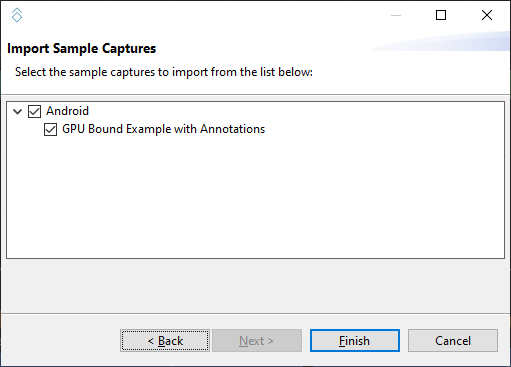

---
# User change
title: "Arm Streamline example capture"

weight: 3 # 1 is first, 2 is second, etc.

# Do not modify these elements
layout: "learningpathall"
---
Streamline as supplied with Arm Mobile Studio supports Android application profiling only.

For other use cases, use the version supplied as a component of [Arm Development Studio](https://developer.arm.com/Tools%20and%20Software/Arm%20Development%20Studio).

## Example Streamline report

To help you understand the capabilities of Streamline, an example report is provided with `Arm Mobile Studio`.

Open the IDE, and navigate the menu to `File` > `Import`, and select `Import Streamline Sample Captures`. Click `Next`.

Select the example to import, and click `Finish`.

Double-click on the report in `Streamline Data`, then click `Analyze` when prompted. The report will be processed, and an interactive timeline will be shown.

## Analyze the capture

The captured data can manually explored. Calipers in the timeline view allow you to focus on particular windows of activity. A full description of the capabilities is given in the [Streamline User Guide](https://developer.arm.com/documentation/101816/latest/Analyze-your-capture).

Understanding the output of Streamline is key to the usefulness of Streamline. [Android performance triage with Streamline](https://developer.arm.com/documentation/102540) describes how to understand the capture from a number of points of view, depending on what information you are trying to extract from it.
