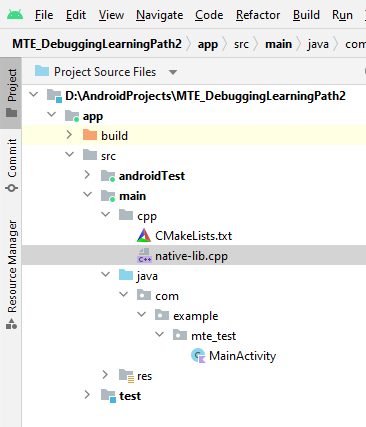

## Simple implementation of most common memory safety bugs
A simple Android app has been implemented for this learning path, to be used from Android Studio in debug mode. The project of this app is available at (provide link).
Once downloaded to your local machine, launch Android Studio and open the Android project in this location.
By default, Android Studio displays your project files in the Android view. Click on the project view selector at the top left below the menu bar and select Project Source Files option. You will see the actual file structure of the project shown in the picture below. 
 


Unfold the file structure as indicated in the picture and double click on the *native-lib.cpp* file to open it. This file contains the implementation of several of the most common memory safety bugs.
For example, the function below implements a common case that tries to access an array element after the array has been freed.

```

Java_com_example_mte_1test_MainActivity_useAfterFreeC(JNIEnv *env, jobject thiz) {
    int *p = new int[20];

    delete[] p;
    p[15] = 67;    // Trying to access an array element that no longer exists!
}
```
Other functions in the *native-lib.cpp* file implement different types of memory safety bugs. Have a look at them. These functions are called from the *MainActivity.kt* file.

Each of the four functions is associated with one of the buttons in the app. See the picture below. 
This association is implemented in the *activity_main.xml* file. To see this file, expand the content of the *res* folder in the project view and next the *layout* folder. Double click on the file to open it. You can visualize this file in code and design modes.
Explore the code mode to see the implementation of each button. For example, the implementation of the button associated with the function listed above looks like:

```
<Button
    android:id="@+id/button"
    android:layout_width="270dp"
    android:layout_height="100dp"
    android:layout_marginTop="140dp"
    android:backgroundTint="#0091BD"
    android:onClick="useAfterFree"
    android:text="@string/use_after_free"
    android:textColor="#002B49"
    android:textSize="30sp"
    app:layout_constraintEnd_toEndOf="parent"
    app:layout_constraintStart_toStartOf="parent"
    app:layout_constraintTop_toTopOf="parent" 
/Button>
```

