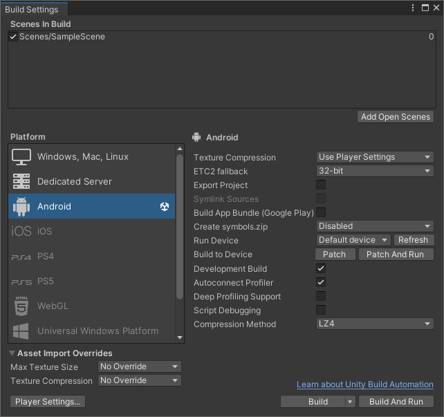

## Build and deploy to Android
Using the Profiler when running your project inside the Unity Editor can be very convenient and a quick way of assessing high level performance issues. However, your end-user's device is likely to have different performance characteristics.

You should always check the performance of your app on a device comparable to that which your end users will use. In this next step, you will run the profiling again but this time on your Android device.

1. Select _File->Build Settings_. You will see the Build Settings window as before.

1. To activate profiling, we will enable the _Development Build_ and _Autoconnect Profiler_ options.

1. You should already have the Android platform selected, so connect your device and click on _Build and Run_.

1. Choose a filename for your build.

1. The Profiler will automatically collect. As before in the editor, the Profiler will start collecting data and your timeline will start to fill.

1. Allow the app to run for a few seconds. Once you have a few seconds of timeline you can stop the app.

You have confirmed that the app's performance is poor on Android as well as in the Unity editor.

## Profiling on Android

The Profiler window below shows a timeline of a capture made using a Samsung S8 mobile phone.

Remembering that we're trying to find out why the spinning cube isn't running smoothly, there are a few things that stand out in the timeline:

- In the main timeline at the top, the different areas of the app are coloured. The graph is filled with a lot of blue. On the left under _CPU Usage_ we can see that blue is for _Scripts_.

- Unity has provided convenient figures for us to compare against (on the left we see tags showing 60FPS, 30FPS and 15FPS). It's telling us that in order to hit 60 frames per second, we would want our frame to take no more than 16 milliseconds. To hit 30 frames per second, we would want our frame to take less than 33ms, and less than 66ms if we targeted a frame rate of 15FPS.

- Looking at the _Main Thread_ for the selected frame, we can see that the _PlayerLoop_ is taking _117.7ms_ (milliseconds). That is awfully high - way above our targeted frame time of 16ms.

- Staying on the _Main Thread_ we can see where the most time is being spent. _PlayerLoop_ is taking more than _117ms_. Part of the high level _PlayerLoop_ task is _Update.ScriptRunBehaviourUpdate_which calls the _Update_ function on all of the scripts in our app. The last entry is _Spin.Update_.

- _Spin.Update_ is the _Update_ function in our _Spin_ component. On the frame selected it took over _100ms_. Even with just this function alone, the maximum frame rate would be something like 10fps (one second or 1000ms, divided by 100ms, is 10).

So by using the Profiler window, we now know where to look in the next step of our investigation.

Try fixing the performance issue yourself.

Hint: To solve the problem, try looking for a very unnecessary function call in Spin.Update(). Remove the call and then re-deploy to your Android device. The cube will now be spinning smoothly.
