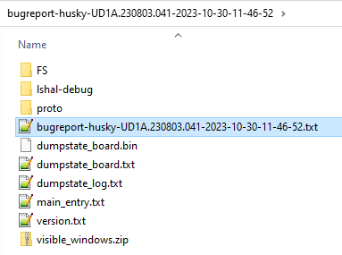
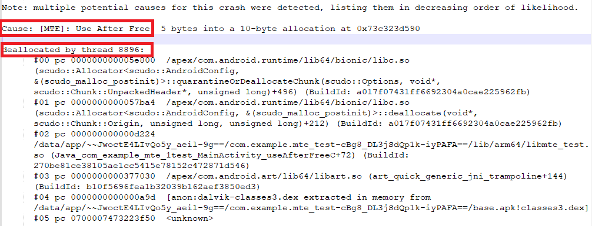

## Bug Report Content
The bug report is a zip file. Once you have it in your desktop machine, you need to decompress it to access its the content. Once unzipped, you will see the folder structure below and the bug report txt file. Husky is the code name for Gooogle Pixel 8 Pro and it is used when generating the name of the bug report file.

More detailed information is written to a tombstone file located in FS/data/tomstones folder as shown below:

## Interpreting the Bug Report

The bug report contains diagnostic output for system services, error logs, and system message logs (logcat). The system messages include stack traces when the device throws an error. When running MTE in SYNC mode, the Android allocator records stack traces for all allocations and deallocations and uses them to produce the bug report.

On encountering a tag mismatch, the processor aborts execution immediately and terminates the process with SIGSEGV, using code SEGV_MTESERR, logging full information about the memory access and the faulting address. In addition, the crash report shows the process ID, the thread ID, and the cause of the crash. 

More detailed information is written to the tombstone file. It contains detailed data about the crashed process, including the following:
* Stack traces for all the threads in the crashed process, including the thread that caught the signal
* A full memory map
* A list of all open file descriptors

The tombstone file includes an explanation of each memory error, such as use-after-free, or bufferoverflow, and the stack traces of the relevant memory events. These reports provide more contextual information and make bugs easier to trace and fix.

For more information about how to interpret bug reports, see the following Android documentation
resources:
* [MTE User Guide for Android OS](https://developer.arm.com/documentation/108035/latest/) 
* [Android OS Documentation: Diagnosing Native Crashes](https://source.android.com/docs/core/tests/debug/native-crash)
* [Android OS Documentation: Debugging Native Android Platform Code](https://source.android.com/docs/core/tests/debug)

YOUR CONTENT GOES HERE

