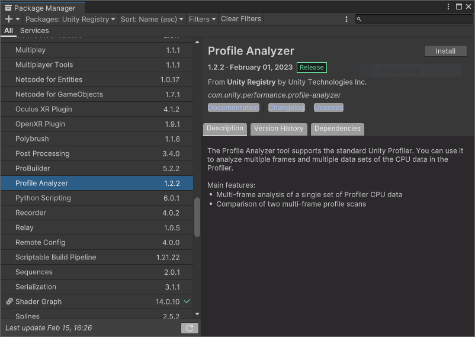
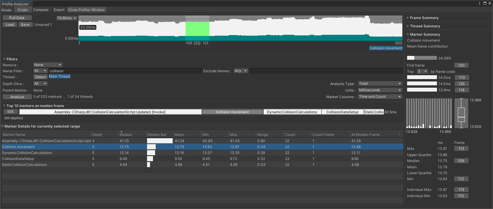

## Setup the Analyzer
Before you can use the Analyzer tool, we need to install the related package it comes in. Follow these steps with the Package Manager:

1. Select menu option Window/Package Manager

1. Switch Packages option to “Packages: Unity Registry

1. Select Profile Analyzer

    

1. Select Install

1. After installation has complete you will have a new menu option Window/Analysis/Profile Analyzer

## Pulling data into the Analyzer

Because we have already collected data from both sessions, you will need to repeat some steps. This is because the Analyzer cannot actually use the saved data directly so we will need to use the Profiler again. Once you are familiar with the tools you can streamline the steps to better suit your preferred workflow.

For now, jump straight in to the Analyzer we have just installed:

1. Open the Analyzer from the menu option Window/Analysis/Profile Analyzer

1. Select Open Profiler Window

1. The Profiler may show data from a previous session, so clear it using the Clear button at the top of the panel

1. Select the Load button (icon of an open folder) in the Profiler panel in the top right

1. Select your file plain.data

1. Click into the Analyzer window and select Pull Data in the top left

The Analyzer will now import the unoptimized recording and you will see several panels summarizing the data:

- The Mode can be switched between Single (view a single data set) and Compare (compare two frames from the same or different data sets)

- Export can be used to save data in a format that the Analyzer can use directly

- A graph of the first 300 frames of activity

- Filters that let you search the data, e.g. by marker name or thread

- Top 10 markers on the medium frame (i.e. a quick indication of which areas are taking the most time on the median frame)

- Table of Marker Details for selected range

- Frame summary (for frame range and timing ranges for those frames)

- Thread summary details

- Marker summary

Markers relate to the profiling data markers as named in calls such as BeginSample.

## Analyzing the unoptimized code

The Analyzer will let you review performance data over multiple frames. Before you start you might want to find a frame that looks indicative of your application - and not an unusual outlier. 

### Review the top 10 markers

The Top 10 markers area can give a quick indication of problem areas if you are confident that the frames you have selected are representative of your application and not outliers.

The (median) frame it chooses to highlight will be dependent on your frame selection. If you select a single frame, then the measurements will be for that single frame. If multiple frames are selected, it will choose the median frame for that selection.

### Use the graph to select interesting frames

The collision sample is reasonably consistent; the frame times don’t differ wildly between each other; though they do seem to get progressively worse. You can select a specific frame from the frame time graph by clicking anywhere on the graph.

You can also reorder the data by frame duration:

1. Right-click on the Analyzer graph to show a context menu

1. Select Order by Frame Duration to toggle it on

This may help you find a representative frame. Alternatively you could ask the Analyzer to find the median frame for you:

1. Right-click on the graph again to show the context menu

1. Select context menu option Select Median Frame

The Analyzer will jump to the median frame. Notice the Marker Details table automatically updates with the relevant data.

You can also reduce the data analysis to a specific range of frames.

1. On the graph, left-click and drag to highlight the frames you want to analyze

1. Hover your mouse over the selected frames in the graph to see a popup summary. The popup will tell you the frame duration of the exact frame you are hovering over, and also the total time of the selected frames.


You can see from the Marker Details table, the function CollisionCalculationScript.Update is high in the list.

### Is the sample code GPU bound?

We don’t think the collision sample is CPU bound but here’s how to tell using the Analyzer.

- Type Gfx.WaitForPresent in the Name Filter

- Open the panel for Marker Details to see detailed table of results

    - Marker Name, Depth, Median, Median Bar etc.

- If the median value is non-zero, then the CPU is waiting for the GPU to finish meaning your application could be GPU-bound

- In the case of the collision sample, the median is zero. Under Marker Summary we can see the min and max values are also both zero. Our sample never seems to be waiting on the GPU.

 for the GPU.")

### Performance data for specific functions or markers

Right-click on the graph and choose Clear selection. The graph will turn white and the Marker Details will disappear.

The Analyzer allows you to reduce the information presented so we can focus on specific areas.

Select multiple frames again by left-clicking and dragging on the graph.

You have seen above that the collision detection script is taking a significant amount of the total frame time. In the Name Filter enter “collision” to reduce the Marker Details table to functions and markers with “collision” in the name.



You can now see data for functions and markers with “collision” in their name.

When you click on one of the functions or markers, you will see the time for that entry in the graph. The white bars in the graph are showing the total frame duration. The cyan color is the function or marker you have selected. This provides an immediate indication of what percentage this function or marker is taking.

The Marker Summary panel is showing 24.06% for the marker named “Collision movement”.

You can see the code from _CollisionCalculationScript.cs_ starting at line 256.

```
UnityEngine.Profiling.Profiler.BeginSample("Collision movement");
collisionMoveMs.Start();
CollisionMovement(numChar, characters);
collisionMoveMs.Stop();
UnityEngine.Profiling.Profiler.EndSample();
```

You can see we have used the BeginSample() and EndSample() functions to create a custom sample marker.

## Compare data from pre- and post- optimization

Up to now we have concentrated on a single data set - that of the unoptimized version. You will now import the optimized version and use the Analyzer to compare them.

### Pull the optimized data into the Analyzer

Keep the unoptimized data in the Analyzer. Leave the Name Filter set to “collision”.

1. Click in the Profiler window or open it using the menu option Window/Analysis/Profiler

1. Click Clear to reset the Profiler

1. Click on the Load Binary (folder icon) in the top-right

1. Select the data file you named neon.data

1. Click back to the Analyzer window

1. Now click Compare in the top-left. You will see the unoptimized data set repeated in two rows, each with a frame time graph. To the left of the graphs, you will see that both are labeled “Unsaved 1”

1. Click on the Pull Data button for the second row.

1. The graph will change to the new data set and will now be named “Unsaved 2”

You are now looking at the unoptimized (upper graph) and optimized (lower graph).

### Graph selection
Each graph can have a range of frames selected. If you want to ensure that you select the same frames from both graphs, you can tick the option Pair Graph Selection. Do this now. When you click on a specific frame in either graph, the same frame will be selected in the other automatically.

Right-click on either graph and choose Select All. Do the same for the lower graph.

You are now comparing the first 300 frames of each data set.

### Comparing the two data sets
Immediately you will notice a difference in the “Top 10 markers on median frames” area. You can see the difference between the two median frames in the screenshot below. The upper frame duration is 87.7ms while the lower frame is 33.4ms (these numbers are to the right of the colored entries). The size of each marker/function for the optimized set are all reduced compared to the unoptimized version. As we would expect, since the optimizations will have reduced how long each of those operations takes.


In the Marker Details table (now labeled Marker Comparison) you will see that there are new columns. Left Median, Right Median and two columns marked “<” and “>”. The “left” dataset is the unoptimized code, the right is the optimized code. The Diff and Abs Diff columns give us the numerical difference (and absolute difference) between each function/marker.

The Diff column values are all negative - so for all of the functions/markers named “collision” have been reduced. The optimizations have worked!

## Summary
We have covered using the Profiler and the Analyzer tools to collect and analyze performance data of an application running on an Android device. Check out the further reading section in [Next Steps](/learning-paths/smartphones-and-mobile/profiling-unity-apps-on-android/_next-steps).

Thank you for following this learning path. The next learning path in this series, [Using Neon intrinsics to optimize Unity on Android](/learning-paths/smartphones-and-mobile/using-neon-intrinsics-to-optimize-unity-on-android/), will explore the optimizations (the Burst compiler and Arm Neon) used by the collision sample code.
