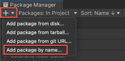
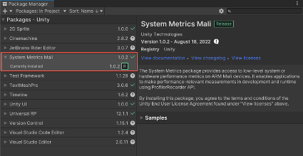
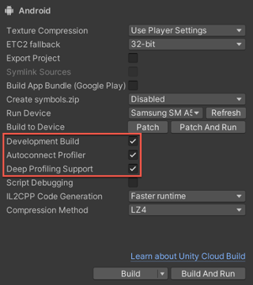
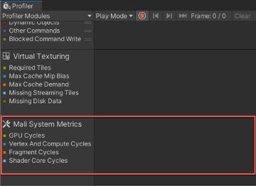
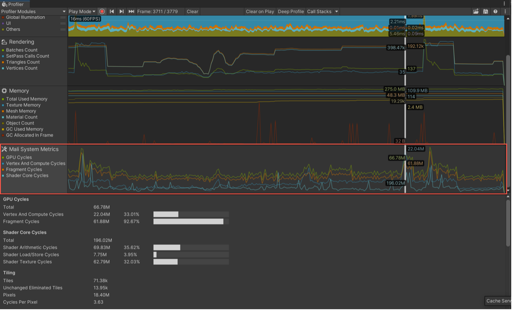
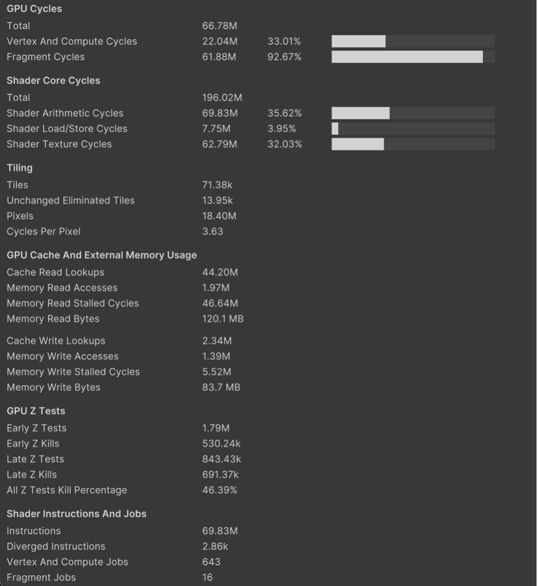

## Show Mali GPU metrics in the Unity Profiler 

Arm provides a Unity package that enables the [Unity profiler](https://unity.com/features/profiling) to read and display the GPU hardware counters from Mali GPUs. It is supported in Unity versions 2021.2 and later.

### Install the System Metrics Mali Package 

Follow these steps to install the package in Unity.

1. In Unity, select **Window > Package Manager** to show the Package Manager.
1. In the top left corner, click the **+** icon and then select the option **Add package by name…**

    
1. In the search field, type **com.unity.profiling.systemmetrics.mali** and click **Add**.

    When the install completes, you should then see System Metrics Mali in your list of installed packages.

    

### Unity build settings for profiling

To use the Unity profiler to analyze performance as your game runs on a connected device, your device needs to be in developer mode and have USB debugging enabled.

1. Connect your device to your computer and check that it is accessible via Android Debug Bridge (ADB). In a command terminal, enter the `adb devices` command, which returnsa list of the connected devices.

```
List of devices attached
RZ8MC03VVEW	device
```

If your device is listed as `unauthorized`, disable and enable the **USB Debugging** option on your device, and then re-approve your computer’s access.

1. In Unity, select **File > Build Settings**.
1. Check that Android is set as the platform. If it is not, select Android, and choose Switch Platforms.
1. Check that your device is visible in the **Run device** field. If it is not, check that the device is connected and has USB debugging enabled, then click **Refresh**.
1. Check that the following settings are enabled:
    1. **Development Build**
    1. **Autoconnect Profiler**
    1. **Deep Profiling Support**

    

1. Choose **Build and Run**.
1. Specify a location for the APK and click **Save**. Unity will build the game, then install and run it on the device.

### Capture a profile with the Unity Profiler

Once the game is running on the device, the Unity Profiler should automatically open. If it does not, you can open it using **Window > Analysis > Profiler** (or the keyboard shortcut CTRL+7).

1. Check that the **Mali System Metrics** chart is visible at the bottom of the profiler modules.

     

    If you don’t see this chart, select **Profiler Modules** and enable **Mali System Metrics**.

1. Click the record button to start collecting data from the device. You’ll see the charts populating as the game runs. Play the game on the device until you get to a scene you want to analyze, perhaps where you know the FPS drops or the game slows down. When you’ve finished, click the button again to stop recording.

    The Mali System Metrics chart displays a high-level overview of how the GPU distributed its processing load:

     1. GPU Cycles - Indicates the overall GPU processing load requested by the application. The counter increments every clock cycle that the GPU has any pending workload active, queued or stalled.

    1. Vertex and Compute Cycles - The number of cycles where the GPU was busy computing one of the following: vertex shaders, tessellation shaders, geometry shaders, fixed function tiling, or compute shaders.
    
    1. Fragment Cycles - The number of cycles where the GPU calculates any type of fragment shader operation. This counter increments every clock cycle where the GPU has any workload present in the fragment queue. For most content there are orders of magnitude more fragments than vertices, so this counter will usually be the highest processing load.
    
    1. Shader Core Cycles – The number of cycles where the shader core is processing any workload. Workloads could be arithmetic, texture, or load/store operations.

        

1. Select the chart to see more detailed metrics for the currently selected frame. For descriptions of each metric, hover over the name to see a tooltip or refer to Unity's [Metrics Guide](https://docs.unity3d.com/Packages/com.unity.profiling.systemmetrics.mali@1.0/manual/metrics-guide.html).

     
