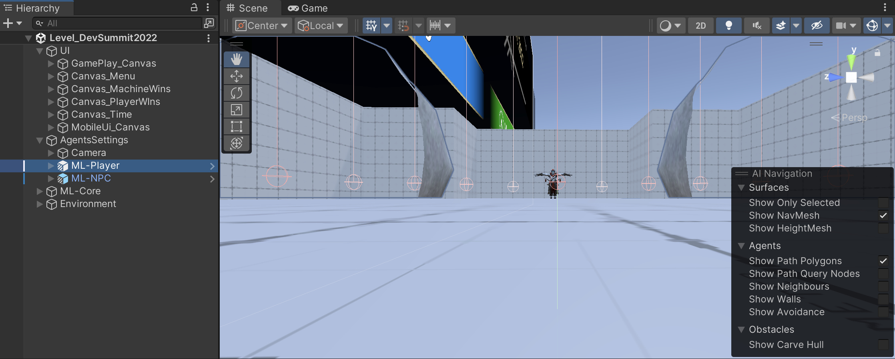
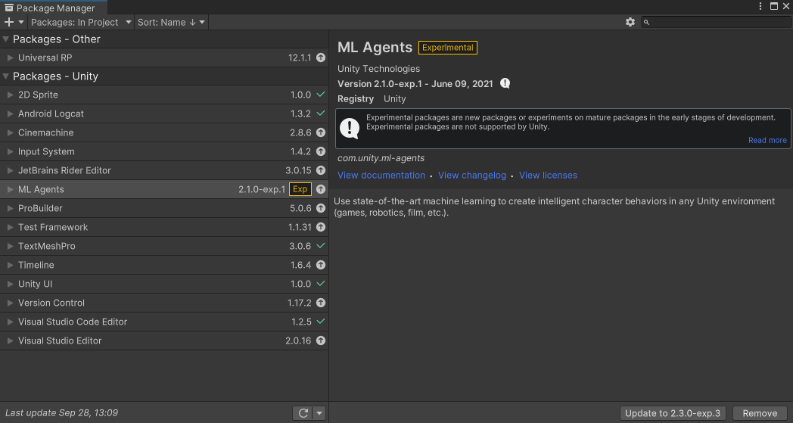
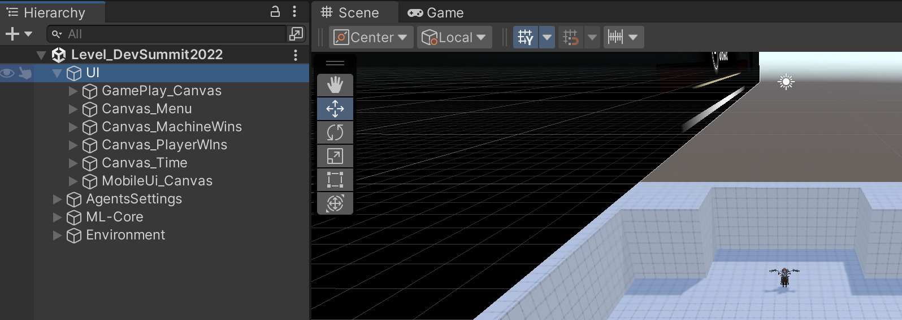
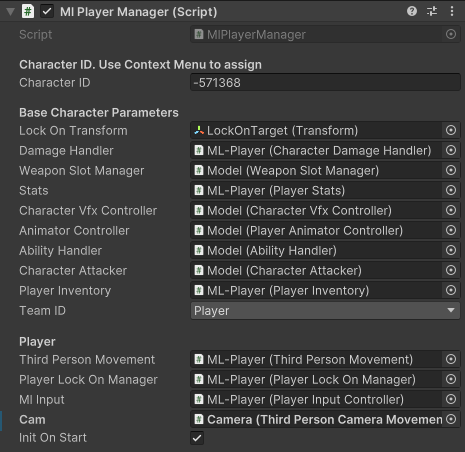
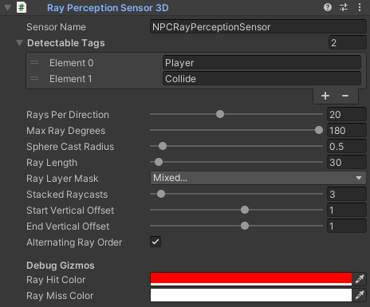
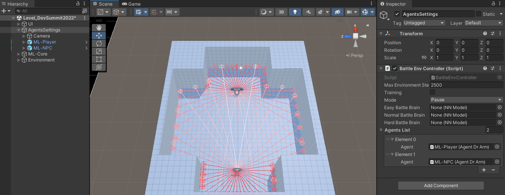
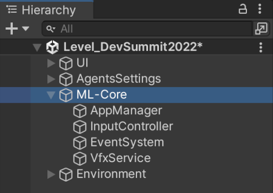
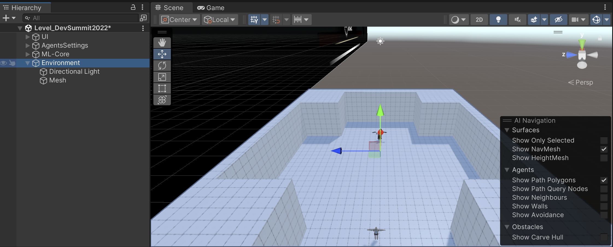

## Prepare the project for training

Before we move on to run the training, we will go through some of the key objects and scripts in Dr Arm. We will modify some of them to prepare for the training based on what we covered in the previous machine learning sections.

## Overview of the project

We will assume you still have the project open. From here onwards, you can ignore the "Ready to Play" version of the scene. We will use an incomplete scene to demonstrate some of the steps for using ML in Unity.

1. Inside the _Project_ tab, navigate to _Assets->#DevSummit2022->Scenes_ (See Figure 1).

   

1. Double click the _Level DevSummit2022_ scene to open it.

1. The hierarchy view lists the objects in the scene. You will see an object called AgentsSettings.

1. Click the arrow next to AgentsSettings to reveal child objects Camera, ML-Player and ML-NPC.

    The Camera object is the 3D camera - when played, the game will be rendered from this viewpoint.

    The ML-Player object is our player-controlled character.

    The ML-NPC object is our AI enemy character.

1. To get a better look of the scene from the player's perspective, right click on _ML-Player_ and select _Align View to Selected_. This will change the scene view to the viewpoint of our player character at ground level. You will see the inside of the arena and the enemy character off in the distance.

    

1. Check that the Package Manager is updated and everything is correctly installed by navigating to _Window->Package Manager_.

    The screen that appears should look similar to Figure 3. You should see the ML Agents package in the list. Click on "ML Agents" to see the package description. You should see in the bottom right that it is marked as installed or it may say there is an update available. This project was created using ML Agents version 2.1.0.

    

## Walkthrough of the Unity scene and relevant objects

_Level_DevSummit2022_ is the main gameplay scene - it is the one we use when playing the game. We use a different Unity scene when running training because we do a few things to make the training run quicker (we'll cover this later).

Let's look at the various parts of the gameplay scene and examine some key game objects and script components.

The Hierarchy view shows all of the objects in our scene, and we can view more information (in the Inspector panel) by clicking on them or by clicking on the arrows to unfold the hierarchy to view their child objects.

At the top of the hierarchy are 4 objects. These parent objects help us group related objects together, making the scene more readable and easier to navigate.

Parent objects don't necessarily need script components themselves, but often contain manager (or controller) scripts that perform some form of management of their child objects. Sometimes game objects are left empty and act purely as an organizational tool to make the scene easier to understand and navigate.

- UI

    Each child object is a Unity canvas. A canvas is a special component for rendering 2D text and images. Each canvas contains a user interface (e.g. main menu, in-game display, and on-screen controls for mobile).

- AgentsSettings

    The object itself contains a script for controlling the flow of a battle. Under this object we have the main protagonists of our game - the characters. Both characters take part in the AI training, but when playing the game, the player will take over control of "ML-Player".

- ML-Core

    ML-Core groups together some objects that contain scripts for general services such as input and visual effects.

- Environment

    This object simply parents the 3D light and the 3D mesh used for the arena.

### UI

The UI object contains script components that manage the user interfaces. We have various 2D interfaces that need to be shown and hidden at specific times during the game. When the game is run on a device or played in the editor, the first thing you will see is a main menu. You can choose what level of AI to play against. When you select Easy, Medium or Hard, the main menu will disappear and the in-game display (with player health etc.) will be shown. On mobile you will also see touchscreen controls such as a virtual joystick and action buttons.

### Agents Settings

This component of the scene will be our focus, as it contains our AI characters. AgentsSettings contains:

- A Battle Environment Controller script

    * Main function is to check if the battle has finished
    * Tracks character objects and brain assets for each difficulty level
    * Tracks running state (game difficulty, pause state, training etc.)
    * Ensures that the characters use the correct brain depending on difficulty and whether it is player controlled

- A Camera object

    * The ThirdPersonCameraMovement leverages the Unity Cinemachine package to implement a third-person camera that follows our player character. Under the Camera object is a traditional Unity camera called "Main Camera". This is the viewpoint of the rendered scene and controls which render settings to use.

- 2 character objects (who will be fighting each other)

    * Player object (ML-Player)
    * Non-player character (ML-NPC)
    * Both are setup with ML
    * Both have models and abilities (like fireball and to lock on target)

    The character objects contain some key scripts that we'll go through in more detail next.

### The character objects (ML-Player and ML-NPC)

The character objects both contain many scripts, but of most interest for now are the ML components.

#### MlPlayerManager Component

This component provides high level gameplay management for each player. Alongside some third person camera information, this manager stores weapon slots, player statistics such as health, team identity (human player or opponent), and damage and animation handling.

#### DecisionRequester Component

_DecisionRequester_ is a component from the ML Agents Toolkit. It controls how often a decision is requested (Decision Period) for an ML Agent (character).

ML Agent components are designed to be run from a _MonoBehaviour_'s _FixedUpdate_ function.

_MonoBehaviour_ provides a variety of functions that game objects can use to perform various functions at specific times during a frame. _FixedUpdate_ is called in step with the Unity physics system and is called at a fixed interval (independent of frame rate). The interval rate for _FixedUpdate_ can be changed using Edit->Project Settings->Time->Fixed Timestep.

You shouldn't need to modify this value but it is important to be aware that _FixedUpdate_ can be called multiple times per frame depending on the interval.

On each character, the _DecisionRequester_ component tells the system how often the machine learning algorithms should be updated. We have used a "decision period" value of 5. This means that a decision will be made every 5th physics frame. This provides the characters with a perfectly acceptable update rate while keeping performance high. _Take Actions Between Decisions_ is ticked so the ML Agent won't just take actions every 5th frame.

#### AgentDrArm Component

This component is derived from the Agent behavior provided by ML Agents Toolkit. All game objects to have AI (such as our characters) require an Agent component. The Agent component contains the "brain" of our characters. Inputs and actions are fed to and from the Agent. In training mode, this data will pass to and fro between the game and the Python training framework.

_Max Step_ is a property from _Agent_. It determines the maximum number of steps taken by an _Agent_ before being done; in our case this is effectively the maximum number of frames we want our battles to last (when training).

The ML subsystem will call on AgentDrArm implementations of functions such as _CollateObservations(..)_ and _OnActionReceived(..)_. We'll learn more about these later.

#### BehaviourParameters Component

The behavior parameters dictate the size of our neural network.

We set a limit to the maximum number of inputs (_Space Size_ of _Vector Observations_); these are pieces of state information about a character's environment and feed into the reinforcement learning. _Stacked Vectors_ is effectively giving us frames of historical data to feed in. The _Actions_ are the output that we use to determine which action a character should take (move, roll, attack etc). We have only used 13 out of the 19 limit set here; you can ignore the related warning on the Unity console.

_Inference Device_ is set to _Default_ and determines which compute device is used to run the machine learning. Regarding runtime performance, we have found for this project that ML Agents run better on the CPU. Although strictly speaking the GPU is faster, the overhead for sending and receiving the data negates the performance gain.

There shouldn't be much difference between Burst and CPU though typically Unity is moving more and more to the Burst compiler.

The _Behaviour Name_ is important as we'll use it again later in the training sections. You will see that "BossBattle" is used in several places.

#### RayPerceptionSensor3D Component

Each character needs to know what is around it. We do this by casting rays from the character out into the scene. We track nearby characters and obstacles and feed this back to the characters so they can avoid obstacles and fight opponents. We use the RayPerceptionSensor3D component to do this.

We will setup values so that rays are cast out in a circle around the character at an interval that isn't too large, so we don't miss a nearby object, but not so close that we cast too many rays (which could hurt performance). Our rays also have a radius because strictly speaking the component performs "sphere casting" rather than just "ray casting".

Sphere casting effectively gives our ray volume so we can make up for the gap between the rays. Note in _Figure 10_, that we can see a visualization of the sphere at the end of each ray being cast.

Later we'll look at finishing the setup of the NPC character by modifying some of the components above, examine some properties for tweaking the AI, and go through how to setup and run the training.

### ML-Core

ML-Core contains various managers and controllers common to many apps and games. There are no AI-specific objects or scripts here. You shouldn't need to modify any of these objects or components. However, if you would like to explore them anyway, the most interesting options are:

- ML-Core contains behavior _DontDestroyOnLoad_. This is useful for when you want an object to persist between scene loads
- SettingsController (on child AppManager) contains an option for setting the target framerate (Unity will attempt to run the game at this framerate if possible)
- VfxService controls which particle systems to use for which effects

### Environment

The entire scene is lit from a single light called "Directional Light". The light is marked as "Realtime" so it doesn't include any baked lighting. You could try adding baked lighting or more realtime lights to make the lighting more interesting, but this is outside the scope of this learning path.

If you experiment with the lighting, remember that adding extra lights and changing some options can affect performance.
